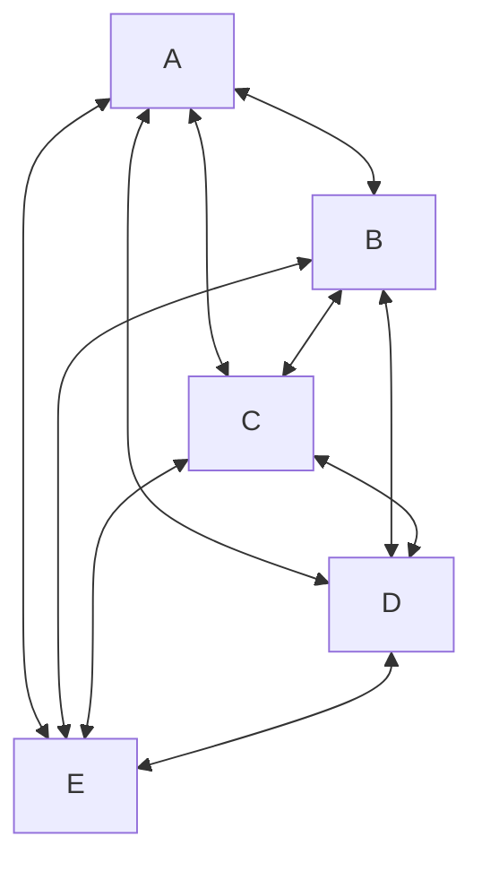
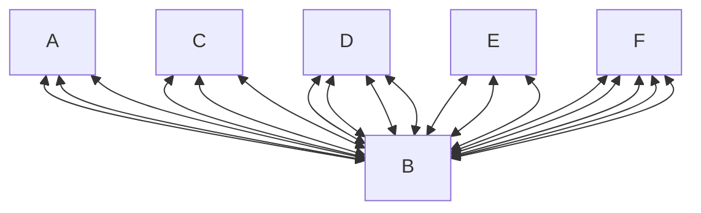

## 구현

### 1. prelude
ICE, STUN, TURN, SDP만 있다고 되는 것은 아니다. peer간 offer, answer을 통한 session 정보를 중계하는 서버를 만들어야 한다. 

### 2-1. Signaling(P2P/ Mesh)
peer 간 offser, answer라는 session 정보를 교환할 때만 부하가 발생한다. 

### 2-2. SFU(Selective Forwarding Unit)
종단 간 미디어 트래픽을 중계하는 중앙 서버 방식이다.
1:1, 1:N, N:N 혹은 N:M 등 모든 연결 형식에서 클라이언트는 연결된 모든 사용자에게 데이터를 보낼 필요 없어 서버에게만 자신의 영상 데이터를
보내면 된다. (1:N / N:M 스트리밍에)

### 2-3. MCU(Multi-point Control Unit)
다수의 송출 미디어를 중앙 서버에서 혼합(mixing) 또는 가공(transcoding)하여 수신측으로 전달하는 중앙 서버 방식이다.
클라이언트 peer간 연결이 아닌, 서버와 클라이언트 간의 peer를 연결한다.
