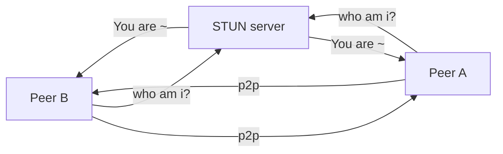
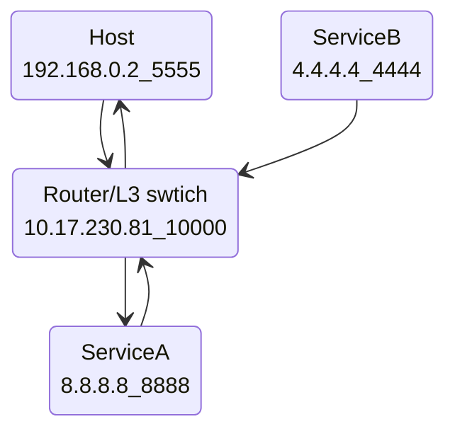
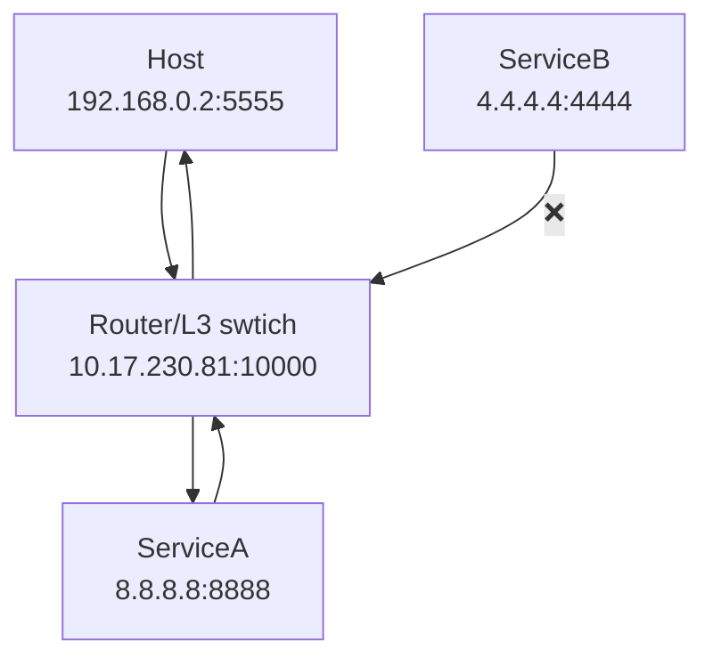
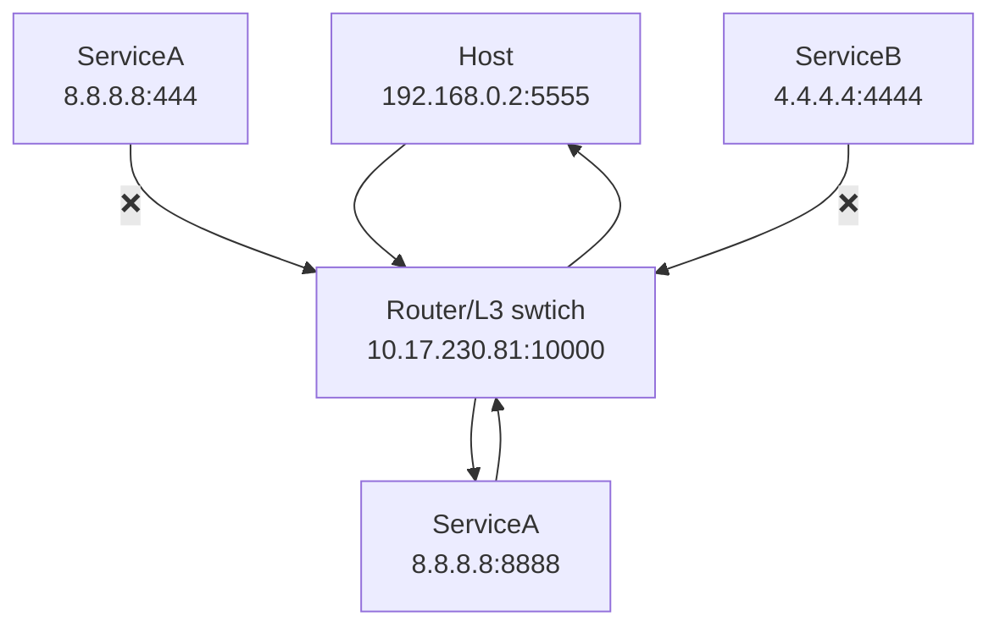
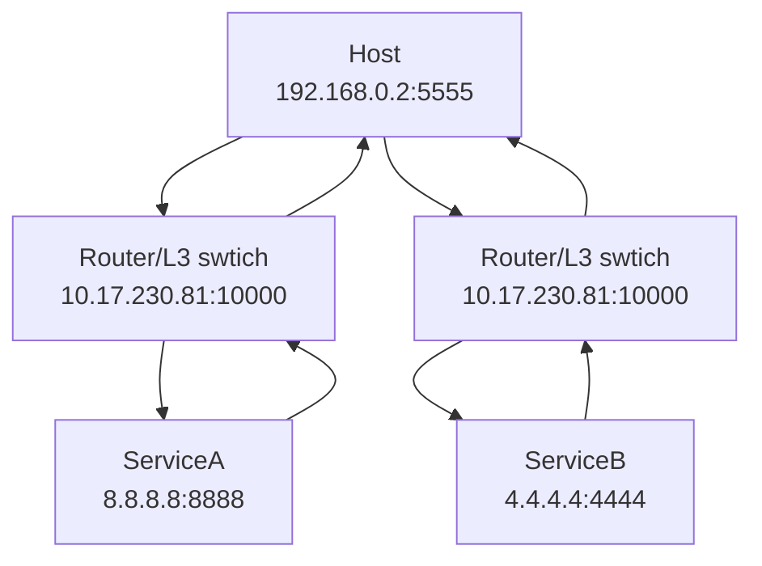
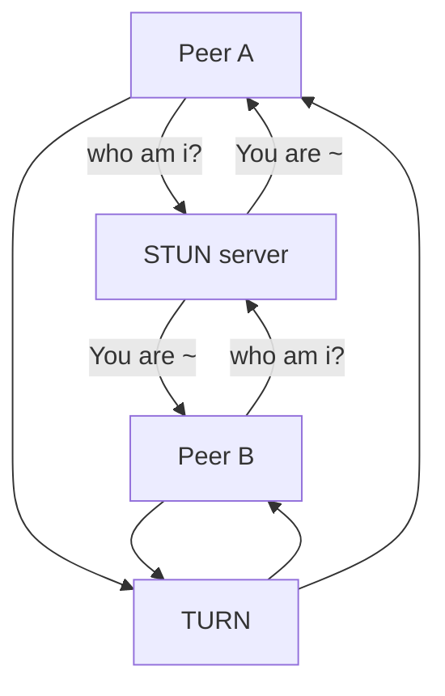

## 용어
### ICE( Interactive Connectivity Establishment )
peer 간 연결이 가능하도록 해주는 프레임 워크
ICE는 작업을 수행하기 위해 `STUN`, `TURN` 서버를 둘 혹은 최소 하나 사용한다.

### STUN( Session Traversal Utilities for NAT )
클라이언트 자신의 public Address(IP:PORT)를 알려준다.
peer 간 직접 연결을 막거나 라우터 제한을 결정하는 프로토콜이다.
클라이언트는 인터넷으로 클라이언트 PublicAddress와 라우터 NAT 뒤에 있는 클라이언트가 접근 가능한지에 대한 답변을 STUN에 요청

### NAT( Network Address Translation )
네트워크 주소 변환(Network Address Translation, 줄여서 NAT)은 IP 패킷의 TCP/UDP 포트 숫자와
소스 및 목적지의 IP 주소 등을 재기록하면서 라우터를 통해 네트워크 트래픽을 주고 받는 기술을 말합니다.
패킷에 변화가 생기기 때문에 IP나 TCP/UDP의 체크섬(checksum)도 다시 계산되어 재기록해야 합니다.
NAT를 이용하는 이유는 대개 사설 네트워크에 속한 여러 개의 호스트가 하나의 공인 IP 주소를 사용하여 인터넷에 접속하기 위함입니다

#### Full Cone NAT
private ip:port와 public ip:port가 매핑되면 public ip:port로 접근하면 host에 통신할 수 있는 방식

Host의 Private IP와 Port가 Router나 L3 Switch를 통해 Public IP와 Port로 매핑이 되면,
매핑된 정보를 토대로 Host가 Service A로 통신을 시도했을 때,
Service A도 마찬가지로 매핑된 정보를 토대로 Host에게 패킷을 보낼 수 있고,
이는 Router 또는 L3 Switch를 통해 Host에게 전달이 가능하다.

여기서 중요한건, Service A가 아니다.
바로 Service B이다.Service B는 Host와 통신하지 않았지만,
매핑된 정보를 토대로 Host에게 패킷을 보낼 수 있고,
이는 Host에게 전달이 가능하다는 점이다.

`"즉 정리하면, 통신을 하던 목적지가 아님에도 NAT로 매핑된 정보만 안다면 누구든지 Host에게 패킷을 전달할 수 있다"` 는 것이다.

#### Restricted Cone NAT

Full cone에서 매핑된 경우 누구든지 보낼 수 있는 것을 제한한 NAT이다.
즉, `통신을 하던 목적지가 아님에도 NAT로 매핑된 정보만 안다면 누구든지 Host에게 패킷을 전달할 수 있다`

#### Port Restricted Cone NAT

Restricted Cone에서 Host가 같고 포트가 다른 경우를 허용했다면 `Port Restrict cone`은 나간 호스트:포트만 허용한다.
즉, `기존에 통신하던 Service의 IP가 아니라면 Host에게로 패킷이 도달하지 않는다`

#### Symmetric NAT

기본적으로 Port Restrict Cone NAT과 같다.
Cone 방식의 Nat는 Host와 Router / L3 Switch 간의 매핑이 이루어지면 통신할때 계속해서 그 매핑된 정보를 쓴다.
지만 Symmetric 방식은 통신하는 Service의 IP/Port 를 기반으로, 매핑정보를 달리한다.
router/L3 Switch의 포트를 달리해서 각각 통신을 진행한다.

### TURN( Traversal Using Relays around NAT )
TURN 서버와 연결하고 모든 정보를 그 서버로 전달하는 것으로 `Symmetric NAT` 제한을 위회하는 것을 의미한다.
이를 위해서 TURN 서버와 연결하고 모든 peer에 저 서버에 모든 패킷을 보내고 다시 TURN에 전달해달라고 요청해야 한다.

### SDP(Session Description Protocol)
해상도, 형식, 코덱, 암호화 등 멀티미디어 컨텐츠의 연결을 설명하기 위한 표준이다.
두 개의 peer가 다른 한쪽이 데이터가 전송되고 있다는 것을 알게 해준다.
기본적으로 컨텐츠에 대한 메타 데이터 설명이다.

> SDP는 프로토콜이 아니다. 데이터 포맷은 디바이스 간 미디어를 공유하기 위한 연결을 설명하기 위해서 사용한다.
