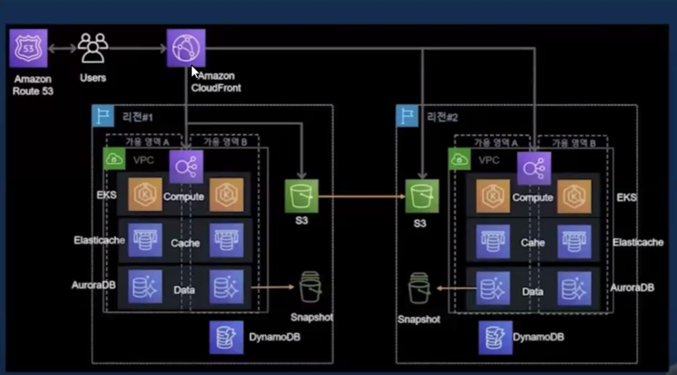

# VPC

## IDC(Internet Data Center)
물리적 인프라를 제공하는 시설

## Region
물리적으로 분리된 위치 각 Region은 여러 개의 데이터 센터(AvailableZone)으로 구성되어 있다.
Region은 네트워크 지연 시간 단축, 법적, 규제 요구 사항을 충족하기 위해서 설계됐다.

## VPC(Virtual Private Cloud)
가상 사설 네트워크다.

### 용어
- public/private subnet 
  - subnet: ip 주소의 범위
  - public subnet : public + sub + net = 공개된 더 작은 단위의 네트워크
  - private subnet : private + sub + net = 공개되지 않은 더 작은 단위의 네트워크 
- routing table : "내부 네트워크가 어떻게 정의되어 있는가?"가 명시된 표
  - 네트워크에서 데이터가 이동할 경로를 결정
- internet gateway : 퍼블릭 서브넷에 있는 진입로  
- NAT gateway/instance : publicSubnet/ privateSubnet 간 통로 (CIDR)
  - Network Address Translation(내부 네트워크의 사설 IP주소를 공용 IP 주소로 변환)
- network ACL(AccessControlList)
  - 서브넷 수준에서 특정 인바운드 또는 아웃바운드 트래픽을 허용하거나 거부합니다. (들어가고 나가고 모두 검사 -> Stateless)
- securityGroup
  - 기본적으로 배타적, whiteList를 추가하는 개념, 각 인스턴스, 오브젝트에 대한 통제 정책을 지정( 들어올 때만 검사 -> Stateful )

> 기본 VPC? 생각보다 빈약
 
> CIDR 표기법
> Classes Inter-Domain Routing
> 
> 10001111 / 0000111 / 01000001 / 11001011
> 와 같이 옥텟으로 나뉘었을 때
> 
> /24라면 앞의 24비트는 고정이구 뒤의 옥텟을 전부 사용할 수 있다는 이야기가 된다.

> ISMS
> 정보 보호관리에 대한 표준적 모델 및 기준을 제시, 정보 자산을 보호하기 위해 수립,관리,운영하는 종합적인 체계의 적합성에 대해서
> 인증을 부여하는 제도
 
> BastionHost
> 보안을 위해서 고안된 HOST로 외부, 내부 네트워크 사이에서 게이트웨이 역할을 수행하는 호스트를
> 의미한다. PRIVATE IP로만 접근이 허용된 서버를 외부에서 접속하고자 할 경우, BASTION HOST를 경우해서
> 타고 들어갈 수 있게 할 수 있다.