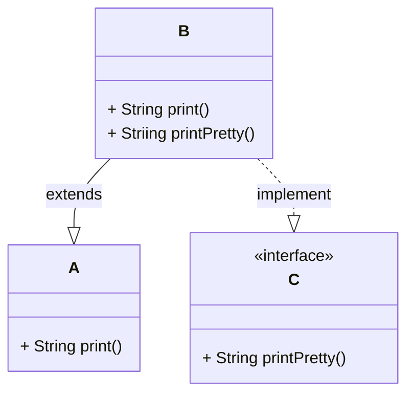
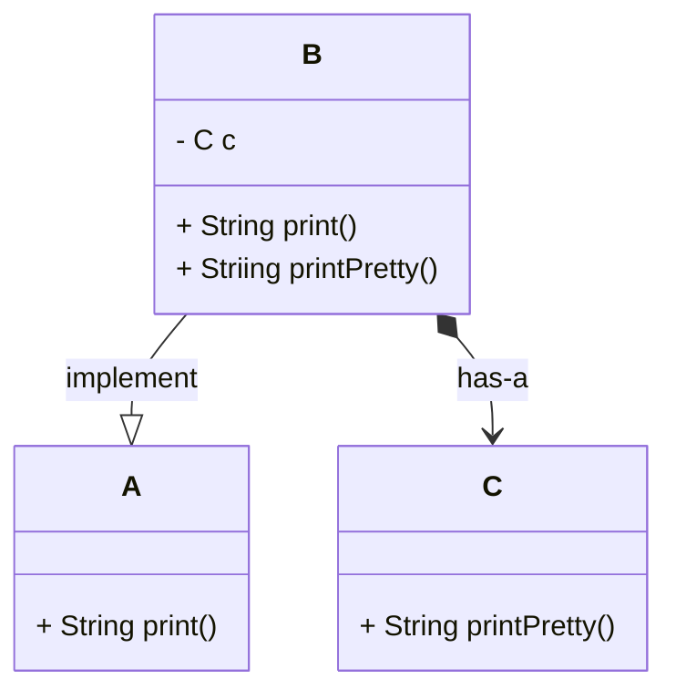

# Adapter

- 이미 주어진 것, 새롭게 필요한 것 사이의 간극을 채우는 디자인 패턴
- **Wrapper**라고도 불린다.
- 종류로는
    1. 클래스에 의한 Adapter(상속)
    2. 인스턴스에 의한 Adapter(위임 -> 컴포지션이 더 적합한 의미가 될 수도 있다.)

## 1. 클래스 상속에 의한 Adapter

- 부모 클래스를 상속 받아서 override를 해서 구현

> 예를 들어서 A라는 주어진 것(print)과 요청한 결과인 C(printPretty) 사이 간극을 메우기 위해서

## 2. 위임
- 컴포지션을 통한 간극을 메우기다.

- 호환되지 않은 인터페이스 간 변환 로직을 캡슐화한 것