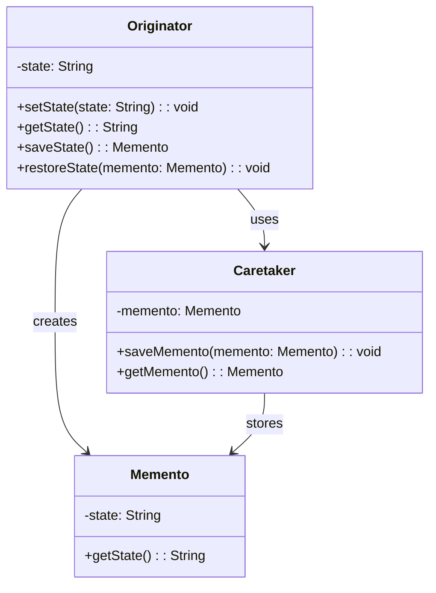

# Memento

- 객체의 상태를 캡슐화해서 외부에서 접근할 수 없게 하고, 나중에 해당 상태를 복원할 수 있게 하는 패턴

```mermaid
classDiagram
    class Originator {
        -state: String
        +setState(state: String): void
        +getState(): String
        +saveState(): Memento
        +restoreState(memento: Memento): void
    }

    class Memento {
        -state: String
        +getState(): String
    }

    class Caretaker {
        -memento: Memento
        +saveMemento(memento: Memento): void
        +getMemento(): Memento
    }

    Originator --> Memento : creates
    Caretaker --> Memento : stores
    Originator --> Caretaker : uses
```