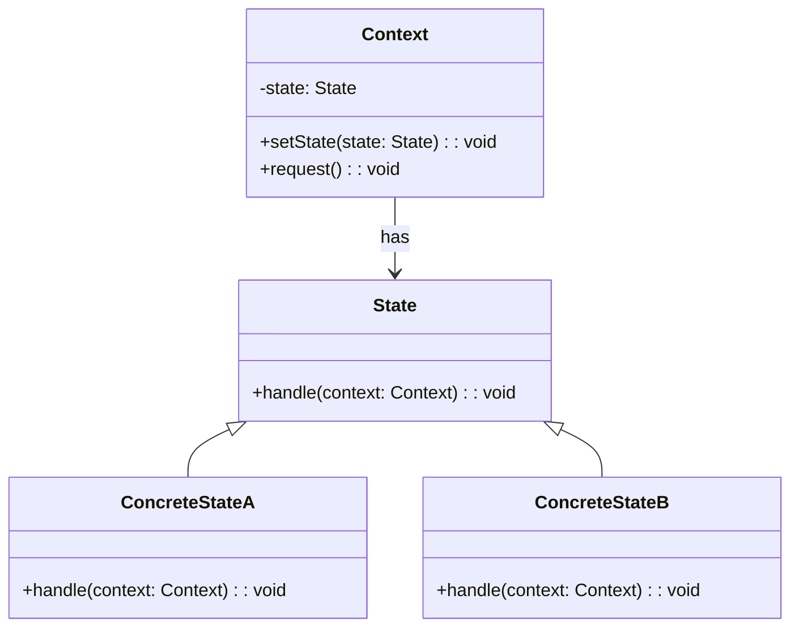

# State

- 객체의 상태에 따라 다른 동작을 수행하도록 설계하며, 상태와 관련된 행동을 각가 상태 클래스로 캡슐화하는 패턴
- 즉, 상태별 동작을 클래스에 캡슐화해서 상태와 행동을 분리한다.
- 상태 변경 로직이 Context에서 벗어나 각가의 상태 클래스로 위임된다.

```mermaid
classDiagram
    class Context {
        -state: State
        +setState(state: State): void
        +request(): void
    }

    class State {
        +handle(context: Context): void
    }

    class ConcreteStateA {
        +handle(context: Context): void
    }

    class ConcreteStateB {
        +handle(context: Context): void
    }

    Context --> State : has
    State <|-- ConcreteStateA
    State <|-- ConcreteStateB

```