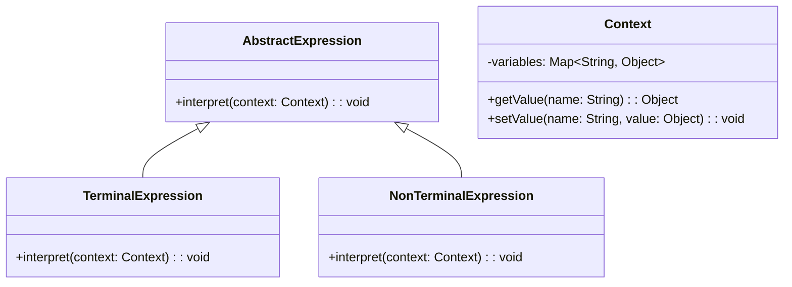

# Interpreter

- 프로그램이 해결하려는 문제를 미니 언어로 표현하는 방식
- 각 문법의 규칙을 별도의 객체로 캡슐화하고 이를 통해서 복잡한 문법을 비교적 다루기 쉽게 만든다.
- 언어, 문법을 클래스 형태로 표현하고, 이를 해석하는 객체를 통해 문법에 대한 해석과 실행을 처리하는 패턴
- 

```mermaid
classDiagram
    class AbstractExpression {
        +interpret(context: Context): void
    }

    class TerminalExpression {
        +interpret(context: Context): void
    }

    class NonTerminalExpression {
        +interpret(context: Context): void
    }

    class Context {
        -variables: Map~String, Object~
        +getValue(name: String): Object
        +setValue(name: String, value: Object): void
    }

    AbstractExpression <|-- TerminalExpression
    AbstractExpression <|-- NonTerminalExpression

```