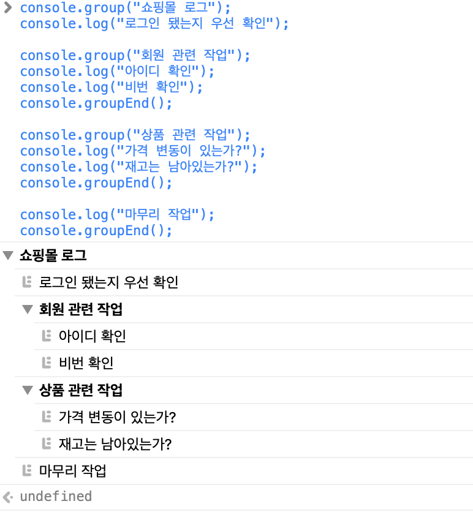

# Console.~

```javascript
console.log("콘솔 로그") 
console.info("콘솔 정보") 
console.debug("콘솔 디버그") 
console.warn("콘솔 경고") 
console.error("콘솔 오류")
console.table("콘솔 테이블")
console.group("콘솔 그룹")
console.time("콘솔 타이머")
console.count("콘솔 카운드")
```

## log
|  치환 문자열  | 	설명|
|:--------:|:----:|
| %o 또는 %O | JavaScript 객체를 출력합니다. 객체 이름을 클릭하면 검사기에 더 자세한 정보를 보여줍니다.|
|%d 또는 %i| 정수를 출력합니다. 서식도 지원합니다. 예를 들어 console.log("Foo %.2d", "1.1")은 정수부를 0이 앞서는 두 자리로 표현하므로 Foo 01 을 출력합니다.|
|%s| 문자열을 출력합니다.|
|%f| 부동소수점 수를 출력합니다. 서식도 지원합니다. 예를 들어 console.log("Foo %.2f", "1.1")은 소수부를 두 자리로 표현하므로 Foo 1.10 을 출력합니다.|

### style
```javascript
//style
console.log("This is %cMy stylish message", "color: yellow; font-style: italic; background-color: blue; padding: 2px");
//multiStyle
console.log("Multiple styles: %cred %corange", "color: red", "color: orange", "Additional unformatted message");
//module
let styles = [
    'background: linear-gradient(#D33106, #571402)',
    'border: 1px solid #3E0E02',
    'color: white',
    'display: block',
    'text-shadow: 0 1px 0 rgba(0, 0, 0, 0.3)',
    'box-shadow: 0 1px 0 rgba(255, 255, 255, 0.4) inset, 0 5px 3px -5px rgba(0, 0, 0, 0.5), 0 -13px 5px -10px rgba(255, 255, 255, 0.4) inset',
    'line-height: 40px',
    'text-align: center',
    'font-weight: bold'
].join(';'); // 각 배열 인자들을 join 시켜 하나의 문자열로 치환하고 인자마다 끝에 ; 기호를 첨가해준다

console.log('%c a spicy log message ?', styles);
```

### 주의 사항
```javascript
var obj = {};

console.log(obj);

obj.a = 1;

// 실시간으로 변경되므로 Obj에서 a = 1이 찍힘
```

# 이외
console.log : 아이콘이 없는 검은색 텍스트
console.info : 진한 텍스트
console.debug : 파란색 텍스트
console.warn : 아이콘이 있는 노란색 텍스트
console.error : 아이콘이 있는 빨간색 텍스트


# assert
첫번째 인수가 false이면 출력됨
```javascript
let name = "inpa";
let msg = 2;

console.assert(typeof msg === 'number', { name, msg: msg }); // 출력 안함

msg = "2";

console.assert(typeof msg === 'number', { name, msg: msg }); // 출력
```

# group
```javascript
console.group("쇼핑몰 로그");
console.log("로그인 됐는지 우선 확인");

console.groupCollapsed("회원 관련 작업"); // 그룹 닫기
console.group("회원 관련 작업");
console.log("아이디 확인");
console.log("비번 확인");
console.groupEnd();

console.group("상품 관련 작업");
console.log("가격 변동이 있는가?");
console.log("재고는 남아있는가?");
console.groupEnd();

console.log("마무리 작업");
console.groupEnd();
```




# time
```javascript
// time과 timeEnd에 같은 타이머 이름을 주어야 정상적으로 작동한다.
let count = 0

console.time('time1')

for (let i = 0; i < 1000000000; i++) {
  count++
}

console.timeEnd('time1') // time1: 1382.543212890625 ms
```

# table
```javascript
const foods = [
  {
    name: '🍔',
    price: 30.89,
    group: 1,
  },
  {
    name: '🍨',
    price: 20.71,
    group: 1,
  },
  {
    name: '🍿',
    price: 10.31,
    group: 2,
  },
  {
    name: '🍵',
    price: 5.98,
    group: 2,
  },
]

console.table(foods)
```


# dir
DOM의 body를 console.log하면 html 태그가 출력되지만 console.dir는 `Object`로 출력된다.


# trace
호출된 함수 스택을 자동으로 출력한다. 

# count
특정 호출된 값디 몇 번 호출됐는지 횟수를 기록하고 싶을 때 사용하면 된다.

# clear
콘솔을 clear