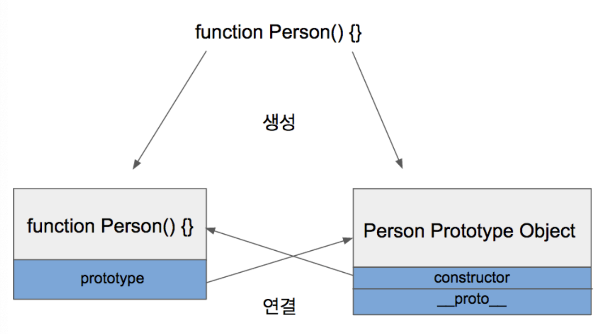
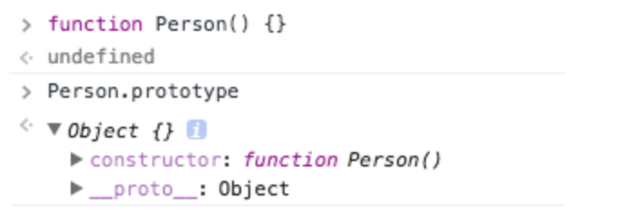

# Prototype

JS는 Prototype 기반 언어다. 만약 class에 필드가 2개 있다고 해보자. 인스턴스를 100개 생성하면 필드는 200개 생성된다.
프로퍼티를 사용하면 이를 해결할 수 있다. 
```javascript
function Person() {}

Person.prototype.eyes = 2;
Person.prototype.nose = 1;

var kim  = new Person();
var park = new Person():

console.log(kim.eyes);  // => 2
console.log(kim.nose);  // => 1
console.log(park.eyes); // => 2
console.log(park.nose); // => 1
```
간단히 설명하자면 Person.prototype이라는 빈 Object가 어딘가에 존재하고, 
Person 함수로부터 생성된 객체(kim, park)들은 어딘가에 존재하는 Object에 들어있는 값을 모두 갖다쓸 수 있습니다.


## Prototype Link/ Prototype Object
JS에는 Prototype Link, Prototype Object라는 것이 존재한다. 이를 통틀어 Prototype이라고 부른다. 
### Prototype Object
객체는 언제나 함수로 생성된다.
```javascript
function Person() {} // => 함수

var personObject = new Person(); // => 함수로 객체를 생성
```
Object와 마찬가지로 Function, Array도 모두 함수로 정의되어 있다. 
함수가 정의될 때는 2가지 일이 동시에 이뤄진다.

1. 해당 함수에 construct 자격 부여 (Construct 자격이 부여되면 new를 통해서 객체를 만들 수 있게 된다. )
2. 해당 함수의 Prototype Object 생성 및 연결 
함수를 정의하면 함수만 생성되는 것이 아니라 Prototype Object도 같이 생성된다.

그리고 생성된 함수는 prototype이라는 속성을 통해 Prototype Object에 접근할 수 있습니다.
Prototype Object는 일반적인 객체와 같으며 기본적인 속성으로 constructor와 __proto__를 가지고 있습니다.

constructor 생성자는 Prototype Object와 같이 생성되었던 함수를 가리키고 있습니다. (생성자니까)
__proto__는 Prototype Link입니다.

### Prototype Link
```javascript
function Person() {}

Person.prototype.eyes = 2;
Person.prototype.nose = 1;

var kim = new Person();
var park = new Person();

console.log(kim.eyes); // => 2

//kim에는 eyes라는 속성이 없는데도, kim.eyes를 실행하면 2라는 값을 참조하는 것을 볼 수 있습니다.
//딱 하나의 속성 __proto__가 그것을 가능하게 해주는 열쇠입니다.
//이렇게 __proto__속성을 통해 상위 프로토타입과 연결되어있는 형태를 프로토타입 체인(Chain)이라고 합니다.
```