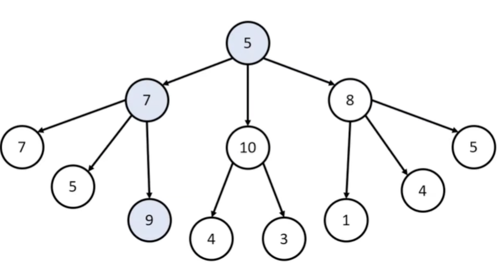

# Greedy

Greedy는 '당장 눈 앞에 보이는 최적의 상황만을 쫓는 알고리즘'이다. 항상 최적의 결과를 도출한다고 보장할 수는 없지만
어느 정도 최적의 해에 근사한 값을 빠르게 구할 수 있다는 장점이있다. 또한 `특정 상황`에서는 Greedy가 최적의 해를 보장할 수도 있다는 것이다.


주로 문제를 분할 가능한 문제들로 분할한 뒤, 각 문제들에 대한 최적해를 구한 뒤 이를 결합하여 전체 문제의 최적해를 구하는 경우에 주로 사용됩니다.

## 에시 1)
>
> 
> 
> Greedy의 예시로 거스름 돈 문제를 들 수 있다. 거스름 돈을 줄 때 최소 개수의 화폐를 주는 것이 편하다. 예를 들어서 560원이면
> 56개의 10원보다는 500원 1개 50원 1개 10원 1개로 주는 것이 동전 양이 적어집니다. 
> 즉, 이런 경우 무조건 더 큰 화폐부터 거슬러 준다는 원칙만 지키면 최적의 해를 보장할 수 있습니다.
> 
> 이러한 Greedy는 무조건 큰 경우, 무조건 작은 경우, 무조건 긴 경우, 무조건 짧은 경우와 같이 극단적으로 문제에 접근한다는 점에서 정렬과
> 함께 사용되는 경우가 많다. 
> 
> ```java
> class Greedy {
>     public static void main(String[] args) {
>         int price = 1260;
>         
>     }
>     
>     public int getGreedyResult( int price ) {
>         int result = 0;
>         int income = price;
>         int[] coins = {500, 100, 50, 10};
>         for ( int i = 0; i < coins.length; i ++ ) {
>             result += income / coins[i];
>             income %= coins[i];
>         }
>     }
> }
> ```
> 

## 예시 2)
>
> 
> 노드에서 가장 합이 높은 방법을 선택하는 방법을 알아보자.
> 
> 
> 각각의 상황에서 '최적'이라고 생각하는 방법을 선택한다.
>  5 -> 다음 레벨 중 가장 큰 10 -> 그 다음 레벨에서 가장 큰 4
> 
> 

## 탐욕법 선택 조건

1. 탐욕 선택 속성(Greedy Choice Property) : 각 단계에서 최적의 선택을 했을 때 전체 문제에 대한 최적해를 구할 수 있는 경우를 의미한다.
2. 최적 부분 구조(Optimal Substructure) : 전체 문제의 최적해가 '부문 문제의 최적해로 구성'할 수 있는 경우

## 알고리즘 단계
1. 문제의 최적해 구조를 결정
2. 문제 구조에 맞게 선택 절차를 정의 : (Selection Procedure)
3. 선택 절차에 맞춰 수행
4. 선택된 해가 문제의 조건을 만족하는지 검사 : (Feasibility Check)
5. 조건에 만족하지 않으면 해당 해를 제외
6. 모든 선택이 완료되면 해답 검사 : (Solution Check)
7. 조건이 만족하지 않으면 해답으로 인정되지 않음
 

|    분류    |                                     Greedy                                     |                            [DP](./DynamicProgramming.md)                            |
|:--------:|:------------------------------------------------------------------------------:|:-----------------------------------------------------------------------------------:|
|    설명    |                       각 단계에서 최적의 선택을 하는 방식으로 문제를 해결하는 방식                       |                작은 문제의 해를 메모이제이션하여 중복 계산을 피하고, 이를 이용해서 큰 문제를 해결하는 방식                 |
|  성립 조건   |   1. 탐욕 선택 속성(Greedy Choice Property)<br/>2. 최적 부분 구조(Optimal Substructure)    | 1. 중복 부분 문제 (Overlapping Subproblems)       <br/>2. 최적 부분 구조 (Optimal Substructure) |
| 중복 부분 문제 |                              중복 부분 문제를 해결하지 않는다.                               |                                 중복 부분 문제를 해결할 수 있다.                                 |
|    상황    | - 각 단계의 상황에서 최적 선택하여 최적 경로를 구한다. <br/> - 최적이 아닌 경우가 될 수 있거나 풀리지 않는 문제가 될 수 있다. |           - 모든 상황을 계산하여 최적의 경로를 구할 수 있다. <br/> - 모든 상황을 계산하기에 시간이 오래 걸린다.           |