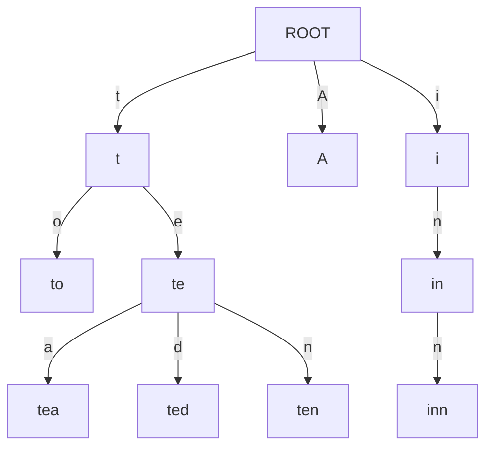
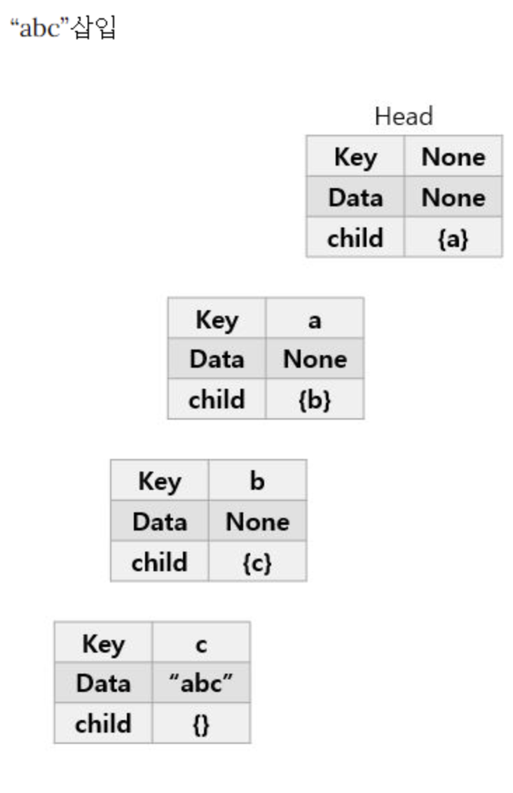

# Trie



- 문자열을 저장하고 효율적으로 탐색하기 위한 트리 형태의 자료구조
- 자동 완성, 사전 검색 득 문자열을 탐색하는데 특화되어 있는 자료구조다.
- `radixTree`, `prefixTree`, `retrievalTree`라고도 한다. (reTRIEval tree)에서 나온 단어

## 장점
- 문자열 검색에 특화
- 문자열을 하나 하나 검색하는 것보다 시간 복잡도 측면에서 효율적

## 단점
- 각 노드에 자식들에 대한 포인터들을 배열로 모두 저장하고 있기에 저장 공간의 크기가 크다는 단점이 있다.


## 예시


```java
class Node {
    Map<Character, Node> childNode = new HashMap<>();
    boolean endOfWord;
}

class Trie {
    Node root = new Node();
    
    public void insert( String str ) {
        Node node = this.root;
        
        for( int i = 0; i < str.length(); i ++ ) {
            node = node.childNode.computeIfAbsent(str.charAt(i), key -> new Node());
        }
        
        node.endOfWord = Boolean.TRUE;
    }
    
    public search( String str ) {
        Node node = this.root;
        
        for( int i = 0; i < str.length(); i ++ ) {
            node = node.childNode.getOrDefault(str.charAt(i), null);
            if( Objects.isNull(node) )  return false;
        }
        
        return node.endOfWord;
    }
}

class Test {
    public static void main(String[] args) {
        Trie trie = new Trie();

        // Trie에 문자열 저장
        trie.insert("kakao");
        trie.insert("busy");
        trie.insert("card");
        trie.insert("cap");

        // Trie에 저장 된 문자열 확인
        System.out.println(trie.search("bus"));		// false
        System.out.println(trie.search("busy"));    // true
        System.out.println(trie.search("kakao"));   // true
        System.out.println(trie.search("cap"));     // true
        
    }
}
```
출처: [아는 만큼 재밌는 개발 Coding Knowjam(코딩노잼):티스토리](https://codingnojam.tistory.com/40)