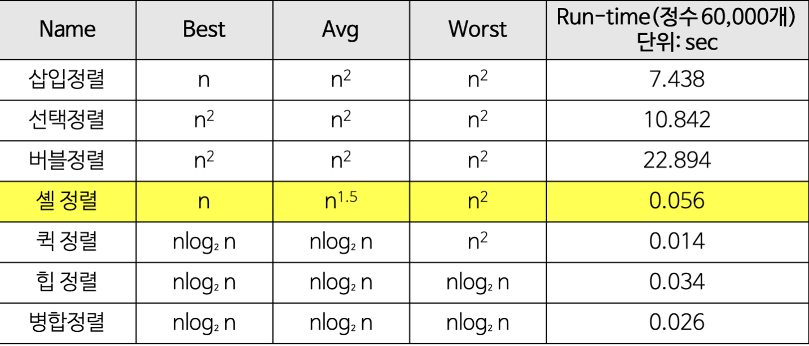

# 정렬

- 버블 정렬 : 이웃한 두 요소의 대소 관계를 비교하여 교환을 반복
- 삽입 정렬 : 가장 작은 요소부터 선택해서 알맞는 위치로 옮겨서 순서대로 정렬하는 알고리즘
- 선택 정렬 : 선택한 요소를 그보다 더 앞쪽에 알맞는 위치에 삽입하는 작업을 반복해서 정렬하는 알고리즘
- 셸 정렬 : 어느 정도 정렬된 상태에서만 빠른 것에서 착안된 개선된 삽입 정렬, 삽입 정렬이 이웃된 요소 간 정렬을 통해서 제자리를 찾아가는 것을 최적화 함
- 퀵 정렬 : 분할 정복을 사용해서 정렬한다. 피벗을 고르고 피벗을 중심으로 작은 것, 큰 것으로 나눈다. 정렬되지 않는 덩어리 중 피벗을 다시 선택하고 재귀적으로 정렬한다.
- 힙 정렬 : 이진 탐색트리로 최대 힙<sup>[[1]](#maxHeap)</sup>, 최소 힙<sup>[[2]](#maxHeap)</sup>을 이용해서 정렬하는 알고리즘
- 병합 정렬 : 분할 정복을 사용한다. 리스트를 균등한 크기로 분할하고 분할된 리스트를 정렬한 다음, 다시 합쳐서 정렬하는 알고리즘




### 버블 정렬
```java
public void bubbleSort () {
    int[] array ={1,38,6,30,31,35,1,38,16,33};
    
    outer: for ( int i =  array.length - 1; i > 0; i -- ) {

    int hasSwapped = 0;

    inner: for ( int j = 0; j < i; j ++ ){
    if( array[j] > array[j + 1] ) hasSwapped += swap(array,j , j + 1);
    }

    if( hasSwapped == 0) break outer; //한 번이라도 정렬하지 않으면 이미 정렬된 상태다.
    //따라서  더 이상 작업을 할 필요성이 없어짐
    }
}
```

### 선택 정렬
```java
public void selectionSort () {
    int[] array ={1,38,6,30,31,35,1,38,16,33};

    outer : for ( int i = 0; i < array.length - 1; i ++ ) {
        //가장 작은 값을 맨 앞으로 둔다.
        //index가 하나씩 올라가므로, 이전에 정렬한 요소는 정렬 대상에 두지 않는다.

        int minimum = i;

        inner : for ( int j = i + 1; j < array.length; j ++ ) {
            if( array[j] < array[minimum]) minimum = j;
        }

        swap(array, i, minimum);
    }
}
```

### 삽입 정렬
```java
public void insertionSort () {
    int[] array ={1,38,6,30,31,35,1,38,16,33};

    outer: for ( int i = 1; i < array.length; i ++ ) {
        int j;
        int tmp = array[i];

        // array [j - 1] > tmp; :: 이미 정렬된 것은 안건듦
        inner: for ( j = i; j > 0 && array [j - 1] > tmp; j -- ) {
            array[j] = array[j - 1];
        }

        array[j] = tmp;
    }
}
```

### 셸 정렬
```java


public void shellSort () {
    int[] array ={1,38,6,30,31,35,1,38,16,33};

    shell: for ( int h = array.length / 2; h > 0; h /= 2 ) {
        outer: for ( int i = h;  i < array.length; i ++ ) {
            int j;
            int tmp = array[i];

            inner: for ( j = i - h; j >= 0 && array [j] > tmp; j -= h ) {
                array[j + h] = array[j];
            }

            array[j + h] = tmp;
        }
    }
}
```

### 퀵 정렬
```java

public void quickSort () {
    int[] array ={1,38,6,30,31,35,1,38,16,33};
    quickSortAction(array, 0, array.length - 1);
}

/**
 * 퀵 정렬의 내부 루프는 대부분의 컴퓨터 아키텍처에서 효율적으로 작동하도록 설계되어 있고(그 이유는 메모리 참조가 지역화되어 있기 때문에 CPU 캐시의 히트율이 높아지기 때문이다.),
 * 대부분의 실질적인 데이터를 정렬할 때 제곱 시간이 걸릴 확률이 거의 없도록 알고리즘을 설계하는 것이 가능하다.
 */

private int[] quickSortAction( int[] array, int left, int right) {
    int pivotLeft = left;
    int pivotRight = right;
    int x = array[Math.floorDiv(pivotLeft + pivotRight, 2)];

    do {
        while( array[pivotLeft] < x ) pivotLeft ++;
        while( array[pivotRight] > x ) pivotRight --;

        if( pivotLeft <= pivotRight ) swap(array, pivotLeft++, pivotRight--);
    } while (pivotLeft <= pivotRight);


    if( left < pivotRight ) quickSortAction(array, left, pivotRight);
    if( pivotLeft < right ) quickSortAction(array, pivotLeft, right);

    return array;
}
```

### 병합 정렬
```java
public void mergeSort () {


    int[] array ={1,38,6,30,31,35,1,38,16,33};
    List<Integer> result  = mergeSortAction(Arrays.stream(array).boxed().collect(Collectors.toList()));

}

private List<Integer> mergeSortAction(List<Integer> refList){
    Integer size = refList.size();
    if( size < 2 ) return refList;
    else {
        Integer splitPoint = Math.floorDiv(size, 2);
        List<Integer> left  = mergeSortAction(refList.subList(0, splitPoint));
        List<Integer> right  = mergeSortAction(refList.subList(splitPoint, size));


        List<Integer> result = new ArrayList<>();
        merge(left, right, result);
        return result;
    }
}
    
private List<Integer> merge (List<Integer> left, List<Integer> right, List<Integer> result) {
    if( left.isEmpty() && right.isEmpty() ) return result;
    if( left.isEmpty() ) {
        result.addAll(right);
        return result;
    }
    if( right.isEmpty() ) {
        result.addAll(left);
        return result;
    }


    List<Integer> leftCopy =  new ArrayList<>(left);
    List<Integer> rightCopy = new ArrayList<>(right);
    Integer leftElement = leftCopy.get(0);
    Integer rightElement = rightCopy.get(0);

    int compare = leftElement.compareTo(rightElement);
    if( compare > 0 ) {
        result.add(rightElement);
        rightCopy.remove(rightElement);
    } else if ( compare < 0){
        result.add(leftElement);
        leftCopy.remove(leftElement);
    } else {
        result.add(rightElement);
        result.add(leftElement);
        leftCopy.remove(leftElement);
        rightCopy.remove(rightElement);
    }


    merge(leftCopy, rightCopy, result);
    return result;
}
```


-------------------------------
<a name="maxHeap">[1]</a> : 부모 노드의 키 값이 자 식노드의 키 값보다 항상 큰 힙

<a name="maxHeap">[2]</a> : 부모 노드의 키 값이 자식 노드의 키 값보다 항상 작은 힙