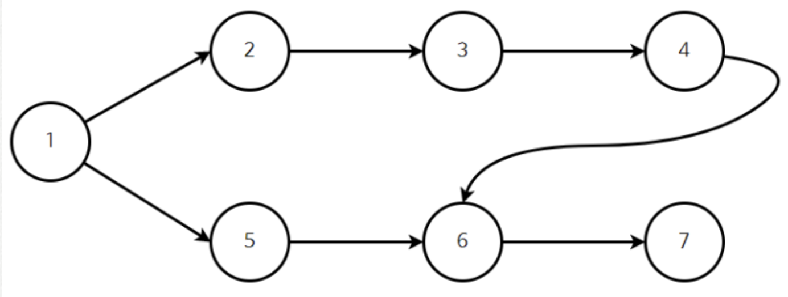

# Topology

토폴로지는 노드들과 이에 연결된 회선들을 포함한 네트워크 배열이나 구성을 개념적으로 표현한 것 정도로 정의할 수 있다.
토롤로지 종류로 별, 망, 버스, 환형 등이 있다.

# TopologySort
위상 정렬은 '순서가 정해져 있는 작업'을 차례대로 수행해야 할 떄 그 순서를 결정하기 위해서 사용하는 알고리즘이다.
위상 정렬은 DAG(Directed Acyclic Graph)에만 적용이 가능하다. 이는 사이클이 발생하지 않는 방향 그래프라는 의미이다. 사이클이 발생하면 위상 정렬을 수행할 수 없다. 
그 이유는 위상정렬은 시작점을 찾아야하는데, 사이클 그래프는 시작점을 상정할 수 없기 떄문이다.

위상 정렬은 두 가지 결과를 도출할 수 있다는 특징이 있다. 
1) 현재 그래프는 위상 정렬이 가능하지
2) 위상 정렬이 가능하다면 그 결과는 어떻게 되는지

위상 정렬을 수행하는 도구는 
1) 스택
2) 큐
를 사용해서 작업할 수 있다.

큐로 진행한다고 가정했을 때 아래의 과정을 진행하면 된다.
1. 진입 차수가 0인 정점을 큐에 삽입한다.
2. 큐에서 원소를 꺼내 연결된 모든 간선을 제거한다.
3. 간선 제거 이후에 진입차수가 0이 된 정점을 큐에 삽입한다.
4. 큐가 빌 때까지 반복한다. 모든 원소를 방문하기 전에 큐가 빈다면 사이클이 존재하는 것이고, 모든 원소를 방문했다면 큐에서 꺼낸 순서가 위상 정렬의 결과가 된다.

|  vertex  |  1  |  2  |  3  |  4  |  5  |  6  |  7  | 
|:--------:|:---:|:---:|:---:|:---:|:---:|:---:|:---:|
| entrance |  0  |  1  |  1  |  1  |  1  |  2  |  1  |

진입차수가 0인 정점(1)을 큐에 enqueue한다. 그 다음 해당 정점에 연결되어 있던 간선을 모두 제거한다.

|  vertex  |  1  |  2  |  3  |  4  |  5  |  6  |  7  | 
|:--------:|:---:|:---:|:---:|:---:|:---:|:---:|:---:|
| entrance |  0  |  0  |  1  |  1  |  0  |  2  |  1  |

그 다음 정점이 0인 요소들을 enqueue한다. 그 다음 큐에서 정점을 뺴고 (2) 연결된 간선을 제거한다.

|  vertex  |  1  |  2  |  3  |  4  |  5  |  6  |  7  | 
|:--------:|:---:|:---:|:---:|:---:|:---:|:---:|:---:|
| entrance |  0  |  0  |  0  |  1  |  0  |  2  |  1  |

2 다음 정점인 3의 진입차수가 0인 것을 확인했고 enqueue한다.

이후 집어 넣었던 정점 5를 dequeue하고 연결된 간선을 제거한다. 이후 간선을 제거하고 dequeue한다.

|  vertex  |  1  |  2  |  3  |  4  |  5  |  6  |  7  | 
|:--------:|:---:|:---:|:---:|:---:|:---:|:---:|:---:|
| entrance |  0  |  0  |  0  |  1  |  0  |  1  |  1  |

다음 큐에 있던 3을 dequeue하고 연결된 간선을 제거하고, 그 결과 진입차수가 0이된 요소를 체크한다. 이러면 정점 4가 발견된다.

위와 같이 4를 enqueue, dequeue, 간선 제거, 체크하면

|  vertex  |  1  |  2  |  3  |  4  |  5  |  6  |  7  | 
|:--------:|:---:|:---:|:---:|:---:|:---:|:---:|:---:|
| entrance |  0  |  0  |  0  |  0  |  0  |  0  |  1  |

이 된다. 6을 처리하면 7이 마지막으로 enqueue되면서 끝이 난다.

위상정렬 결과는 1,2,5,3,4,6,7이 된다.

//https://blog.naver.com/PostView.naver?blogId=ndb796&logNo=221236874984&categoryNo=128&parentCategoryNo=0&viewDate=&currentPage=5&postListTopCurrentPage=&from=postList&userTopListOpen=true&userTopListCount=5&userTopListManageOpen=false&userTopListCurrentPage=5