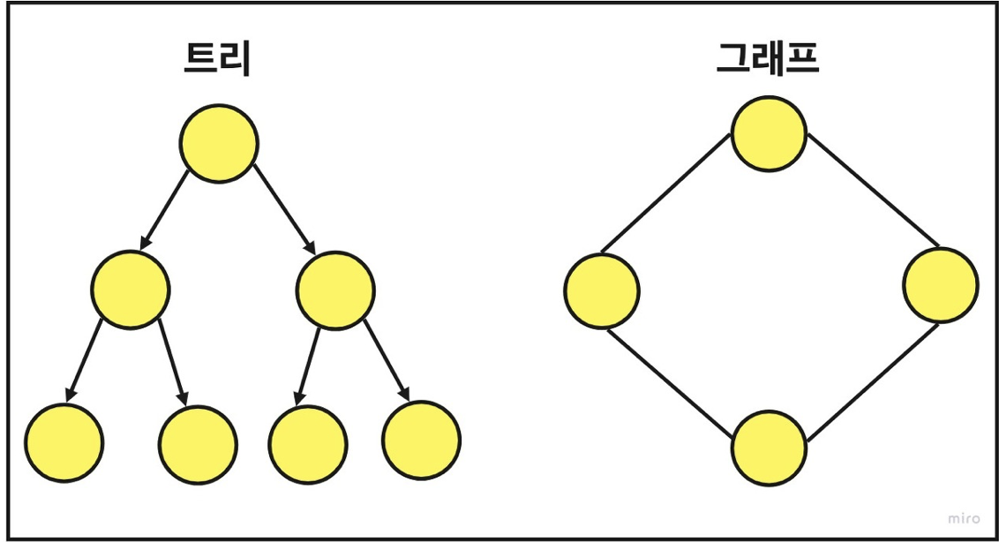

# Tree

트리는 한 노드가 여러 노드를 가리킬 수 있는 비선형적 자료구조

## 그래프 vs. 트리

| 구분  |                             그래프(Graph)                             |                  트리(Tree)                  |
|:---:|:------------------------------------------------------------------:|:------------------------------------------:|
| 정의  |                   객체 혹은 노드와 그것을 연결하는 간선으로 모인 구조                    |       그래프의 한 종류이고 방향성이 없으며, 순환하지 않음        |
| 방향성 |                             무방향 혹은 유방향                             |                  무방향 그래프                   |
| 순환성 | 순환 가능 자기 자신을 연결하는 Self-Loop도 가능  순환(Cycle), 비순환(Acyclic) 모두 가능 | 순환 불가능 Self-Loop 불가능  비순환(Acyclic) 그래프 |
| 루트  |                        루트의 개념이 있거나 없을 수 있다.                        |                하나의 루트 노드 존재                |
| 모델  |                              네트워크 모델                               |                   계층 모델                    |
| 순회  |                              BFS, DFS                              |            Pre, In, Post order             |
| 간선수 |                       그래프에 따라 다르며, 없을 수도 있다.                       |               N개의 노드라면 N - 1               |

## 종류
1. 편향 트리(Skew Tree) : 모든 노드들이 자식 노드를 하나씩만 가진 트리
2. 이진트리 : 각 노드의 차수(자식 노드)가 2 이하인 트리구조
3. 이진 탐색 트리(BinarySearchTree, BST) : 왼쪽 자신은 자식보다 작고 오른쪽은 부모보다 크다.
4. m원 탐색 트리(m-way Search Tree) : 최대 m개의 서브트리를 갖는 탐색 트리 
5. 균형 트리(BalancedTree, B-Tree) : m원 트리에서 높이 균형을 유지하는 트리

2-1. 이진 트리

2-2. 포화 이진 트리 : 모든 노드가 2개의 자식을 가지고 leaf 노드가 모두 같은 레벨인 트리

2-3. 완전 이진 트리
- 마지막 레벨을 제외하고 모든 노드가 채워진 트리
- 노드는 왼쪽 -> 오른쪽으로 채워져야 한다.