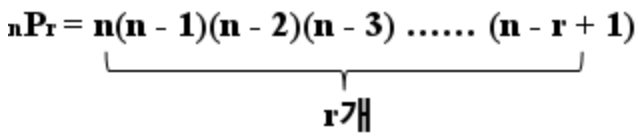

# 완전 탐색 
모든 경우의 수를 다 체크해서 정답을 찾는 방법

## 적용
1) 해결하고자 하는 문제의 가능한 경우의 수를 대략적으로 계산
2) 모든 가능성 고려
    - BruteForce -> 반복/ 조건문으로 대입
    - 순열(Permutation) -> n의 원소 중 r개의 원소를 중복 허용 없이 나열
    - 재귀호출
    - 비트마스크 -> 2진수 표현 기법을 활용
    - BFS, DFS
3) 적용

### A. bruteforce : 무차별 대입
- 반복, 조건으로 모든 경우를 만들어 답을 구하는 방법

### B. 순열(nPr) : 임의의 수열이 있을 때, 다른 순서로 연산하는 방법 [1,2,3]과 [3,2,1]를 보는 순서가 차이가 있음이 중요한 경우

- 서로 다른 N개를 일렬로 나열하는 경우의 수를 의미
- 순열의 경우의 수는 N!으로 완전 탐색을 이용하기 위해서는 N이 한 자리 수여야 현실성 있음
- 순열에 원소를 하나씩 채워나감

### C. 재귀: 반복호출 + 탈출조건으로 결과를 구한다. 
[DP](./DynamicProgramming.md)와 유사해보이지만 DP는 이전의 상태를 기억하고 시도에서 실패 시 이전 상황에서부터 다음 경우의 수를 탐색한다는 것이 다르다.
- 비트마스크와 마찬가지로 두 가지 선택지를 가질 때 유용

### D. [비트 마스크](./bit/BitOperator.md)
bit 연산으로 부분 집합을 표현하는 방법을 의미한다.

|  A  |  B  | A&B | A￨B | ~A  | A^B |
|:---:|:---:|:---:|:---:|:---:|:---:|
|  0  |  0  |  0  |  0  |  1  |  0  |
|  0  |  1  |  0  |  1  |  1  |  1  |
|  1  |  0  |  0  |  1  |  0  |  1  |
|  1  |  1  |  1  |  1  |  0  |  0  |

shift (>> ,<< ) 비트를 특정 값만큼 민다. 빈 값은 0으로 채운다.
1(2)<<2 = 1000(2)
- 나올 수 있는 모든 경우의 수가 각각의 우너소가 포함되거나, 아닌 경우(0, 1)로 구성되는 경우

### E. [BFS](tree/BFS.md), [DFS](tree/DFS.md)
1. BFS
- 그래프라면 방문 여부 체크 필수
- BFS는 방문 노드를 차례로 저장하고 꺼낼 수 있는 queue 사용
- 두 노드 간 최단 경로 혹은 임의의 경로를 찾고 싶을 때 사용

2. DFS
- 재귀적으로 동작( 재귀, 스택 )
- 그래프라면 방문 여부 체크 필수
- 모든 노드 방문하고자 할 때 사용
- BFS에 비해 간단하지만 느림

