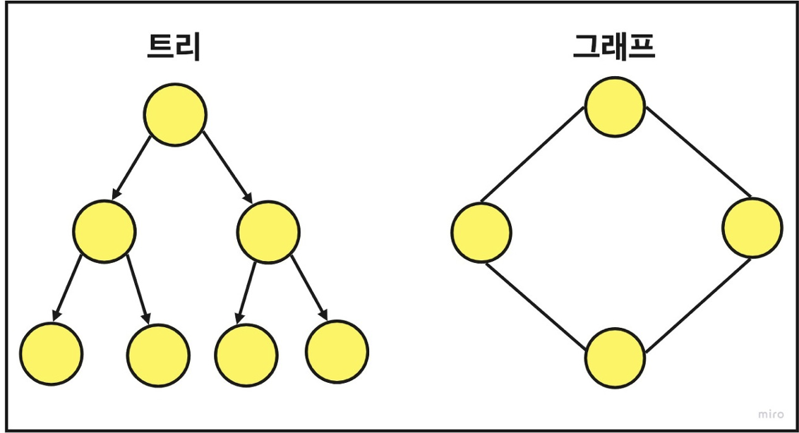
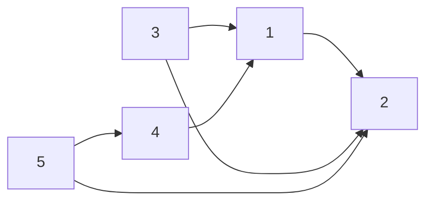
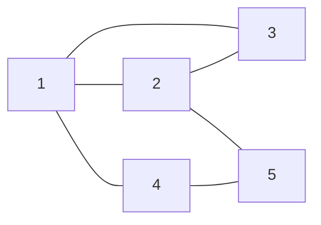
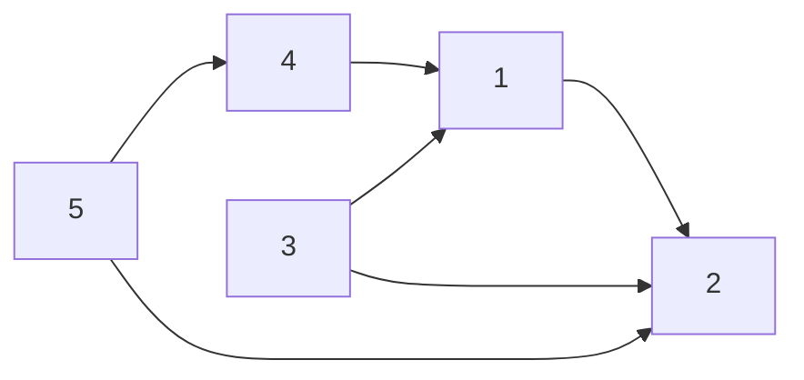
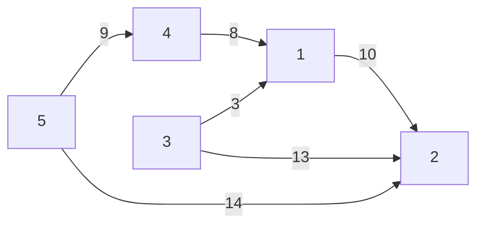
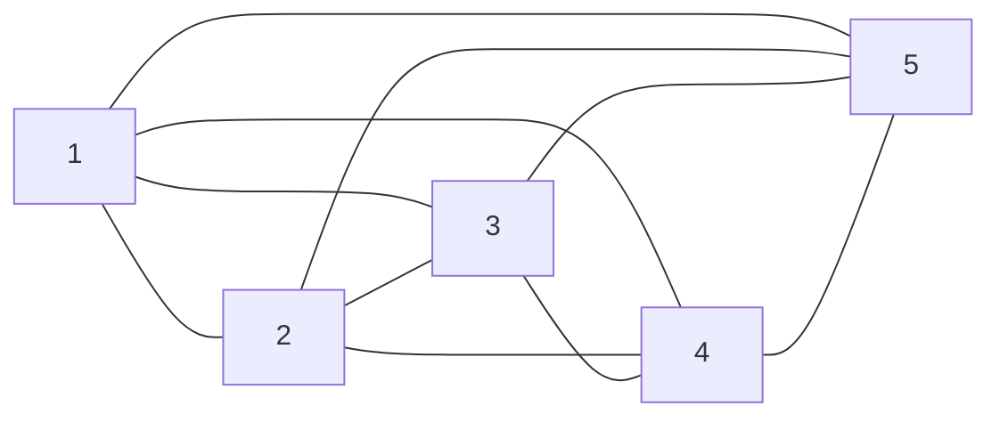
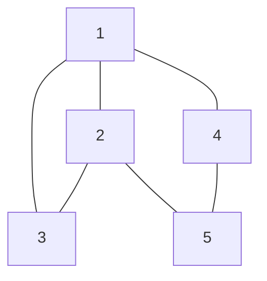

# Graph
Graph는 정점(Vertex)의 집합 V와 간선(Edge)의 집합 E로 구성된 비선형 데이터 구조



# 그래프와 트리

| 구분  |                             그래프(Graph)                             |                  트리(Tree)                  |
|:---:|:------------------------------------------------------------------:|:------------------------------------------:|
| 정의  |                   객체 혹은 노드와 그것을 연결하는 간선으로 모인 구조                    |       그래프의 한 종류이고 방향성이 없으며, 순환하지 않음        |
| 방향성 |                             무방향 혹은 유방향                             |                  무방향 그래프                   |
| 순환성 | 순환 가능 자기 자신을 연결하는 Self-Loop도 가능<br/> 순환(Cycle), 비순환(Acyclic) 모두 가능 | 순환 불가능 Self-Loop 불가능<br/> 비순환(Acyclic) 그래프 |
| 루트  |                        루트의 개념이 있거나 없을 수 있다.                        |                하나의 루트 노드 존재                |
| 모델  |                              네트워크 모델                               |                   계층 모델                    |
| 순회  |                              BFS, DFS                              |            Pre, In, Post order             |
| 간선수 |                       그래프에 따라 다르며, 없을 수도 있다.                       |               N개의 노드라면 N - 1               |
| 예시  |                  네비게이션 길찾기, SNS 팔로우, 친구 추천, 검색 엔진                  |       대진표, 파일 시스템, HTML Tag 구조, 주소 체계       |

# 용어
1. vertex(정점) : 노드, 정점에는 데이터가 저장된다.
2. edge(간선) : 링크(arcs)라고도 하며, 선을 통해 노드 간의 관계를 나타낸다.
3. adjacentVertex(인접 정점) : 하나의 정점에서 edge에 의해 직접적으로 연결된 정점을 의미한다.
4. simple-path(단순 경로) : 경로 중 반복되는 정점이 없는 것, 같은 간선을 지나지 않는 경로를 뜻한다.
5. degree(차수) : 무방향 그래프에서 하나의 정점에 인접한 정점의 수를 의미한다.
6. out-degree(진출 차수) : 방향 그래프에서 사용되는 용어로 한 노드에서 외부로 향하는 간선 수를 뜻한다.
7. in-degree(진입 차수) : 방향 그래프에서 사용되는 용어로 외부 노드에서 들어오는 간선의 수를 뜻한다.
8. path(경로) :  출발지에서 목적지로 가는 순서
9. simple path(단순 경로) : 경로 중 반복되는 정점이 없음, 한붓그리기처럼 같은 간선 지나지 않음
10. cycle(사이클) : 단순 경로의 출발지 - 목적지가 같은 경우 

## 예시



V(G) = {1, 2, 3, 4, 5} ## Vertex
E(G) = {{1,2}, {3, 1}, {3, 2}, {4, 1}, {5, 2}, {5, 4}} ## Edge


# 종류
1. 방향 그래프 - 방향성 간선/ 무방향성 간선
- 무방향 그래프

- 방향 그래프


2. 가중치 그래프 ( 가중치는 양, 음 모두 가능 )

3. 루프
4. 순환 그래프 - 한 vertex에서 ede를 타고 가면 다시 그 vertext로 돌아오는 그래프
5. 신장트리(Spanning Tree)
6. [최소 신장 트리(Minimum Spanning Tree, MST)](tree/MinimumSpanningTree.md)
7. 희소 그래프(Sparse) / 밀집 그래프(Dense) - 희소 그래프는 노드 수 > 간선의 수 / 밀집 그래프는 노드 수 < 간선 수
8. 완전 그래프 - 그래프에 속한 모든 정점들이 상호 연결된 그래프, 총 간선의 수는 ((n - 1) * n ) / 2



# 그래프 구현


### 인접 행렬
|  \  |  1  |  2  |  3  |  4  |  5  |
|:---:|:---:|:---:|:---:|:---:|:---:|
|  1  |  0  |  1  |  1  |  1  |  0  |
|  2  |  1  |  0  |  1  |  0  |  1  |
|  3  |  1  |  1  |  0  |  0  |  0  |
|  4  |  1  |  0  |  0  |  0  |  1  |
|  5  |  0  |  1  |  0  |  1  |  0  |


- 2차원 배열 사용
- 1이면 간선 존재, 0이면 없음

1. 장점 
- 정점을 찾기 쉬움
- 구현이 쉬움

2. 단점
- O(n^2)의 공간 복잡도


```java
class Matrix {
    public static void main(String[] args) {
        int[][] edges = new int[][]{
                {1, 2}, {1, 3}, {1, 4}, {2, 3}, {2, 5}, {4, 5}
        };

        int n = 5; //정점의 개수

        int[][] matrix = new int[n + 1][n + 1];

        for (int[] edge : edges) {
            matrix[edge[0]][edge[1]] = 1;
            matrix[edge[1]][edge[0]] = 1;
        }

        //출력
        for (int i = 1; i <= n; i++) {
            for (int j = 1; j <= n; j++) {
                System.out.print(matrix[i][j] + " ");
            }
            System.out.println();
        }
    }
}
```

### 인접 리스트
|  1  | -> 2 | -> 3 | -> 4 |
|:---:|:----:|:----:|:----:|
|  2  | -> 1 | -> 3 | -> 5 |
|  3  | -> 1 | -> 2 |      |
|  4  | -> 1 | -> 5 |      |
|  5  | -> 2 | -> 4 |      |

- 배열 또는 리스트 사용
- 정점의 개수만큼 헤드 노드가 있고 각 정점에 인접한 정점들 리스트로 연결

1. 장점
- 필요한 만큼 공간을 사용하기 때문에 공간 낭비가 적음
2. 단점
- 인접 행렬보다 구현이 어려움
```java
class List {
    public static void main(String[] args) {
        int[][] edges = new int[][] {
                {1, 2}, {1, 3}, {1, 4}, {2, 3}, {2, 5}, {4, 5}
        };

        int n = 5;

        ArrayList<Integer>[] list = new ArrayList[n + 1];

        for (int i = 0; i <= n; i++) list[i] = new ArrayList<>();

        for(int[] edge : edges) {
            list[edge[0]].add(edge[1]);
            list[edge[1]].add(edge[0]);
        }

        //출력
        for (int i = 1; i <= n; i++) {
            for(int j = 0 ; j < list[i].size();j++)
                System.out.print(list[i].get(j)+" ");
            System.out.println();
        }
    }
}
```