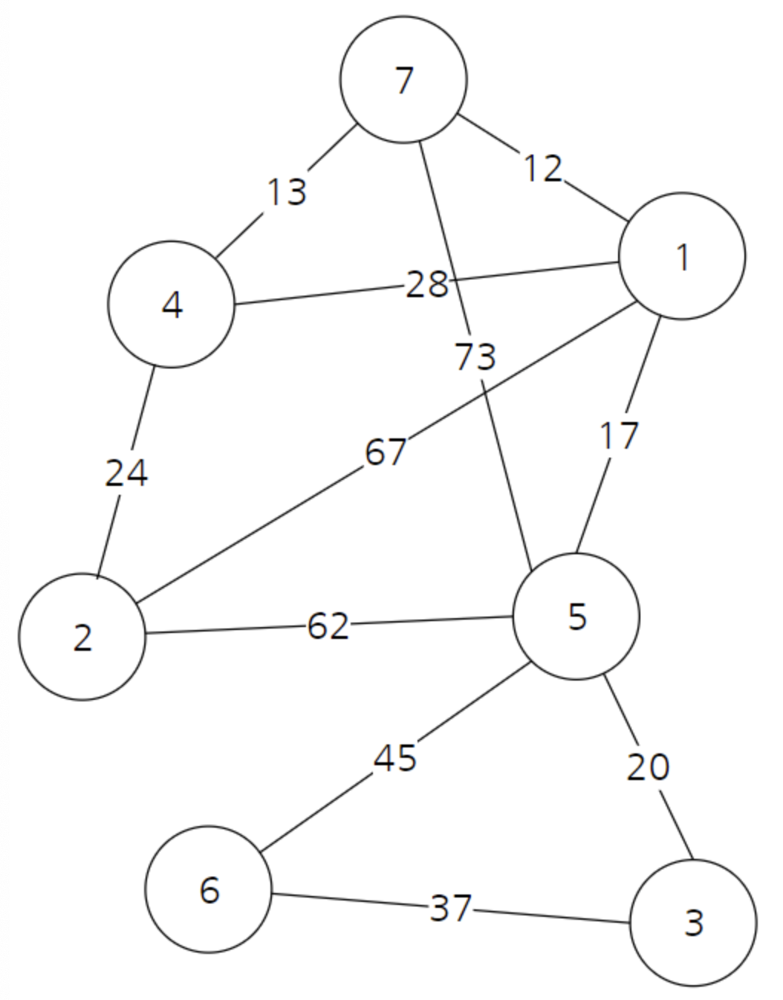

# Kruskal

크루스칼은 가장 적은 비용으로 모든 노드를 연결하기 위해서 사용하는 알고리즘이다. 즉, [최소 비용 신장 트리](MinimumSpanningTree.md)



위 그래프는 노드 개수가 7, 간선 개수가 11이다.

## 핵심 개념
<q> 간선을 거리가 짧은 순서대로 그래프에 포함시키면 어떨까? </q>

일단 모든 노드를 최대한 적은 비용으로 연결만 시키면(DFS?, BFS?) MST가 되니까 간선 정보를 정렬하고 비용이 적은 순서대로 그래프에 포함시키면 된다.

```
1 ->  {
         {fromNode:1, toNode:7, price : 12},
         {fromNode:1, toNode :4, price : 28},
         {fromNode:1, toNode :2, price : 67},
         {fromNode:1, toNode :5, price : 17}
      }
2 ->  {
         {fromNode:2, toNode:4, price : 24},
         {fromNode:2, toNode :5, price : 62}
      }
3 ->  {
          {fromNode:3, toNode:5, price : 20},
          {fromNode:3, toNode :6, price : 37}
      }
4 ->  {
          {fromNode:4, toNode:7, price : 13}
      }
5 ->  {
           {fromNode:5, toNode:6, price : 45},
           {fromNode:5, toNode :7, price : 73}
      }

``` 

이러면 결과적으로 

```
{
    {fromNode:1, toNode:7, price : 12},
    {fromNode:4, toNode:7, price : 13},
    {fromNode:1, toNode:5, price : 17},
    {fromNode:3, toNode:5, price : 20},
    {fromNode:2, toNode:4, price : 24},
    {fromNode:1, toNode:4, price : 28},
    {fromNode:3, toNode:6, price : 37},
    {fromNode:5, toNode:6, price : 45},
    {fromNode:2, toNode:5, price : 62},
    {fromNode:1, toNode:2, price : 67},
    {fromNode:5, toNode:7, price : 73},
}
```
이 된다. 여기서 사이클 테이블을 확인해서 지워주면 MST가 된다. 사이클을 확인할 때는 [Union-Find](UnionFind.md)를 사용하면 된다.

|  1  |  2  |  3  |  4  |  5  |  6  |  7  |
|:---:|:---:|:---:|:---:|:---:|:---:|:---:|
|  1  |  2  |  3  |  1  |  5  |  6  |  1  |

위 그래프를 첫 번째부터 순회하면서 연결성을 확인하고, 부모 노드를 Union-Find로 찾아준다. 

1 ~ 4 노드를 선택하면 사이클 테이블은

|  1  |  2  |  3  |  4  |  5  |  6  |  7  |
|:---:|:---:|:---:|:---:|:---:|:---:|:---:|
|  1  |  2  |  1  |  1  |  1  |  6  |  1  |

이 된다.

5번째 간선 `{fromNode:1, toNode:4, price : 28}`을 선택하면 1 - 4는 이미 연결되어 있다.
```
   0: {fromNode:1, toNode:7, price : 12},
   1: {fromNode:4, toNode:7, price : 13},
   2: {fromNode:1, toNode:5, price : 17},
   3: {fromNode:3, toNode:5, price : 20},
   4: {fromNode:2, toNode:4, price : 24},
   5: {fromNode:1, toNode:4, price : 28},
```
이 경우 패스하고 진행한다. 결론적으로 사이클 테이블의 부모가 모두 하나로 합일되면
최소신장트리가 완성된다. 

