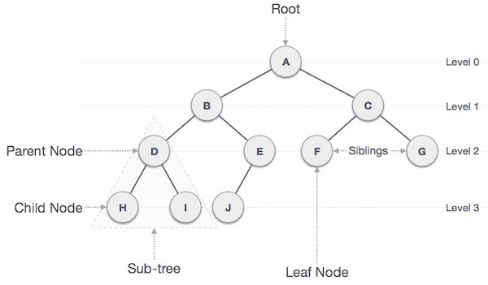
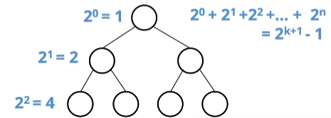
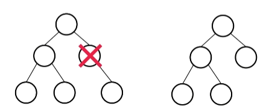

# Tree

트리는 한 노드가 여러 노드를 가리킬 수 있는 비선형적 자료구조

# 종류
1. 편향 트리(Skew Tree) : 모든 노드들이 자식 노드를 하나씩만 가진 트리
2. 이진트리 : 각 노드의 차수(자식 노드)가 2 이하인 트리구조
3. 이진 탐색 트리(BinarySearchTree, BST) : 왼쪽 자신은 자식보다 작고 오른쪽은 부모보다 크다.
4. m원 탐색 트리(m-way Search Tree) : 최대 m개의 서브트리를 갖는 탐색 트리 
5. 균형 트리(BalancedTree, B-Tree) : m원 트리에서 높이 균형을 유지하는 트리

2-1. 이진 트리

2-2. 포화 이진 트리 : 모든 노드가 2개의 자식을 가지고 leaf 노드가 모두 같은 레벨인 트리

2-3. 완전 이진 트리
- 마지막 레벨을 제외하고 모든 노드가 채워진 트리
- 노드는 왼쪽 -> 오른쪽으로 채워져야 한다.