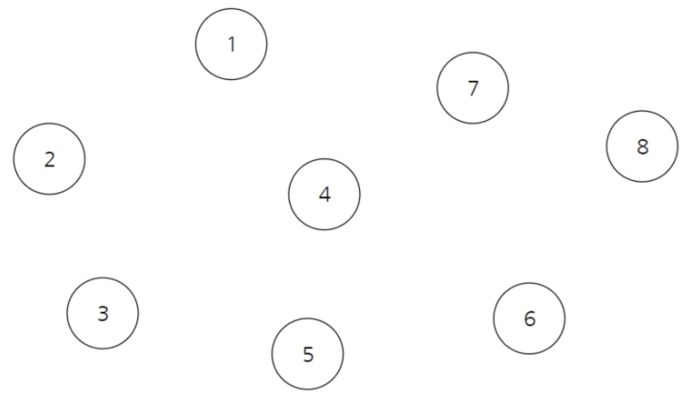
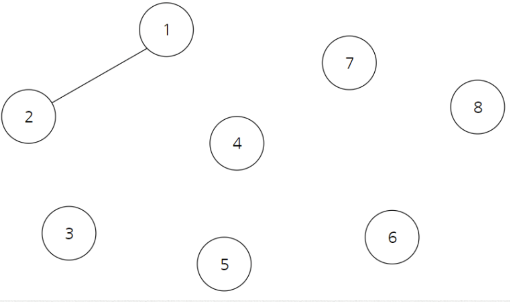
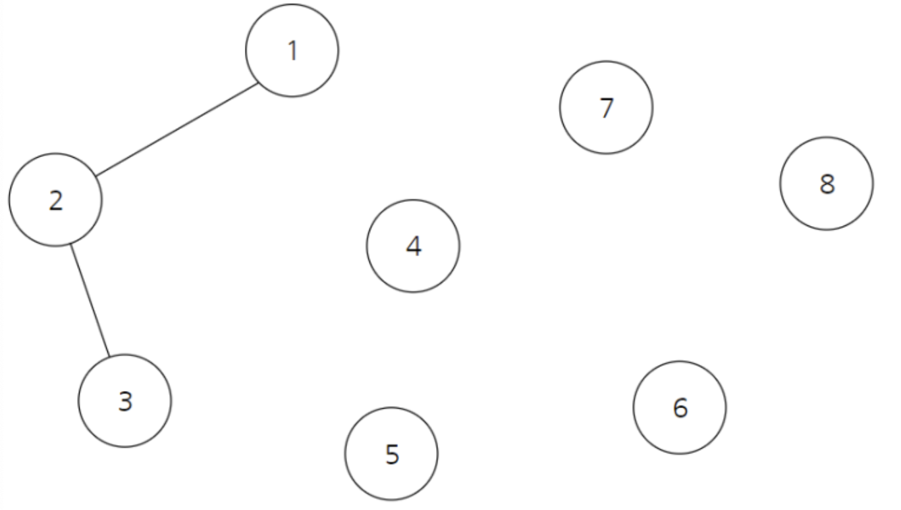

# UnionFind
여러 개의 노드가 존재할 때 두 개의 노드를 선택해서 현재 이 두 노드가 서로 같은 그래프에 속하는지 판별하는 알고리즘


위의 경우를 표로 작성하면

|1|2|3|4|5|6|7|8|
|:---:|:---:|:---:|:---:|:---:|:---:|:---:|:---:|
|1|2|3|4|5|6|7|8|


위와 같이 1 - 2가 연결됐을 때 이 연결성을 표현하기 위한 내용이 UnionFind이다.

|1|  2  |3|4|5|6|7|8|
|:---:|:---:|:---:|:---:|:---:|:---:|:---:|:---:|
|1|  1  |3|4|5|6|7|8|

위와 같이 부모를 합칠 때는 일반적으로 더 작은 값쪽으로 합친다. 이를 Union이라고 한다.


2와 3이 연결되면 아래와 같이 표현된다.

|1|  2  |  3  |4|5|6|7|8|
|:---:|:---:|:---:|:---:|:---:|:---:|:---:|:---:|
|1|  1  |  2  |4|5|6|7|8|

여기서 문제는 1 - 3의 연결성 표현을 어떻게 할건가 이다. 1, 3은 부모 노드만 보고는 한 번에 파악하기 어렵다. 
이 경우 재귀를 통해서 부모를 찾는다. 
결론적으로 이 과정을 수행하면

|1|  2  |  3  |4|5|6|7|8|
|:---:|:---:|:---:|:---:|:---:|:---:|:---:|:---:|
|1|  1  |  1  |4|5|6|7|8|

와 같이 표를 수정할 수 있다. 노드 1,2,3의 부모는 모두 1이기 때문에 세 노드는 모두 같은 그래프에 속한다고 할 수 있다. 

```java
class UnionFind {
    public static int getParent( int[] parent, int x ) {
        if( parent[x] == x ) return x;
        return parent[x] = getParent(parent, parent[x]); //재귀로 올라가면서 찾는다.
    } 
    
    public static void unionParent( int[] parent, int a, int b ) {
        a = getParent(parent, a);
        b = getParent(parent, b);
        
        if( a < b ) parent[b] = a;
        else parent[a] = b;
    }
    
    public static Boolean findParent( int[] parent, int a, int b ) {
        a = getParent(parent, a);
        b = getParent(parent, b);
        
        if( a == b ) return Boolean.True;
        else return Boolean.False;
    }

    public static void main(String[] args) {
        int[] parent = new int[11];
        
        for ( int i = 1; i <= 10; i ++ ) {
            parent[i] = i;
        }
        unionParent(parent, 1, 2);
        unionParent(parent, 2, 3);
        unionParent(parent, 3, 4);
        unionParent(parent, 5, 6);
        unionParent(parent, 6, 7);
        unionParent(parent, 7, 8);
        System.out.println(String.format("1 - 5 %s", findParent(parent, 1, 5)));
        //false
        unionParent(parent, 1, 5);
        System.out.println(String.format("1 - 5 %s", findParent(parent, 1, 5)));
       //true 
    }
}
```

이는 [크루스칼 알고리즘](Kruskal.md)의 베이스가 된다.
