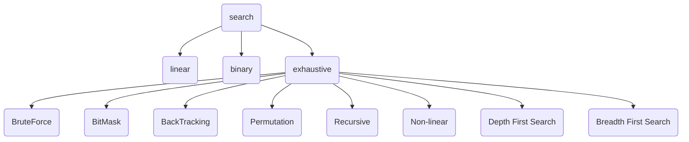

# 탐색


## 선형 탐색
선형 탐색이란 순서대로 순회하면서 찾는 알고리즘을 의미한다.


## 이진 탐색
이진 탐색이란 데이터가 정렬돼 있는 배열에서 특정한 값을 찾아내는 알고리즘이다.
배열의 중간에 있는 임의의 값을 선택하여 찾고자 하는 값 X와 비교한다.

X가 중간 값보다 작으면 중간 값을 기준으로 좌측의 데이터들을 대상으로,
X가 중간값보다 크면 배열의 우측을 대상으로 다시 탐색한다.

동일한 방법으로 다시 중간의 값을 임의로 선택하고 비교한다.
해당 값을 찾을 때까지 이 과정을 반복한다.

-> 업 & 다운

```java
class BinarySearch {
    int[] array = { 17, 28, 43, 67, 88, 92, 100 };
    public int search (int arr[], int target) {
        int low = 0;
        int high = arr.length - 1;
        int mid;

        while(low <= high) {
            mid = (low + high) / 2;

            if (arr[mid] == target) return mid;
            else if (arr[mid] > target) {
                high = mid - 1;
            } else {
                low = mid + 1;
            }
        }
        return -1;
    }
    public int search (int arr[], int target, int low, int high) {
        if ( low > high ) return -1;
        
        int mid = (low + mid) / 2;
        if( arr[mid] == target ) return mid;
        else if ( arr[mid] > target ) return search(arr, target, low, mid - 1);
        else  return search(arr, target, mid + 1, high);
    }
}
```

## 완전 탐색

| 알고리즘  |                                                 설명                                                  |               장               |            단             |
|:-----:|:---------------------------------------------------------------------------------------------------:|:-----------------------------:|:------------------------:|
 | 브루트포스 |                                  '모든 경우의 수를 탐색'하면서 원하는 결과를 얻는 알고리즘                                  | 모든 경우를 검사하기에 예상된 결과를 얻을 수 있다. |    경우의 수에 따라 시간이 걸린다.    |
| 비트마스크 |                             '모든 경우의 수를 이진수로 표현' 하고 '비트연산'으로 결과를 얻는 알고리즘                             |          이진수로 속도가 빠름          | 경우의 수가 많을 수록 공간 복잡도가 높아짐 |
| 백트래킹  | 결과를 얻기 위해 진행하는 도중에 ‘막히게 되면’ 그 지점으로 다시 돌아가서 ‘다른 경로를 탐색’하는 방식을 의미합니다. 결국 모든 가능한 경우의 수를 탐색하여 해결책을 찾는다. |        경우의 수를 줄이면서도 모든 경우를 탐색할 수 있음                       |             재귀 함수를 이용하기 때문에 스택 오버플로우가 발생할 가능성 있음             |
|  순열   |                                          ‘순열을 이용하여 모든 경우의 수를 탐색‘하는 방법입니다. 순열은 서로 다른 n개 중에서 r개를 선택하여 나열하는 방법을 의미합니다                                                           |      경우의 수가 적을 때 사용하면 유용함                         |            경우의 수가 많을 경우 시간이 오래 걸림              |
|  재귀   |                                                                                              ‘자기 자신을 호출‘하여 모든 가능한 경우의 수를 체크하면서 최적의 해답을 얻는 방식을 의미합니다.       |                         코드가 간결하며, 이해하기 쉽습니다      |                   스택 오버플로우가 발생할 가능성이 있음       |
|  DFS  |                  루트 노드에서 시작하여 다음 분기로 넘어가기 전에 해당 분기를 완벽하게 탐색하는 방법을 의미합니다.                                                                                   |             최선의 경우, 가장 빠른 알고리듬이다. ‘운 좋게’ 항상 해에 도달하는 올바른 경로를 선택한다면, 깊이 우선 탐색이 최소 실행시간에 해를 찾는다.                  |       -찾은 해가 최적이 아닐 가능성이 있다. <br/> -최악의 경우, 가능한 모든 경로를 탐험하고서야 해를 찾으므로, 해에 도달하는 데 가장 오랜 시간이 걸린다.                   |
|  BFS  |                루트 노드에서 시작하여 인접한 노드를 먼저 탐색하는 방법을 의미합니다.                                                                                     |                 최적해를 찾음을 보장한다.              |                         - 최소 실행시간보다는 오래 걸린다는 것이 거의 확실하다.<br/> - 최악의 경우, 실행에 가장 긴 시간이 걸릴 수 있다. |

