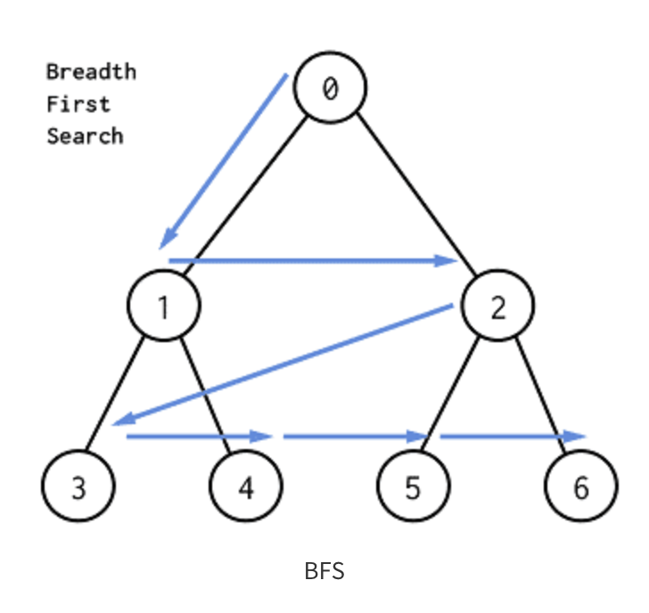
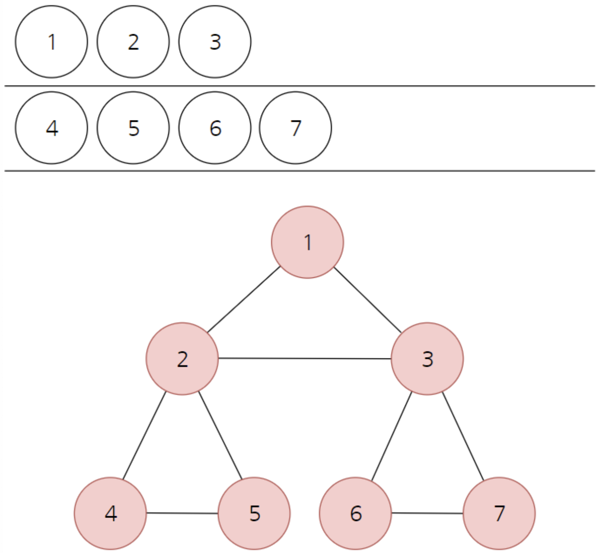

# 우선 너비 탐색 (BFS - Breadth First Search)

## 사전 지식
### 그래프
각 정점들이 어떠한 연관 관계를 갖고 있는지를 나타내는 자료구조다. 
 1. 네트워크 : 각 네트워크 장비를 정점(vertex, node)로 연결을 간선(edge)로 본다면 그래프로 표현이 가능하다.
 2. 경로 찾기 : 특정 위치 간 짧은, 긴 경로를 그래프를 통해서 찾을 수 있다. 
 3. 순서 확인 : 정점을 할 일로 보며 그에 대한 연결을 통해서 순서를 지정할 수 있다. (위상 정렬)
 4. 연결성 확인 : 전자 회로 내 특정 회로가 상호 연결되어 있는지 확인하는 경우 등에 사용한다.

### 비교 대상 - 트리 구조의 계층 순회
[그래프](../Graph.md)도 [트리](Tree.md)와 비슷한 방식으로 동작하는데, 최초 시작 정점에서 가장 먼저 이어져 있는 정점을 모두 순회한 뒤, 각 순회된
정점부터 또 시작하여 가장 먼저 이어진 정점을 순회하는 방식을 반복한다.

트리와 큰 차이점은 그래프는 순환(Cycle)할 수 있다는 것, 그래서 순환 탐지(Cycle Detection)을 할 수 있도록 추가 기능을 구현해야 한다.

<cite>BFS 예시, 출처 : https://victorqi.gitbooks.io/swift-algorithm/content/breadth-first_search_bfs.html</cite>

위 그래프는 A 정점에서 시작하여 B, C를 우선 탐색하고 B,C가 인접하고 있는 정점을 순환하고 있다.
순서는 `A -> B -> C -> D -> E -> F -> G -> H`가 된다.

## BFS
탐색을 할 떄 너비를 우선하여 탐색하는 알고리즘이다. '맹목적인 탐색'을 할 때 사용할 수 있는 탐색 기법이다. 
`최단 경로`를 찾아준다는 점에서 최단 길이를 보장해야할 떄 많이 사용한다.

이 때 큐를 사용한다. 방문 처리가 된 노드들을 큐에 넣는다. 



 1 -> 2 -> 3 -> 4 -> 5 -> 6 -> 7 순으로 큐에 들어간다.

```java

class Bfs {
    public static void main(String[] args) {

        // 그래프를 2차원 배열로 표현해줍니다.
        // 배열의 인덱스를 노드와 매칭시켜서 사용하기 위해 인덱스 0은 아무것도 저장하지 않습니다.
        // 1번인덱스는 1번노드를 뜻하고 노드의 배열의 값은 연결된 노드들입니다.
        int[][] graph = {{}, {2,3,8}, {1,6,8}, {1,5}, {5,7}, {3,4,7}, {2}, {4,5}, {1,2}};
        boolean[] visited = new boolean[9];
        
        
        
    }
    
    static String bfs( int start, int[][] graph, boolean[] visited ) {
        StringBuilder sb = new StringBuilder();
        Queue<Ineter> queue = new LinkedList<Integer>(); 
        
        queue.offer(start);
        visited[start] = true;
        
        
        while( !queue.isEmpty() ) {
            int nodeIndex = q.poll();
            sb.append(nodeIndex + " -> ");
            for(int i=0; i<graph[nodeIndex].length; i++) {
                int temp = graph[nodeIndex][i];
                // 방문하지 않았으면 방문처리 후 큐에 넣기
                if(!visited[temp]) {
                    visited[temp] = true;
                    q.offer(temp);
                }
            }
        }

        // 탐색순서 리턴
        return sb.toString() ;
    }
    
    
    
}
//출처: https://codingnojam.tistory.com/41 [아는 만큼 재밌는 개발 Coding Knowjam(코딩노잼):티스토리]
```

## 동작
재귀적으로 동작하지 않고 노드들을 차례대로 방문할 수 있는 큐를 사용한다. FIFO를 원칙으로 한다.

## 목적 
시작점에서 가까운 점을 방문하고 멀리 떨어져 있는 점을 나중에 방문하기 때문에 최단 경로를 찾을 떄 사용한다.

```java
public class Node {
    int data;
    Node lt;
    Node rt;

    public Node(int val) {
        data = val;
    }
}

public class BFS {
    Node root;

    public static void main(String[] args) {
        BFS tree = new BFS();
        tree.root = new Node(0);
        tree.root.lt = new Node(1);
        tree.root.rt = new Node(2);
        tree.root.lt.lt = new Node(3);
        tree.root.lt.rt = new Node(4);
        tree.root.rt.lt = new Node(5);
        tree.root.rt.rt = new Node(6);

        tree.scan(tree.root);
    }

    public void scan(Node element) {
        Queue<Node> queue = new LinkedList<>();
        queue.offer(element);
        int L = 0;


        while (!queue.isEmpty()) {
            int len = queue.size();
            System.out.print(L + " : ");

            for ( int i = 0; i < len; ++i) {
                Node current = queue.poll();
                System.out.print(current.data + " ");
                if(Objects.nonNull(current.lt)) queue.offer(current.lt);
                if(Objects.nonNull(current.rt)) queue.offer(current.rt);
            }

            L ++;
            System.out.println();
        }
    }
}
/**
 * 0 : 0 
 * 1 : 1 2 
 * 2 : 3 4 5 6 
 */
```


## BFS 사용 예시
[다익스트라(Dijkstra) 알고리즘](Dijkstra.md)으로 최단 경로를 찾을 떄고 활용되며,  Network Flow의 [Maximum Flow(최대 유량)](Network.md)를 찾기 위한
`Ford-Fulkerson 알고리즘`에도 사용된다.


[땅따먹기 lv.2](https://school.programmers.co.kr/learn/courses/30/lessons/12913)
<pre>
땅따먹기 게임을 하려고 합니다. 땅따먹기 게임의 땅(land)은 총 N행 4열로 이루어져 있고,
모든 칸에는 점수가 쓰여 있습니다.
1행부터 땅을 밟으며 한 행씩 내려올 때,
각 행의 4칸 중 한 칸만 밟으면서 내려와야 합니다.
단, 땅따먹기 게임에는 한 행씩 내려올 때,
같은 열을 연속해서 밟을 수 없는 특수 규칙이 있습니다.

예를 들면,
| 1 | 2 | 3 | 5 |
| 5 | 6 | 7 | 8 |
| 4 | 3 | 2 | 1 |

로 땅이 주어졌다면, 1행에서 네번째 칸 (5)를 밟았으면,
2행의 네번째 칸 (8)은 밟을 수 없습니다.
마지막 행까지 모두 내려왔을 때,
얻을 수 있는 점수의 최대값을 return하는 solution 함수를 완성해 주세요.
위 예의 경우,
1행의 네번째 칸 (5),
2행의 세번째 칸 (7),
3행의 첫번째 칸 (4) 땅을 밟아 16점이 최고점이 되므로 16을 return 하면 됩니다.

제한사항
- 행의 개수 N : 100,000 이하의 자연수
- 열의 개수는 4개이고, 땅(land)은 2차원 배열로 주어집니다.
- 점수 : 100 이하의 자연수
</pre>

```java
class Problem {
    //BFS
    public int solution(int[][] land) {

        for (int y = 1; y < land.length; y++) {
            int max = -1;
            for (int x = 0; x < land[0].length; x++) {
                if (x != 0) max = Math.max(land[y][x] + land[y - 1][0], max);
                if (x != 1) max = Math.max(land[y][x] + land[y - 1][1], max);
                if (x != 2) max = Math.max(land[y][x] + land[y - 1][2], max);
                if (x != 3) max = Math.max(land[y][x] + land[y - 1][3], max);

                land[y][x] = max;
                max = -1;
            }
//            System.out.println(Arrays.stream(land[y]).boxed().map(String::valueOf).collect(Collectors.joining(", ")));;
        }

        int max = -1;
        for (int x = 0; x < 4; x++) max = Math.max(land[land.length - 1][x], max);
        return max;
    }
}
```
