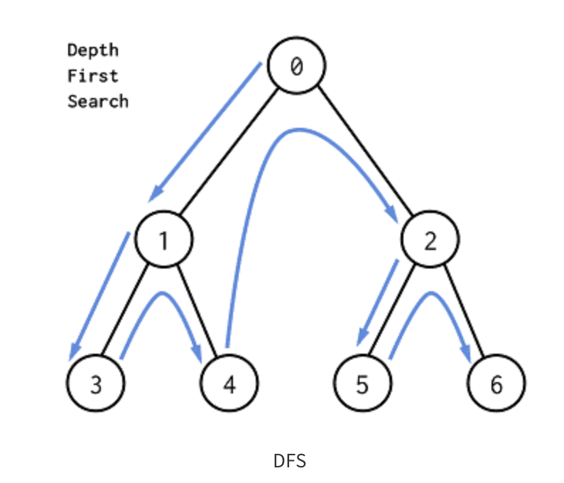
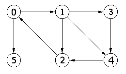

# 깊이 우선 탐색 (DFS - Depth First Search)

## 비교
가장 쉽게 비교할 수 있는 것은 Tree 구조의 순회(in/pre/post)이다.
최초 시작 지점에서 가장 먼저 이어져 있는 (간선으로 연결된) 정점을 하나 찾고 해당 정점에서 또 인접한 정점을 찾아 더 이상 깊이 갈 수 없을 때까지 탐색한 뒤
돌아오는 방식이다.

트리와의 차이점은 그래프는 순환할 수 있다. 그래서 순환 탐지를 할 수 있도록 구현해야 한다.
BFS와 큰 차이점은 DFS는 탐색을 한 뒤 이전의 정점으로 돌아온다는 것이다. 이를 Backtracking이라고 한다.



## 예시
그래프의 순환이 있는지 확인하는 경우 많이 쓰인다.
BFS는 인접 정점을 다 체크하고 넘어가서 최소 경우로만 이동하도록 보장된다.
DFS는 느리든 빠르든 탐색부터해서 해당 경로가 최단이라고는 보장이 어렵다. 최단 거리를 찾기 위해서는 모든 경우의 수를 다 시도해야 하는데 이는 BruteForce가 된다.


## DFS
탐색에서 깊이를 우선적으로 하여 탐색하는 알고리즘이다. 
BFS는 Queue DFS는 스택을 사용한다. 추가적으로 스택 없이도 가능하다( 재귀를 이용하면 된다.)


```java
class DFS {
    static ArrayList<Integer>[] adj; // adjacency list representation of the graph
    static boolean[] visited; // array to keep track of visited vertices

    public static void dfs(int v) {
        Stack<Integer> stack = new Stack<>();
        stack.push(v);
        visited[v] = true;

        while (!stack.isEmpty()) {
            int vertex = stack.pop();
            System.out.print(vertex + " ");

            for (int neighbor : adj[vertex]) {
                if (!visited[neighbor]) {
                    stack.push(neighbor);
                    visited[neighbor] = true;
                }
            }
        }
    }

    public static void main(String[] args) {
        int n = 5; // number of vertices
        adj = new ArrayList[n];
        visited = new boolean[n];

        // initialize adjacency list and visited array
        for (int i = 0; i < n; i++) {
            adj[i] = new ArrayList<>();
            visited[i] = false;
        }

        // add edges to the graph
        adj[0].add(1);
        adj[0].add(2);
        adj[1].add(2);
        adj[2].add(0);
        adj[2].add(3);
        adj[3].add(3);

        for (int i = 0; i < n; i++) {
            if (!visited[i]) {
                dfs(i);
            }
        }
    }
}
```