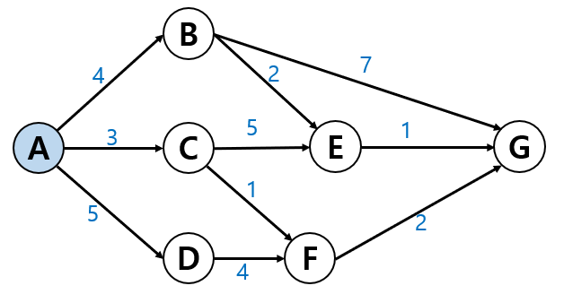

# Dijkstra

[다이나믹 프로그래밍](../DynamicProgramming.md)을 활용한 최단 경로 탐색 알고리즘이다.
특정한 하나의 정점에서 다른 모든 정점으로 가는 최단 경로를 알려준다. 다만, 이 때 음의 간선을 포함할 수 없다. 

다익스트라가 다이나믹 프로그래밍 문제인 이유는 최단 거리는 여러 개의 최단 거리로 이뤄져있기 때문이다.


A에서 출발하고 파란 숫자는 이동하는데 드는 비용이라고 하면
- A -> B 는 비용 4
- A -> C 는 비용 3
- A -> D 는 비용 5
가 된다. 뒤이어 계속 탐색하면
- B -> E 는 비용 6 (A ~ E)
- B -> G 는 비용 11 (A ~ G) 도착!
이 된다.

이와 같이 계산하면 
- C -> E : 8
- C -> F : 4
- D -> F : 7

----

- E -> G : 7  ( A -> E -> G)
- F -> G : 6  ( A -> C -> G)
- F -> G : 11 ( A -> F -> G)

다익스트라는 전체 경로의 최단 경로를 찾기 위해서 중간 중간 부분 노드에서 최단 경로를 찾고 새로 탐색한 경로가 내가 이전에
찾았던 경로보다 더 짧은 거리라면 해당 거리로 계속 업데이트한다.

이 저장하고 업데이트하는 과정은 배열을 사용한다.
1. 노드 수만큼 배열을 생성한다.
2. 배열의 값을 출발 노드에는 0, 나머지는 infinite로 넣는다.

| index | node | distance  |
|:-----:|:----:|:---------:|
|   0   |  A   |     0     |
|   1   |  B   |    INF    |
|   2   |  C   |    INF    |
|   3   |  D   |    INF    |
|   4   |  E   |    INF    |
|   5   |  F   |    INF    |

3. 출발 노드 큐에 삽입한다. (PriorityQueue)
4. 가능성을 모두 탐색하고 목적지를 큐에 넣는다. 
5. 그 다음 큐에서 데이터를 뺴서 계속 탐색 진행

| index | node | distance |
|:-----:|:----:|:--------:|
|   0   |  A   |    0     |
|   1   |  B   |    3     |
|   2   |  C   |    2     |
|   3   |  D   |    3     |
|   4   |  E   |    9     |
|   5   |  F   |    5     |

```java
class dijkstra {
    public int shortestPath(Igraph graph, int src, int dst) {
        int size = 0;
        for ( int n : graph.getVertexes()) {
            if ( size < n ) {
                size = n + 1;
            }
        }
        
        // 가장 먼저 노드가 몇 개인지 센다.
        
        
        int[] dist = new int[size]; //distance를 노드 개수 만큼 초기화
        for ( int i = 0; i < dist.length; i ++ ) {
            dist[i] = Integer.MAX_VALUE; //distnace를 INFINITE로 초기화
        }
        
        dist[src] = 0;// 시작 노드의 거리 = 0
        
        
        // 우선순위 큐를 생성
        PriorityQueue<int[]> pq = new PriorityQueue<> ( (a, b) ->  a[1] - b[1]);
        pq.add(new int[] {src, 0}); //노드 번호, 해당 노드까지의 최단거리
        
        
        //큐가 빌 때까지 반복
        while ( !pq.isEmpty() ) {
            int[] top = pq.poll();
            int vertex = top[0];
            int distance = top[1];
            
            if( dis[vertex] < distance )  continue; //지금 vertex의 배열에서 위치가 최단거리보다 짧으면 스킵 
            
            
            for ( int node : graph.getNodes(vertex) ) {
                if ( dist[node] > dist[vertex] + graph.getDistance(vertex, node) ) {
                    dist[node] = dist[vertex] + graph.getDistance(vertex, node);
                    pq.add( new int[] {node, dist[node]} );
                }
            }
        }
        
        
        return dist[dst];
    }
}
```
## 요약
1. 출발점 설정 : 


## 다른 알고리즘과 비교
|  \  |                               [Floyd-Warshall](FloydWarshall.md)                               |             Bellman-Ford              |                              [Dijkstra](Dijkstra.md)                              |
|:---:|:------------------------------------------------------------------------------:|:-------------------------------------:|:----------------------------------------------------------------------:|
| 장점  | - 모든 정점 쌍 간 최단 거리를 한 번에 계산 가능<br/> - 음의 가중치의 간선도 처리 가능<br/> - 경로 추적을 위한 경로도 제공 | - 음의 가중치의 간선도 처리 가능<br/> - 음수 사이클 감지  | - 시간 복잡도가 O((V+E)logV)로 빠르다. <br/> - 그래프에서 음의 가중치를 가지는 간선이 없는 경우 적합하다. |
| 단점  |          - 시간 복잡도가 O(V^3)   으로 계산 양이 많다.<br/> - 밀집 그래프에서 메모리 사용량이 많다.          | - 시간 복잡도가 O(V * E)로 간선 수에 비해 계산량이 크다. |      - 음의 가중치르 가지는 간선 처리 불가 <br/> - 시작 ~ 도착 정점 간의 최단 경로만 구할 수 있다.      |