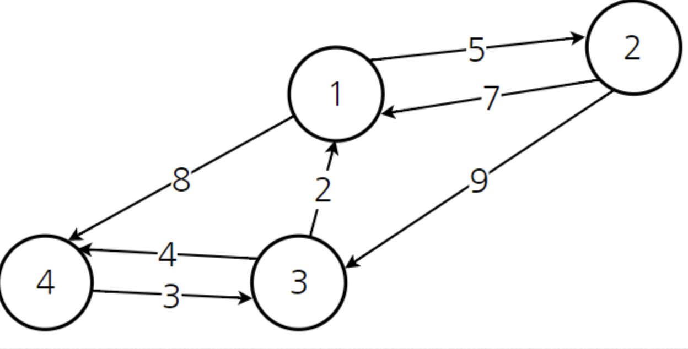

# Floyd Warshall

[Dijkstra](Dijkstra.md)는 하나의 정점에서 출발했을 때 따른 모든 정점으로의 최단 경로를 구하는 알고리즘이다. 
하지만 만약에 '모든 정점'에서 '모든 정점'으로 최단 경로를 구하고 싶으면 FloydWarshall을 사용해야 한다.

Dijkstra는 가장 적은 비용을 하나씩 선택해야 했다면 FloyWarshall은 기본적으로 거쳐가는 정점을 기준으로 알고리즘을 수행한다는 특징이 있다. 
추가적으로 [다이나믹 프로그래밍](../DynamicProgramming.md)을 사용한다.


<q> 플로이드 와샬 알고리즘의 핵심은 '거쳐가는 정점'을 기준으로 최단 거리를 구하는 것이다. </q>



위와 같은 그래프가 존재한다고 했을 때 각각의 정점이 다른 정점으로 가는 비용을 이차원 배열의 형태로 출력하면 아래와 같다.

|  \  |  1  |  2  |    3     |    4     | 
|:---:|:---:|:---:|:--------:|:--------:|
|  1  |  0  |  5  | INFINITE |    8     |
|  2  |  7  |  0  |    9     | INFINITE |
|  3  |  2  | INFINITE    |    0     |    4     |
|  4  |   INFINITE  | INFINITE    |    3     |    0     |
* INFINITE는 노드를 거치지 않고 바로 가는 간선이 없는 경우 

이 테이블이 의미하는 바는 '현재까지 계산된 최소 비용'이다. 이러한 이차원 배열을 반복적으로 갱신하면서 모든 최소 비용을 구할 것이다.
여기서 반복의 기준이 '거쳐가는 정점'이다.

1) 노드 1을 거치는 경우

|  \  |    1     |    2     |    3     |  4  |
|:--------:|:--------:|:--------:|:---:|:--------:|
|  1  |   0      |    5     | INFINITE |  8  |
|  2  |   7      |    0     |    -     |  -  |
|  3  |   2      |    -     |    0     |  -  |
|  4  | INFINITE |    -     |    -     |  0  |

- 만 갱신하면 된다.

식은 `x -> y 스트레이트 비용 vs. x -> node 1 -> y 비용` 이를 바탕으로 갱신하면 아래와 같다.


|  \  |    1     |        2         |    3     |        4        |
|:--------:|:--------:|:----------------:|:--------:|:---------------:|
|  1  |   0      |        5         | INFINITE | 8               |
|  2  |   7      |        0         |    9     |       15        |
|  3  |   2      |        7         |    0     |        4        |
|  4  | INFINITE |     INFINITE     |    3     |        0        |


이 아이디어를 모든 거쳐가는 노드에 적용시키면

|   \   |  1  |  2  |  3  |  4  |
|:-----:|:---:|:---:|:---:|:---:|
|   1   |  0  |  5  |  1  |  8  |
|   2   |  7  |  0  |  9  | 13  |
|   3   |  2  |  7  |  0  |  4  |
|   4   |  5  | 10  |  3  |  0  |

이 된다.

```java
class FloydWarshall {
    public static void main(String[] args) {
        int[][] input = {
                {0, 5, Integer.MAX_VALUE, 8},
                {7, 0, 9, Integer.MAX_VALUE},
                {2, Integer.MAX_VALUE, 0, 8},
                {Integer.MAX_VALUE, Integer.MAX_VALUE, 3, 8},
        };
        
        getFloydWarshallResult(input);
    }

    public static int[][] getFloydWarshallResult (int[][] input) {
        int[][] result = new int[4][4];
        int length = result.length;
        
        for ( int i = 0; i < length; i ++ ) {
            for ( int j = 0; j < length; j ++ ) {
                result[i][j] = input[i][j];
            }
        }
        
        //k = 거쳐가는 노드
        for ( int k = 0; k < length; k ++ ) {
            // i = 출발 노드
            for ( int i = 0; i < length; i ++ ) {
                // j = 도착 노드
                for ( int j = 0; j < length; j ++ ) {
                    result[i][j] = Math.min(result[i][k] + result[k][j], result [i][j]);
                }
                
            }
        }
        
        return a;
    }
}
```