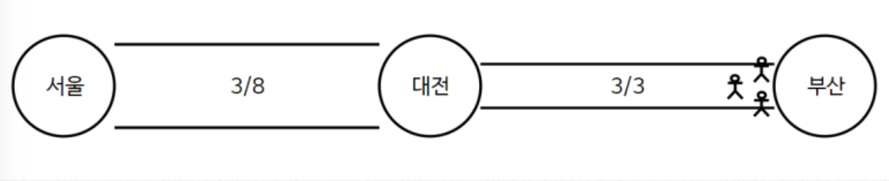

# NetworkFlow

네트워크 플로우는 <u>특정한 지점에서 다른 지점으로 데이터가 얼마나 흐르고 있는가</u>를 측정하는 알고리즘이다.


서울 -> 대전 -> 부산으로 이동시킬 때 서울 -> 대전 폭은 8, 대전 -> 부산 폭은 3이라고 할 때



서울 -> 부산으로 8명을 보내면 1초 뒤 대전에 5명이 대기하게 된다.
3/8, 3/3 은 `유량/용량`이다.

다른 예를 들어보자


A -> B : 8
B -> C : 6
C -> D : 7
이 최대로 보낼수 있는 양이라고 할 떄 A -> D로 보낼 때 최고로 보낼 수 있는 양은 얼마인가?
6이다. 이 이상 보내면 병목이 발생한다. 이러한 문제를 해결하는 핵심 알고리즘이 네트워크 플로우 알고리즞ㅁ이다.
일반적으로 이를 <b>최대 유량(MaxFlow)</b>라고 한다.

<h4>
    <q>최대 유량 문제는 간성에 정해진 용량이 있을 떄 A -> B로 보낼 수 있는 최대 유량을 구하는 문제다.</q>
</h4>


1 -> 6으로 보낼 수 있는 최대 유량을 계산해보자. 기본적으로 최대 유량 문제는 가능한 경우의 수를 모두 탐색하는 방법을 사용한다. 이 때 (BFS)를 사용하는 것이 일반적이다.
이를 `에드몬드 카프(Edmonds-Karp)` 알고리즘이라고도 한다.

일단 유량을 모두 0으로 초기화한다. 그리고 현재 흐르고 있는 용량 안에서 가능한 용량의 양을 반복적으로 더해주면 된다. 


- 1 -> 2 -> 3 -> 6      : 6
- 1 -> 2 -> 6           : 6
- 1 -> 4 -> 5 -> 6      : 4
- 1 -> 4 -> 5 -> 3 -> 6 : 2

여기서 더 보내 수 있는 방법이 없어보인다. 여기에서 `음의 유량을 계산`한다는 최대 유량 알고리즘의 핵심적인 아이디어가 제시된다.
예를 들어 2 -> 3 일 때 6만큼 흐른다. 3의 관점에서는 3 -> 2로  -6만큼 흐르고 있다고 볼 수 있다. 
이런 아이디어가 필요한 이유는 `남은 모든 가능한 경로를 더 찾아내기 위해서이다.`


- 1 -> 4 -> 5 -> 3 -> 2 -> 6 : 1의 경우 2 -> 3의 유량을 1을 역으로 뺴주는 아이디어로 
음의 유량까지 고려하여 모든 경우의 수를 찾아 줄 때의 최적의 해를 찾을 수 있다.

결과적으로 위 그래프에서 최대 유량은 19가 된다.

````
최대 유량 알고리즘은 순서가 상관이 없다. 남아있는 양이 1이 넘으면 계속해서 흘려보내주면 알아서 최적화가 이뤄진다.
````

