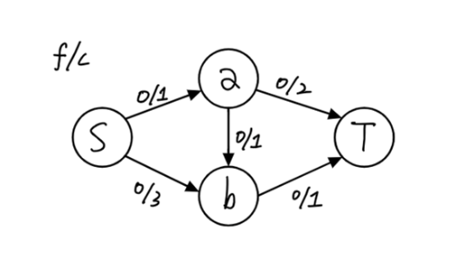
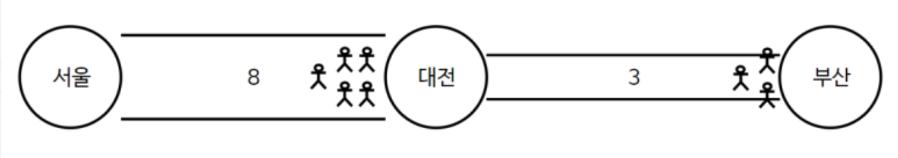

# NetworkFlow

## 용어
1. 용량(Capacity)
   - c( u, v ) : 정점 u에서 v로 전송할 수 있는 최대 용량
2. 유량(Flow)
   - f( u, v ) : 정점 u에서 v로 실제로 흐르고 있는 유량
3. 잔여용량(Residual Capacity)
   - r( u, v ) = c( u, v ) - f( u, v )
   - 간선의 용량과 실제로 흐르는 유량의 차이
4. 소스(Source)
   - 모든 유량이 시작되는 정점
5. 싱크(Sink)
   - 모든 유량이 도착하는 정점
6. 증가 경로
   - 소스에서 싱크로 유량을 보낼 수 있는 경로

## 기본 속성
1. 용량 제한 속성
   - f (u, v) <= c(u, v)
     - 유량은 용량보다 작거나 같다.
2. 유량의 대칭성
   - f (u, v) = -f(v, u)
     - u에서 v로 유량이 흐르면, v에서 u로 음수의 유량이 흐르는 것과 동일하다.
3. 유량의 보존성
   - 각 정점에 들어오는 유량과 나가는 유량은 같다.

## 기존 최대 유량 탐색의 문제점?


- S -> a -> T
- S -> a -> b -> T
- S -> b -> t

```
`s -> a -> b -> t`를 먼저 탐색하면

`s -> a`, `a -> b`, `b -> t` 간선의 유량이 최대치이기 때문에

`s -> b`에 추가로 연결된 경로를 찾지 못하고 최대 유량이 1인 상태에서 프로그램은 중지
```
이 문제를 해결하려면? -> `유량 상쇄`를 통해서 해결할 수 있다.

### 유량 상쇄
유량 상쇄란, 모든 경로에, 기존에 존재하는 간선들과 반대되는 방향의 간선을 추가한 뒤, 각 간선으로 유량으로 흘려보냈을 때, 반대 방향의 간선으로도 음의 유량을
흘러보냄으로써, 유량을 상쇄시키는 것을 의미한다.

물론 실제로는 불가능하지만, 음의 유량을 기록함으로써 잔여 용량을 남겨 추가적인 경로를 탐색하 ㄹ수 있도록 하기 위한 작업이다.

- a -> b 간선이 존재하면, 유량 f(a, b)은 1, 용량 c(a, b)은 1이라고 하면,
- 역간선 b -> a의 유량 f(b, a)은 기존 간선의 방향과 반대이므로 -1 이 되며,
- 용량 c(b, a)은 실제 존재하는 간선이 아니므로 0이 된다.
- 따라서, 역간선 b -> a의 잔여 용량 r(b,a)은, c(b,a) - f(b, a) = 0 - ( -1 ) = 1이 된다.
- 즉, 역간선 b -> a로 1의 유량을 추가적으로 흘려보낼 수 있게 된다. 

해당 규칙은, 두 정점이 서로에게 유량을 보내주는 것은 의미가 없기 떄문에 성립할 수 있으며, 소스에서 싱크로가는 총 유량도 변하지 않는다.


## 최대 유량 종류 및 진행 순서


## #에드몬드 - 커프

   1. 네트워크에 존재하는 모든 간선의 유량을 0으로 초기화하고, 역방향 간선의 유량도 0으로 초기화
   2. 소스에서 싱크로 갈 수 있는, 잔여 용량이 남은 경로를 BFS로 탐색한다.
   3. 해당 경로에 존재하는 간선들의 잔여 용량 중, 가장 작은 값을 유량으로 흘려보낸다.
   4. 해당 유량에 음수 값을 취해, 역방향 간선에도 흘려보낸다.(유량 상쇄)
   5. 더 이상 잔여 용량이 남은 경로가 존재하지 않을때까지 반복

네트워크 플로우는 <u>특정한 지점에서 다른 지점으로 데이터가 얼마나 흐르고 있는가</u>를 측정하는 알고리즘이다.

서울 -> 대전 -> 부산으로 이동시킬 때 서울 -> 대전 폭은 8, 대전 -> 부산 폭은 3이라고 할 때


서울 -> 부산으로 8명을 보내면 1초 뒤 대전에 5명이 대기하게 된다.
3/8, 3/3 은 `유량/용량`이다.

다른 예를 들어보자


A -> B : 8
B -> C : 6
C -> D : 7
이 최대로 보낼수 있는 양이라고 할 떄 A -> D로 보낼 때 최고로 보낼 수 있는 양은 얼마인가?
6이다. 이 이상 보내면 병목이 발생한다. 이러한 문제를 해결하는 핵심 알고리즘이 네트워크 플로우 알고리즞ㅁ이다.
일반적으로 이를 <b>최대 유량(MaxFlow)</b>라고 한다.

<h4>
    <q>최대 유량 문제는 간성에 정해진 용량이 있을 떄 A -> B로 보낼 수 있는 최대 유량을 구하는 문제다.</q>
</h4>


1 -> 6으로 보낼 수 있는 최대 유량을 계산해보자. 기본적으로 최대 유량 문제는 가능한 경우의 수를 모두 탐색하는 방법을 사용한다. 이 때 (BFS)를 사용하는 것이 일반적이다.
이를 `에드몬드 카프(Edmonds-Karp)` 알고리즘이라고도 한다.

일단 유량을 모두 0으로 초기화한다. 그리고 현재 흐르고 있는 용량 안에서 가능한 용량의 양을 반복적으로 더해주면 된다. 


- 1 -> 2 -> 3 -> 6      : 6
- 1 -> 2 -> 6           : 6
- 1 -> 4 -> 5 -> 6      : 4
- 1 -> 4 -> 5 -> 3 -> 6 : 2

여기서 더 보내 수 있는 방법이 없어보인다. 여기에서 `음의 유량을 계산`한다는 최대 유량 알고리즘의 핵심적인 아이디어가 제시된다.
예를 들어 2 -> 3 일 때 6만큼 흐른다. 3의 관점에서는 3 -> 2로  -6만큼 흐르고 있다고 볼 수 있다. 
이런 아이디어가 필요한 이유는 `남은 모든 가능한 경로를 더 찾아내기 위해서이다.`


- 1 -> 4 -> 5 -> 3 -> 2 -> 6 : 1의 경우 2 -> 3의 유량을 1을 역으로 뺴주는 아이디어로 
음의 유량까지 고려하여 모든 경우의 수를 찾아 줄 때의 최적의 해를 찾을 수 있다.

결과적으로 위 그래프에서 최대 유량은 19가 된다.

````
최대 유량 알고리즘은 순서가 상관이 없다. 남아있는 양이 1이 넘으면 계속해서 흘려보내주면 알아서 최적화가 이뤄진다.
````


### 포드 - 풀커슨

1. 네트워크에 존재하는 모든 간선의 유량을 0으로 초기화하고, 역방향 간선의 유량도 0으로 초기화
2. 소스에서 싱크로 갈 수 있는, 잔여 용량이 남은 경로를 DFS로 탐색한다.
3. 해당 경로에 존재하는 간선들의 잔여 용량 중, 가장 작은 값을 유량으로 흘려보낸다.
4. 해당 유량에 음수 값을 취해, 역방향 간선에도 흘려보낸다.(유량 상쇄)
5. 더 이상 잔여 용량이 남은 경로가 존재하지 않을때까지 반복
