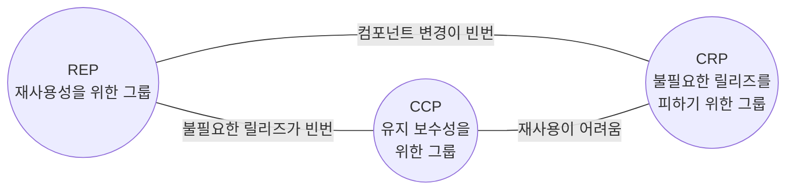

# 컴포넌트 원칙

- 컴포넌트 원칙은 빌딩에 방을 배치하는 방법을 설명한다.

## 컴포넌트 
- 배포 단위다.
- 시스템의 구성 요소로 배포할 수 있는 가장 작은 단위다.
- 더 나아가 SW를 재사용성의 중요성과 필요성을 위해 나온 개념이다. -> 컴포넌트는 독립적 SW 모듈

## 컴포넌트 응집도
> - REP: 재사용/ 릴리즈 등가 원칙(Reuse/Release Equivalence Principle)
> - CCP: 공통 폐쇄 원칙(Common Closure Principle)
> - CRP: 공통 재사용 원칙(Common Reuse Principle)

### REP: 재사용/ 릴리즈 등가 원칙
- 재사용 단위는 릴리즈 단위와 같다.
- 이 원칙을 설계, 아키텍쳐 관점으로 보면 '단일 컴포넌트는 응집성 높은 클래스와 모듈들로 구성되어야 함'을 의미한다.
- 컴포넌트를 구성하는 모든 모듈은 서로 공유하는 중요한 테마나 목적이 있어야 한다.

### CCP: 공통 폐쇄 원칙
- 동일한 이유로 동일한 시점에 변경되는 클래스를 같은 컴포넌트로 묶어라
- 서로 다른 시점에 다른 이유로 변경되는 클래스는 다른 컴포넌트로 분리하라
- 단일 컴포넌트는 변경의 이유가 여러 개 있어서는 안 된다.
- 따라서 같은 이유로 변경될 가능성이 있는 클래스는 모두 한 곳으로 묶을 것을 권한다.
- 동일한 유형의 변경에 대해서 닫혀 있는 클래스들을 하나의 컴포넌트로 묶음으로써 OCP를 확장한다.

### CRP: 공통 재사용 원칙
- 컴포넌트 사용자들을 필요하지 않는 것에 의존하게 강요하지 말라.
- 대체로 재사용 가능한 클래스들은 재사용 모듈의 일부로 편입시키는 경우가 많다. CRP는 이런 클래스들이 동일한 컴포넌트에 포함되어야 한다고 말한다.
- 컴포넌트 간 '사용'이 생기면 상호 의존성이 생긴다. 따라서 사용하면 의존성이 생김을 인지해야 한다.
- 따라서 '어떻게 묶을지'보다는 어떤 클래스를 한 곳에 묶어서는 안되는지에 초점을 둬야 한다. 
- ISP의 포괄적 버전이다.

### 전체적으로 다시 보면
- REP, CCP는 포함 원칙이다. CRP는 배제 원칙이다. 따라서 적당히 균형을 이뤄야 한다.

## 컴포넌트 결합
> - ADP: 의존성 비순환 원칙
> - SDP: 안정된 의존성 원칙
> - SAP: 안정된 추상화 원칙

### ADP(의존성 비순환 원칙)
- WeeklyBuild: 쌓아놓고 하는 빌드는 통합을 위한 통합을 해야 한다. 또한 위험도 커진다. 따라서 주기적 빌드를 하는 것이 추천된다.
- 의존성 순환 제거: 비순환 방향 그래프를 유지한다. 만약 순환이 있다면 끊고 의존성을 다시 DAG로 복구하는 것이 좋다.
  - DIP를 이용하기
  - 흐트러짐이 발생하면 어떤 식으로든 끊기 (컴포넌트는 시스템 논리 설계에 발맞춰 성장해야 한다.)

### SDP(안정된 의존성 원칙)
- 안정성의 방향, 안정된 쪽으로 의존하자
- 설계 시 의존하는 방향이 영원할 수는 없다.
- 특히나 의존하고 있는게 변하면 정말 골치가 아프다.
- 따라서 변경되지 않을 모듈에 의존하는 것이 이런 문제를 미연에 방지할 수 있는 길이다.
- 안정성은 변화가 발생하는 빈도에 초점을 두기 보다는 쉽게 변경되지 않는 쪽이 더 적합하다.
- 또한 모든 컴포넌트가 안정적이어야만 하는 것은 아니다. 오히려 모두 안정적이면 변경이 불가능한 시스템일 것이다.
- 내부적으로 불안정도 있고 안정도 있지만 외부로 보이는 인터페이스가 흔들리지 않은 경우를 의미한다.
- 인터페이스, DIP가 이 역할을 해줄 것이다.

### SAP(안정된 추상 원칙)
- 컴포넌트는 안정된 정도만큼만 추상화되어야 한다.
- 고수준 아키텍쳐, 정책은 자주 변경되면 문제가 된다. 그렇다고 이들을 안정권 컴포넌트에 위치시키면 수정이 어려워진다.
- 따라서 추상화로 이런 문제를 해결한다.
- SAP는 안정성, 추상화 정도의 관계를 정의한다. 
- 안정될수록 추상화 정도가 높으며, 이를 통해서 확장성도 담보한다. 다른 한편으로 불안정할수록 구체적이어야 한다.