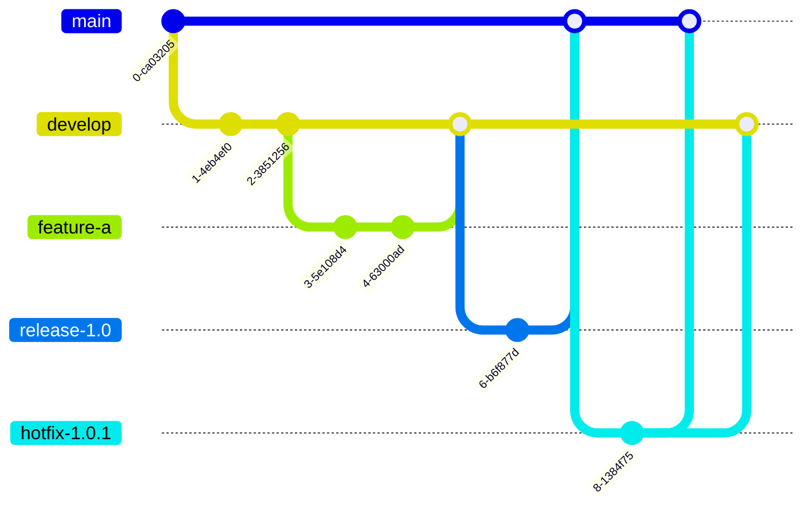
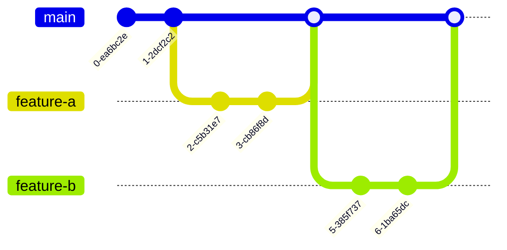
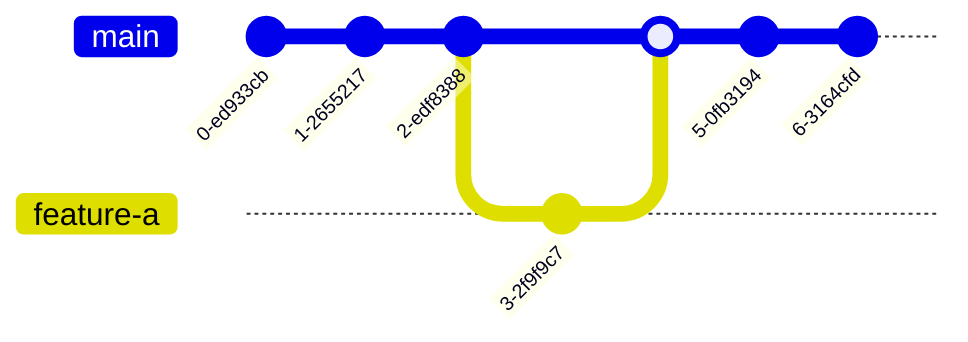

# GitFlow

```mermaid
gitGraph
    commit
    branch develop
    commit
    commit
    checkout main
    checkout develop
    branch feature-a
    commit
    commit
    checkout develop
    merge feature-a
    branch release-1.0
    commit
    checkout main
    merge release-1.0
    branch hotfix-1.0.1
    commit
    checkout main
    merge hotfix-1.0.1
    checkout develop
    merge hotfix-1.0.1
```

# GithubFlow

```mermaid
gitGraph
    commit
    commit
    branch feature-a
    commit
    commit
    checkout main
    merge feature-a
    branch feature-b
    commit
    commit
    checkout main
    merge feature-b
```

# TBD

```mermaid
gitGraph
    commit
    commit
    commit
    branch feature-a
    commit
    checkout main
    merge feature-a
    commit
    commit
```