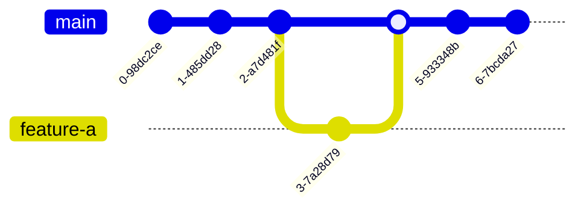

# GitFlow

이 워크플로는 다음과 같은 두 개의 메인 브랜치와 여러 개의 보조 브랜치를 사용해요.
- **메인 브랜치**
    - `main` (또는 `master`): 배포 준비가 완료된, 즉시 배포 가능한 안정적인 코드를 관리해요.
    - `develop`: 다음 배포를 위한 개발을 진행하는 중심 브랜치예요. 모든 개발 브랜치는 이 브랜치에서 시작되고, 이 브랜치로 병합돼요.
---
- **보조 브랜치**
    - `feature` 브랜치: 특정 기능을 개발하기 위해 `develop` 브랜치에서 생성해요. 기능 개발이 완료되면 `develop` 브랜치로 다시 병합하고, 브랜치는 삭제돼요.
    - `release` 브랜치: 배포를 준비하기 위해 `develop` 브랜치에서 생성해요. 이 브랜치에서는 버그 수정, 버전 정보 업데이트 등 최종 배포를 위한 작업만 진행해요. 준비가 완료되면 `main`과 `develop` 브랜치에 모두 병합돼요.
    - `hotfix` 브랜치: `main` 브랜치에서 발견된 심각한 버그를 즉시 수정하기 위해 생성해요. 수정이 완료되면 `main`과 `develop` 브랜치에 모두 병합돼요.
---
**Git Flow**는 **배포 주기가 길고 체계적인 버전 관리가 중요한 프로젝트**에 적합해요. **GitHub Flow**가 지속적인 배포를 목표로 하는 반면, Git Flow는 여러 보조 브랜치를 통해 안정성을 높이는 데 초점을 맞춰요.

# GithubFlow

- **`main` 브랜치**: 배포 가능한 안정적인 코드를 유지하는 중심 브랜치예요.
- **새로운 브랜치 생성**: 새로운 기능 개발이나 버그 수정을 위해 `main` 브랜치에서 새로운 브랜치를 만들어요.
- **커밋**: 새로운 브랜치에서 작업한 내용을 커밋하고, 이 변경 사항을 원격 저장소에 푸시해요.
- **Pull Request (PR)**: 작업이 완료되면 `main` 브랜치로 병합하기 위해 **Pull Request**를 생성해요. 이 PR을 통해 동료 개발자들에게 코드 리뷰를 요청할 수 있어요.
- **리뷰 및 병합**: 동료의 코드 리뷰를 거쳐 승인되면 `main` 브랜치로 병합해요.
- **배포**: `main` 브랜치에 병합된 코드를 **즉시 배포**하는 것을 원칙으로 해요.

# TBD

- **단일 브랜치**: 개발자들이 장기적인 피처 브랜치를 만들지 않고, 모두 동일한 메인 브랜치에서 작업해요.
- **작고 빈번한 커밋**: 기능 개발을 위해 메인 브랜치에 **작고 빈번하게 커밋**하는 것을 권장해요. 이로 인해 충돌 위험이 줄어들고, 문제가 발생하더라도 빠르게 해결할 수 있어요.
- **토글(Toggle)**: 개발 중인 기능은 **피처 토글(Feature Toggle)**이나 **피처 플래그(Feature Flag)**를 사용해 메인 브랜치에 통합돼요. 이 기술을 통해 아직 완성되지 않은 기능을 비활성화한 상태로 메인 브랜치에 커밋할 수 있어요.
- **지속적인 통합**: CI/CD 시스템을 통해 모든 커밋마다 자동으로 테스트를 수행하고 배포하여, 코드의 안정성을 지속적으로 확보해요.