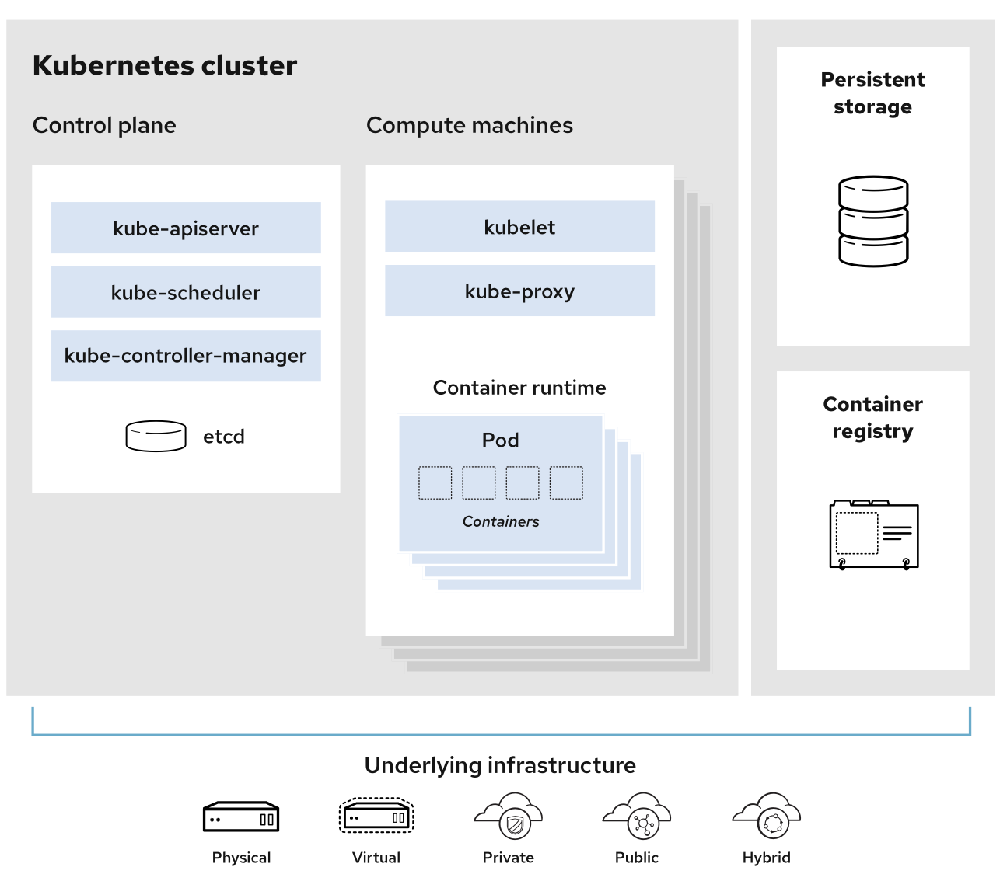
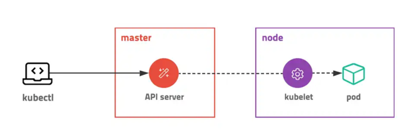
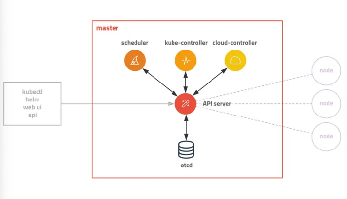
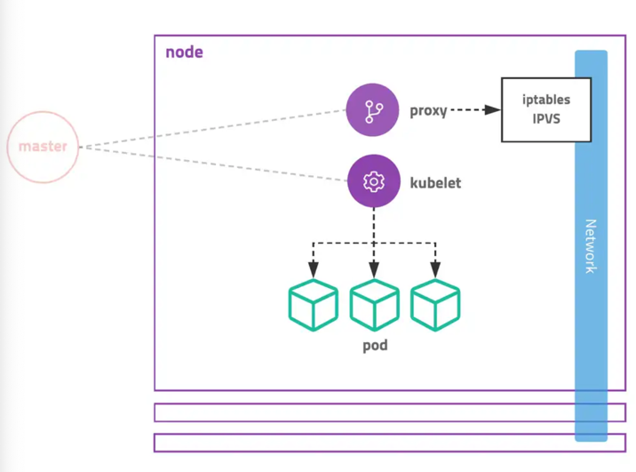

# 쿠버네티스

컨테이너화된 워크로드와 서비스를 관리하기 위한 이식성이 있고, 확장 가능한 오픈소스 플랫폼이다. 쿠버네티스틑 선언적 구성과 자동화를 모두 용이하게 해준다.


## 장점
1. 서버 자원 클러스터링, 마이크로서비스 구조의 컨테이너 배포, 서비스 장애 복구 등 컨테이너 기반의 서비스 운영에 필요한 대부분의 오케스트레이션 기능을 지원
2. 영속성 볼륨(Persistent Volume) : 스케쥴링, 장애복구, 오토스케일링, 서비스 디스커버리 및 인그레스 등 컨테이너 기반의 클라우드를 운영할 때 필요한 대부분의 기능과
컴포넌트를 사용자가 직접 커스터마이징할 수 있다.




## 모든 리소스는 오브젝트 형식으로 관리된다.
모든 리소스는 오브젝트 형태로 관리된다. 예를들어 컨테이너 집합과 이를 관리하는 컨트롤러, 사용자, 노드까지도 오브젝트로 관리할 수 있다.


### 구조


> 전체 클러스터를 관리하는 마스터, 컨테이너가 배포되는 노드로 구성되어 있다.
> 모든 명령은 Master API 서버를 호출하고 노드는 마스터와 통신하면서 필요한 작업을 수행한다.
> 특정 노드의 컨테이너에 명령하거나 로그를 조회할 때도 노드에 직접 명령하는게 아니라 마스터를 통해서 진행한다.

1. Namespace
> - 물리 클러스터 내의 복수의 가상 클러스터
 
2. Master
> - 마스터 서버는 다양한 모듈이 확장성을 고려하여 기능별로 쪼개져 있는 것이 특징이다.
> - 관리자만 접속할 수 있도록 보안 설정이 필요하고 마스터는 보통 홀수 개로 클러스터링한다.

3. Node
> - kubelet, kube-proxy, 동작 중인 pod를 유지시키고 런타임 환경을 제공한다.
> - 노드 서버는 마스터 서버와 통신하면서 필요한 Pod를 생성하고 네트워크와 볼륨을 설정한다.
> - 실제 컨테이너가 생성되는 곳이다.
> - 각각 서버에 라벨을 붙여서 사용 목적을 정의할 수도 있다.

4. Kubectl
> - json, protobuf를 이용한 http 통신을 지원한다.
> - kubectl이라는 명령행 도구를 사용한다.


## Controlplane( MasterNode )


클러스터에 관한 전반적인 결정(scheduling)을 수행하고 클러스터 이벤트를 감지하고 반응한다.
보통 MasterNode는 단독으로 사용자 컨테이너와 분리하여 구성한다.

### kube-apiserver
- 컨트롤 플레인 컴포넌트
- API 서버는 쿠버네티스 컨트롤 플레인의 프론트엔드이다.
- 쿠버네티스 클러스터의 중심 역할을 하는 통로다.

### etcd
- 모든 클러스터 데이터를 담는 쿠버ㅔ티스 뒷단의 저장소로 사용되는 일관성, 고가용성 k-v 저장소다.
- etcd를 복제해두면 장애가 나더라도 시스템의 가용성을 확보할 수 있다.

### kube-scheduler
- 노드의 상태와 자원, 레이블, 요구 조건 등을 고려해서 pod를 어떤 워커 노드로 뿌릴지 결정 및 할당한다.
- cpu, gpu, memory 등 상태 관리

### kube-controller-manager
- 컨트롤러 프로세스를 실행하는 컨트롤 플레인 컴포넌트
- 쿠버네티스에 있는 거의 모든 오브젝트의 상태를 관리한다.
- Deployment는 ReplicaSet을 생성하고 ReplicaSet은 Pod를 생성하고 Pod는 스케쥴러가 관리하는 식이다.

### cloud-controller-manager
- 클라우드 특화 모듈


## Node 컴포넌트( Worker Node )



노드 컴포넌트는 동작 중인 pod을 유지하고 쿠버네티스 런타임 환경을 제공하며, 모든 노드 상에서 동작

### kublet agent
- pod의 구성 내용을 받아서 컨테이너 런타임으로 전달
- 포드 안의 컨테이너들이 정상적으로 작동하는지 모니터링
- kublet은 다양한 메커니즘을 통해 제공된 podSpec을 받아서 컨테이너가 해당 podSpec 따라 동작하는 것을 확정함
- pod 상태를 확인하고 마스터로 전달


### kube-proxy
- pod로 연결되는 네트워크를 관리한다.
- kube-proxy를 통해서 포드가 통신할 수 있는 네트워크를 설정한다.

### 컨테이너 런타임
- 컨테이너 런타임은 컨테이너 실행을 담당하는 소프트웨어


## YAML
YAML로 컨테이너 리소스를 명시적으로 생성하거나 삭제할 수 있다. YAML로는 컨테이너, 모든 리소스 오브젝트들에 사용될 수 있다.
설정값(ConfigMap), 비밀 값(Secrets) 등도 YAML로 정의해서 사용한다.

### 쿠버네티스 기본 세팅

1. apiVersion : 오브젝트 API 버전 ( Pod | ReplicaSet | Deployment | Service )
2. kind : YAML 파일에서 생성하려는 Object 여기서는 Pod
3. metadata : 라벨, 주석, 이름 등과 같은 리소스의 부가 정보
4. spec : 리소스를 생성하기 위한 자세한 정보


## 컴포넌트
쿠버넨티스 노드의 역할은 master-worker로 나뉘어 있다. 마스터는 클러스터를 관리하는 역할을 담당하고, 워커 노드는 애플리케이션 컨테이너가 생성된다.

## Pod : 컨테이너를 다루는 기본 단위
컨테이너 애플리케이션을 구동하기 위해서 반드시 알아야 할 몇 가지 오브젝트가 있다.

### 1. Pod
- 컨테이너 애플리케이션의 기본 단위 ( 1포드 - 1개 이상의 컨테이너가 존재할 수도 있다.)
- 도커 컨테이너와의 차이점 : 여러 리눅스 네임스페이스를 공유하는 여러 컨테이너들을 추상화된 집합으로 사용하기 위해서 
- 완전한 애플리케이션으로서의 포드 : 1개 이상의 컨테이너가 들어설 수는 있지만 보통 1포드 - 1컨테이너로 사용하는 경우가 많다.
- 기능 확장을 위한 추가 컨테이너 : 사이드카 패턴을 통해서 기존 컨테이너를 수정하지 않고 원하는 추가 기능(Logging 등)을 붙이는 식으로 사용할 수 있다.

 ```yaml
spec:
  containers:
    - name: <name>
      images: <imageName>
      ports:
        - containerPort: 
          protocol: TCP
 ```

### 2. ReplicaSet
- 포드의 항상성을 유지해주는 컨트롤러 : 포드가 컨테이너를 추상화해서 하나의 애플리케이션으로 동작하게 만드는 컨테이너 묶음이라면 레플리카셋은 포드의 개수를 일정하게 유지해주는 컨트롤러다.
- 포드에 대한 생성/관리를 쿠버네티스에게 맡기는 시작 포인트 : 직접 생성하면 쿠버네티스가 관리하는 것이 아니라 장애 발생 등에 대응하기 힘들다. 
- 항상성 : 정해진 수의 동일한 포드가 실행되도록 관리해준다. 만일 노드 장애 등이 발생하면 다른 노드에서 포드를 다시 생성한다. (노드 구분 없이 전체 개수를 일정하게 유지할 수 있게 관리해주는 컨트롤러다.)

```yaml
spec:
  replicas: <count> #유지시킬 개수다.
  selector:
    matchLabels:
      app: <appName>
  template:  ## 이 아래로는 포드 생성 시 사용할 템플릿을 정의한다. 포드 스펙, 포드 템플릿이라고 한다.
    metadata:
      name: <replicaSetName>
      labels:
        app: <name>
```

- 느슨한 연결 : 레플리카셋과 포드가 결합되어 있지 않다. 라벨 셀렉터를 통해서 느슨한 연결을 유지하고 있다.
> 라벨은 서로 다른 오브젝트가 서로를 찾아야 할 때 사용되기도 한다. `spec.selector.matchLabel`에 정의된 라벨을 통해서 생성되야할 포드를 찾는다. 

### 3. Deployment

- 레플리카셋의 상위 오브젝트
- 업데이트와 배포를 용이하게 : 디플로이먼트는 컨테이너 애플리케이션을 배포하고 관리하는 역할을 한다.
- 리비전 : 업데이트 시 옵션에 따라서 이전 버전으로 롤백이 용이하도록  리비전을 남겨둔다.(--record)
- 리비전 발생 레플리카 통쨰로 DESRIED, CURRENT로 나눠서 관리한다. 이렇게 디플로이먼트는 여러 개의 레플리카셋을 관리한다.
- 포드의 롤링 업데이트 정책을 사용할 수도 있다.

### 4. Service
- 포드를 연결하고 외부에 노출
- 포드 IP는 고정이 아니라 유동이다. 그래서 하나의 애플리케이션으로 엮으려면 서로 port를 알수 있게 해야한다.
- 포드는 기본적으로 외부 미노출이 원칙이다.
- 다른 디플로이먼트의 포드들이 외부적으로 접근하려면 서비스를 통해야 한다.
- 여러 개의 포드에 쉽게 접근할 수 있도록 고유한 도메인 이름을 부여한다.
- 요청을 분산하는 로드밸런서 기능을 수행한다.
- 클라우드 플랫폼의 로드 밸런서, 클러스터 노드의 포트 등을 통해서 포드를 외부로 노출한다.
- 어떻게 접근할 것이냐에 따라 여러 개로 세분화할 수 있다.

> 1. ClusterIP : 쿠버네티스 내부에서만 포드들에 접근할 때 사용
>    - 따로 무언가를 하지 않아도 서비스와 연결된 여러 개의 포드에 자동으로 요청이 분산된다.
>    - 또한 서비스에는 IP 뿐만 아니라 서비스 이름 그 자체로도 접근할 수 있다.
>    - 쿠버네티스는 애플리케이션이 서비스나 포드를 쉽게 찾을 수 있도록 내부 DNS를 구동하고 있으며, 포드들은 자동으로 이 DNS를 사용하도록 설정되기 때문이다.
>    - 보통 클러스터 내부에서 서로를 찾아서 연결해야할 경우 서비스 이름만 알면 되니, 포드의 IP를 알 필요가 없으며, 서비스 이름으로 간단히 접근할 수 있다.   
> 
> ```yaml
> spec:
>   ports:
>     - name: web-port
>       port: 8080 # 쿠버네티스 내부에서만 사용할 수 있는 고유한 IP를 할당 받는다. 서비스의 IP에 접근할 때 사용할 포트를 설정한다. 
>       targetPort: 80 # 항목에서 정의한 라벨에 의해 접근 대상이 된 포드들이 내부적으로 사용하고 있는 포트를 입력한다.
>   selector:
>     app: webServer # 어떤 라벨을 가지는 포드에 접근할 수 있게 만들 것인지 결정한다.
>   type: ClusterIP # Cluster | NodePort | LoadBalancer 등 설정할 수 있다.
> ```
>
>  2. NodePort : 포드에 접근할 수 있는 포트를 클러스터의 모든 노드에 동일하게 개방
>     - 클러스터 외부에서도 접근할 수 있다. 동일한 서비스 리소스이기 때문에 라벨 셀렉터, 포트 설정 등과 같은 기본 항목의 사용 방법은 모두 같다.
>     - 생성하면 내,외부 모두 접근할 수 있는 포트가 열리고 해당 포트로 접근하면 동일한 서비스에 연결할 수 있다.
>     - 추가적으로 `NodePort`는 `ClusterIP`를 포함하고 있다. 즉, ClusterIP 기능이 외부로 포트가 열린다는 추가적인 부분이 있다는 것 빼고는 크게 다른점이 없다.
>     - 솔직히 NodePort로 두고 쓸 일이 별로 없다. 대신 `Ingress`라는 쿠버네티스 오브젝트를 두고 쓰는 경우가 많다.
>
> ```yaml
> spec:
>   ports:
>     - name: web-port
>       port: 8080 # 쿠버네티스 내부에서만 사용할 수 있는 고유한 IP를 할당 받는다. 서비스의 IP에 접근할 때 사용할 포트를 설정한다.
>       targetPort: 80 # 항목에서 정의한 라벨에 의해 접근 대상이 된 포드들이 내부적으로 사용하고 있는 포트를 입력한다.
>       nodePort: 31000
>   selector:
>     app: webServer # 어떤 라벨을 가지는 포드에 접근할 수 있게 만들 것인지 결정한다.
>   type: NodePort # Cluster | NodePort | LoadBalancer 등 설정할 수 있다.
>
> ```
> 3. LoadBalancer : 클라우드 플랫폼에서 제공하는 로드밸런서를 동적으로 프로비저닝해 포드에 연결
>    - 서비스 생성과 동시에 로드 밸런서를 새롭게 생성해서 포드와 연결한다. 클라우드 플랫폼으로부터 도메인 이름, IP를 할당받기 때문에 NodePort보다 더 쉽게 접근할 수 있다.
>    - 로드밸런서를 동적으로 생성하는 기능을 제공하는 환경에서만 사용할 수 있다.
>    - 생성 후 외부 IP는 해당 클라우드의 외부 접근 도메인, 아이피가 할당된다.
>    - 생성과 동시에 모든 워커 노드는 포드에 접근할 수 있는 랜덤 포트를 개방하고 로드밸런서에 알린다.
>    - 로드 밸런서는 요청을 워커 노드로 밸런싱하여 요청을 전달한다.
>    - NodePort의 기능을 간접, 자동으로 사용할 수 있다.
>    - anntation으로 로드밸런서 타입을 명시할 수도 있다.(AWS)
>    
> ```yaml
> apiVersion: v1
> kind: Service
> metadata: 
>   name: hostname-svc-nlb
>   annotations:
>       service.beta.kubernetes.io/aws-load-balancer-type: "nlb"
> spec:
>   ports:
>     - name: web-port
>       port: 80 # 쿠버네티스 내부에서만 사용할 수 있는 고유한 IP를 할당 받는다. 서비스의 IP에 접근할 때 사용할 포트를 설정한다.
>       targetPort: 80 # 항목에서 정의한 라벨에 의해 접근 대상이 된 포드들이 내부적으로 사용하고 있는 포트를 입력한다.
>   selector:
>     app: webServer # 어떤 라벨을 가지는 포드에 접근할 수 있게 만들 것인지 결정한다.
>   type: LoadBalancer # Cluster | NodePort | LoadBalancer 등 설정할 수 있다.
>
> ```   
>

- 트래픽 분배를 결정하는 서비스 속성: externalTrafficPolicy
  - `externalTrafficPolicy: Cluster`는 NodePort, LoadBalancer의 기본 동작이다.
  - `externalTrafficPolicy: Local`은 포드가 생성된 노드에서만 포드로 접근할 수 있다. 로컬 노드한 포드 중 하나로 요청이 전달된다.
  - 이 설정은 불필요한 네트워크 홉을 줄일 수 있다는 장점이 있다. 또한 요청 리다이렉트로 NAT이 발생하여 클라이언트 IP 보존할 수 없는 문제도 해결될 수 있다.
  - 이 설정은 요청이 고르게 분산되는 것을 막는다.
- 요청을 외부로 리다이렉트하는 서비스: ExternalName
  - 서비스가 외부 도메인을 가리키도로 설정할 수 있다. 해당 서비스에 접근하면 쿠버네티스 DNS는 특정 CNAME을 뱉게 된다.

```yaml
apiVersion: v1
kind: Service
metadata: 
  name: external-svc
spec:
  type: ExternalName
  externalName: record.host.com
```   

## Resource : 리소스 관리와 설정

### 1. Namespace : 리소스를 논리적으로 구분하는 장벽
- 네임스페이스는 포드, 레플리카셋, 디플로이먼트, 서비스 등과 같은 쿠버네티스 리소스들이 묶여 있는 하나의 가상 공간 또는 그룹
- 여러 개의 네임스페이스를 병용하면 하나의 클러스터에서 여러 개의 가상 클러스터를 동시에 사용하는 것처럼 사용할 수 있다.
- 네임스페이스 별로 포드, 레플리카셋, 서비스가 존재할 수 있다.
- 기본 네임스페이스는 `default`다.
- `kube-system` 네임스페이스는 built-in 네임스페이스인데, 클러스터 구성에 필수적인 컴포넌트들과 설정 값이 존재하는 네임스페이스다.
- 물리적 구분은 아니다.
- ResourceQuota로 네임스페이스마다 자원량을 제한할 수 있다.

```yaml
apiVersion: v1
kind: Namespace
metadata:
  name: hostname
  namespace: production
```

- 같은 네임스페이스 내의 서비스는 이름만으로 접근가능하다.
- <serviceName>.<nameSpaceName>.svc 같이 접근 가능하다.
- pod, service, replicaSet, deployment는 오브젝트가 네임스페이스에 속한다.
- 클러스터 관리를 위한 저수준 오브젝트들은 네임스페이스에 속하지 않을 수도 있다.

### 2. ConfigMap : 설정 값을 포드로 전달
- 도커이미지에 세길 수 있지만 따로 설정 값을 관리할 수 있다.
- YAML 파일과 설정 값을 분리할 수 있다. 
- 노출되어도 크게 문제가 되지 않는 것들을 심어두는 편이다.
- 애플리케이션과 설정 값을 별도로 분리해서 관리할 수 있다.
- 네임스페이스에 종속적이다. 네임스페이스별로 달라진다.
- `--from-literal`, `--from-file`, `--from-env-file`로 설정할 수 있다.
- 자동 업데이트 되는건 아니기에 리로드는 따로 구현해야한다.

```yaml
apiVersion: v1
data:
  customKey: customValue
kind: ConfigMap
metadata:
  creationTimestamp: null
  name: configMap
```


### 3. Secret : 비밀 정보를 포드로 전달
- 컨피그 맵과 유사하지만 공개되면 안되는 부분을 저장한다. (SSH key, password)
- 사용 목적에 따라 종류가 나뉜다.
  - Generic
  - Opaque
- 쿠버네티스가 기본적으로 base64로 인코딩해서 저장한다.
- 자동 업데이트 되는건 아니기에 리로드는 따로 구현해야한다.

## 쿠버네티스 고급 기능


### 1. Ingress
Service는 외부 요청을 받아들이기 위한 것이었다면 Ingress는 요청을 어떻게 처리할 것인지 OSI7 계층 레벨에서 정의하는 쿠버네티스 오브젝트
- 외부 요청의 라우팅 : 특정 경로로 들어온 요청을 어떤한 서비스로 전달할지 정의하는 라우팅 규칙
- 가상 호스트 기반의 요청 처리 : 같은 IP에 대해서 다른 도메인응로 요청이 왔을 떄 어떻게 처리할지 정의할 수 있다.
- SSL/TLS 보안 연결처리 : 여러 개의 서비스로 요청을 라우팅할 때 보안 연결에 대한 문제

#### 장점
인그레스 오브젝트를 사용하면 URL 엔드포인트 하나로 처리할 수 있다. 서비스 당 로드밸런서, NordPort 등을 잡아서 매 번 처리할 필요가 없단 소리가 된다.
인그레스에서 정의한 규칙에 따라 처리된 뒤 적절한 디플로이먼트의 포드로 전달된다.

#### 구조

```yaml
apVersion: networking.k8s.io/v1beta1
kind: Ingress
metadata:
  name: ingress
  annotations: 
    nginx.ingress.kubernetes.io/rewrite-target: /
    kubernetes.io/ingress.class: "nginx"
spec:
  rule:
    - host <host> # 해당 도메인 이름으로 접근하는 요청에 대한 처리 규칙
      http:
        paths:
          - path:/~ # 해당 경로로 들어오면 어느 서비스로 전달할지 정의
            backend:
                serviceName: host-service  #path로 들어오면 어디로 보낼지
                servicePort: 80
```

인그레스 자체는 규칙을 명시해 놓은 오브젝트지 외부 요청을 처리하는 실제 서버는 아니다. 인그레스는 `IngressController`가 있어야 처리할 수 있다. NginX는
kubernetes와 협력하여 인그레스 컨트롤러 구현을 제공한다.

#### annotations
- kubernets.io/ingress.class: 인그레스 컨트롤러로 어떤 구현체를 사용할지를 명시한다.
- nginx.ingress.kubernetes.io/rewrite-target : nginx에서만 가능하다. 요청을 재작성하여 보낸다.(주소를 바꾼다거나)


### 2. Persistent Volume(PV), Persistent Volume Claim(PVC)

- 포드는 stateless 하지만 stateful일 필요가 있을 수 있다. 
- 어느 노드에서도 접근할 수 있도록 공유 볼륨이 필요할 수 있다.
- PV는 워커 노드들이 네트워크상에서 스토리지를 마운트해서 영속적으로 데이터를 저장할 수 있는 볼륨을 의미한다.
- AWS의 EBS 등을 사용할 수 있다.

#### hostPath, emptyDir
hostPath는 호스트 볼륨을 공유하는 것, emptyDir는 포드의 컨테이너 간의 볼륨을 공유하기 위해서 사용한다.

1. hostPath: 호스트 볼륨을 공유한다. 디플로이먼트의 포드에 장애가 생겨서 다른 노드로 옮겨가면 이전 데이터를 쓸 수가 없다.
2. emptyDir: 포드가 실행되는 도중에만 필요한 휘발성 데이터를 각 컨테이너가 함께 사용할 수 있도록 임시 저장 공간을 생성한다. 포드가 삭제되면 같이 삭제된다.


#### NetworkVolume 
플러그인을 설치하지 않아도 다양한 네트워크 볼륨을 포드에 마운트 할 수 있다.

##### 1. PV, PVC
> PV, PVC를 사용하는 이유는 볼륨과 애플리케이션을 느슨하게 결합하기 위해서다. PV, PVC는 볼륨이 어떤 것인지는 생각하지 않아도 되게 해준다.
> 
> 결론적으로 사용자는 디플로이먼트의 YAML 파일에 볼륨의 상세 스펙을 정의하지 않아도 된다.
>
> ```yaml
> apiVersion: v1
> kind: PersistentVolume
> metadata:
>   name: ebs-pv
> spec:
>   capacity:
>     storage: 5Gi
>   accessModes:
>     - ReadWriteOnce
>   awsElasticBlockStore:
>     fsType: ext4
>     volumeID: <VolumeID>
> ```
> 위와 같은 다양한 옵션을 설정할 수 있다. 클라우드에 맞춰서도 가능하다.
> 
> ```yaml
> apiVersion: v1
> kind: Pod
> ...
> spec:
>   containers:
>     ...
>   volumes:
>   - name: ebs-volume
>     persistentVolumeClaim:
>       claimName: ebc-pv
> ```
> 
> pv는 클러스터 단위 오브젝트다. 그러나 pvc는 네임스페이스에 속하는 오브젝트다.
> pvc는 인프라에 프로비저닝만 되어 있다면 상관 없이 pvc 조건만 일치하면 볼륨을 마운트해 사용할 수 있다.
> 즉, 볼륨의 세부 구현 및 스펙을 알 필요 없이 볼륨 사용에 대한 추상화된 인터페이스를 제공받을 수 있다.

##### 2. PVC 조건 명시 
위에서 본 바와 같이 pvc는 사용하려는 볼륨 스펙이 명시될 필요는 없다. 그러나 애플리케이션에 필요한 최소한의 조건을 맞출 필요는 있다. 즉, 특정 조건을 만족하는 
볼륨만을 사용해야 한다는 것을 pvc를 통해서 k8s에 알려줄 필요가 있다.

>  AWS 기준 acessMode 옵션
> 
> |  accessMode   | kubectl get |      description       |
> |:-------------:|:-----------:|:----------------------:|
> | ReadWriteOnce |     RWO     | 1:1 mount, read, write | 
>   | ReadOnlyMany  |     ROX     |  1:N mount, read only  |
>  | ReadWriteMany |     RWX     | 1:N mount, read, write |
> 

##### 3. pvc's lifecycle, Reclaim Policy
PV와 연결된 PVC를 삭제하면 어떻게 될까? PVC를 지우고 다시 만들면 PV를 사용할 수 있을 것 같아 보이긴한다.
그러나 PVC를 삭제하면 PV 상태가 `Available`이 아니라 `Release`로 변경된다. Release는 사용이 끝났음을 의미하며 해당 PV는 다시 사용할 수 없다.
물론 데이터는 볼륨 내 그대로 있어서 PV를 지우고 다시 생성하면 Available 상태의 볼륨을 만날 수 있다.

여기서 알 수 있듯, PV는 볼륨과 맞닿아 있는 드라이버, PVC는 인터페이스와 비슷한 느낌같다. 일단 위 케이스는 기본 상태고, `ReclaimPolicy`에 따라서 위 결과는 달라질 수 있다.
ReclaimPolicy는 `Retain`, `Delete`, `Recycle`이 있다.

| Policy  |                   result                   |
|:-------:|:------------------------------------------:|
| Retain  | Released가 되면 데이터는 그대로 보존된다. PV는 사용 종료 상태다. |
| Delete  |       PV가 삭제되며, 실제 볼륨도 같이 따라갈 수 있다.        |
| Recycle | Available 상태로 만들어준다.(항상 사용할 수 있는 정책은 아니다.) |


##### 4. StorageClass, DynamicProvisioning

다이나믹 프로비저닝은 PVC가 요구하는 조건에 맞는 PV이 존재하지 않으면 자동으로 PV와 외부 스토리지를 함께 프로비저닝하는 기능입니다. 여기에 StorageClass를 
얹으면 이 정보를 참고해서 외부 스토리지를 생성할 수 있다. 단, DynamicProvisioning이 지원되는 스토리지 프로비저너가 미리 활성화돼 있어야 한다.

```yaml
kind: StorageClass
apiVersion: storage.k8s.io/v1
metadata:
  name: ssd
provisioner: kubernetes.io/aws-ebs
parameters:
  type: gp2
  fsType: ext4
  zones: ap-northeast-2a
```

### 3. Role Base Access Control(RBAC)

여러 개발자와 함께 사용한다면 RBAC를 기반으로 ServiceAccount를 사용하는 것을 고려할 수 있다. 
사용자 또는 애플리케이션 하나에 해당하며, RBAC라는 기능을 통해 명령을 실행할 수 있는 권한을 ServiceAccount에 부여한다.

권한 분할은 리눅스와 매우 유사한 원리로 이뤄진다. 

#### 인증 과정
쿠버네티스는 `kube-apiserver`, `kube-controller`, `kube-scheduler`, `etcd` 등과 같은 컴포넌트들로 구성돼 있다. 

> user -> httpHandler -> Authentication -> Authorization, -> Mutating Admission Controller -> Validating Admission Controller -> etcd

1. 핸들러에 전송
2. 사용자 인증
3. 권한 확인
4. admssion controller라는 별도의 단계를 거친 뒤
5. 요청받은 기능 수행

#### ServiceAccount, Role, ClusterRole
체계적으로 권한을 관리하기 위한 쿠버네티스 오브젝트이다.

```commandline
kubectl create sa [account]
kubectl get services --as system:serviceaccount:default:[account]
```

serviceAccoutn에 적절한 권한을 부여하지 않으면 사용할 수 없다. 권한 부여는 Role, ClusterRole을 통해 설정한다.
이 둘은 부여할 권한이 무엇인지를 나타내는 쿠버네티스 오브젝트다. 차이가 있다면 `role`은 네임스페이스에 속하는 오브젝이므로 디플로이먼트나 서비스처럼 네임스페이스에 
속하는 오브젝트들에 대한 권한을 정의한다.

`clusterRole`은 클러스터 단위의 권한을 정의할 때 사용한다.


##### 롤

```yaml
apiVersion: rbac.authorization.k8s.io/v1
kind: Role
metadata:
  namespace: default
  name: service-reader
rules:
  - apiGroups: [""] # 대상이 될 오브젝트 API 그룹
    resources: ["services"] # 대상이 될 오브젝트 이름
    verbs: ["get", "list"] # 어떠한 동작을 허용할지 명시
```
ingress 같이 권한을 명시하는 것이기 때문에 만든다고 권한이 부여되지 않는다. 이 롤을 특정 대상에 부여하려면 `roleBinding`이라는 오브젝트로 대상과 롤을 연결해야한다.

```yaml
apiVersion: rbac.authorization.k8s.io/v1
kind: RoleBinding
metadata:
  name: service-rolebinding
  namespace: default
subjects:
  - kind: ServiceAccount # 권한 부여 대상이 ServiceAccount
    name: [name] # [name]이라는 이름의 ServiceAccount에 권한을 부여한다.
    namespace: default
roleRef:
  apiGroup: Role # Role에 정의된 권한을 부여한다.
  name: service-reader #service-reader라는 이름의 Role을 대상에 연결
  apiGroup: rbac.authorization.k8s.io
```

롤과 롤 바인딩, 서비스 어카운트는 1:1이 아니다. 하나의 롤은 여러 개의 롤 바인딩에 의해 참조될 수 있고, 하나의 서비스 어카운트는 여러 개의 롤 바인딩에 의해 권한을 부여받을 수도 있다.

##### 클러스터 롤
롤과 롤 바인딩은 네임스페이스에 한정되는 오브젝트다. 롤은 pod, service, deployement 등과 같은 네임스페이스에 한정된 오브젝트에 대한 권한을 정의하기 위해 사용할 수 있다.
클러스터 롤은 클러스터 단위의 리소스에 대한 권한을  정의하기 위해서 사용한다. 클러스터 롤은 아래와 같이 정의한다.

````yaml
apiVersion: rbac.authorization.k8s.io/v1
kind: ClusterRole
metadata:
  namespace: default
  name: nodes-reader
rules:
  - apiGroups: [""]
    resources: ["nodes"]
    verbs: ["get", "list"]
````
롤 바인딩과 마찬가지로 클러스터 롤바인딩이 따로 있다.

```yaml
apiVersion: rbac.authorization.k8s.io/v1
kind: ClusterRoleBinding
metadata:
  name: nodes-reader-clusterrolebinding
  namespace: default
subjects:
  - kind: ServiceAccount
    name: [name]
    namespace: default
roleRef:
  apiGroup: rbac.authorization.k8s.io
  kind:  ClusterRole
  name: nodes-reader
```

자주 사용되는 클러스터 롤이 있다면 다른 클러스터 롤에 포함시켜서 재사용할 수 있다. 이를 `clusterRoleAggregation`이라고 한다.
이를 사용하면 여러 개의 클러스터 롤 권한을 하나의 클러스터 롤에 합쳐서 사용하거나 롤 권한 상속을 할 수도 있다.

##### User, Group
kubernetes에 User, Group 개념이 있다. 따라서 롤 바인딩이나 클러스터 롤 바인딩을 정의하는 YAML의 Kind에 ServiceAccount 대신 User, Group을 사용할 수도 있다.
```yaml
subjects:
- kind: [User|Group]
  name: ~
```
User는 사용자를 나타내는 개념이며, serviceAccount 또한 개념상으로 유저의 한 종류다. 하지만 User는 추상화되어 사용되기 때문에 Kubernetes 내부에서는 최종적으로 'User'로 취급된다.
Group은 유저를 모아놓은 집합이다. k8s에서 대표적 그룹은 ServiceAccount 집합인 `system:serviceaccounts`로 시작하는 그룹이 있다.

### 4. 자원 사용량 제한

k8s와 같은 컨테이너 오케스트레이션 툴의 가장 큰 장점은 `여러 대의 서버를 묶어 리소스 풀로 사용할 수 있다는 점`이 있다. 리소스가 부족할 때 서버를 수평으로 늘리는 scale-out할 수 있다는
부분이 있다. 또한 자연스럽게 클러스터 내부에서 컴퓨팅 자원 활용률을 늘릴 수 있다. k8s에서 자원 관리 정책으로 활용률 극대화를 위해서 `Overcommit`을 사용한다.

#### Limits
리소스 이용에 제한을 설정합니다.
- --memory
- --cpus
- --cpu-shares
- --cpu-quota
- --cpu-runtime

#### Requests
적어도 이 만큼의 자원은 컨테이너에게 보장돼야 한다는 것을 의미한다. Requests는 k8s에서 Overcommit을 가능하게 만드는 기능이다. 사용할 수 있는 자원보다 많은 양을 
할당하여 전체 자원의 사용률을 극대화하는 방법이다. 실제 물리 자원보다 더 많은 양의 자원을 할당한다. Cpu 사용에 경합이 생기면 Limit 수준으로 쓰로틀을 걸어서 낮춘다.
이런 이유로 CPU는 압축 가능한 자원이라고 분류한다.

#### Memory
메모리는 압축 불가한 자원이다. 메모리 경합이 생기면 압축이 불가하기 때문에 메모리를 확보하기 위해서 우선순위가 낮은 프로세스를 강제를 종료하도록 설계되어 있다.
이를 Eviction이라고 한다.

#### OOM
이상 상태에서 MemoryPressure, DiskPressure 등이 있다. kubelet이 노드 자원 상태를 주기적으로 확인하면서 두 값을 갱신한다. MemoryPressure가 생기면 실행 중이더
모든 포드에 순위를 매기고 퇴거 시킨다. 쿠버네티스 감지보다  linux의 OOM이 더 빠르게 반응하면 OOM_KILLER가 강제로 죽일 수도 있다. OOM에는 `oom_score_adj`, `oom_score`가 있다.

linux가 OOM KILLER로 죽이면 일이 복잡해질 수도 있기에 이를 방지할 수도 있다. 예를 들어 쿠버네티스는 OOM 점수가 -999로 설정돼 있다. 
pod의 재시작 정책에 의해 맡겨진다.

#### QOS
Limit, Requests에 따라서 

1. Guaranteed : Limit, Requests가 동일 / 오버 커밋이 허용되지 않음 / OOM 점수 -998로 고정
2. BestEffort : Limit, Requests가 설정되지 않음 / 노드에 유휴 자원이 있으면 쓸 수 있을 만큼 그냥 끌어다 쓴다. / 반대로 아예 못 쓸수도 있다.
3. Burstable  : Limit, Requests 중 Limits이 더 큰 경우 / Limit까지 사용할 수도 있다. / 위의 둘이 아니면 Burstable

#### ResourceQuota, LimitRange
이 둘은 네임스페이스 단위로 자원 사용량의 합을 제한할 수 있는 Object이다.

1. ResourceQuota
   - namespace에 할당할 수 있는 자원(CPU, Mem, PVC)의 총합을 제한할 수 있다.
   - namespace에 할당할 수 있는 리소스(service, deployment, pod, secret)를 제한할 수 있다.
   - 소급적용되는 건 아니다.

2. LimitRage
   - namespace에서 할당되는 자원의 범위 또는 기본값을 지정할 수 있는 쿠버네티스 오브젝트
   - pod/container의 CPU, Mem이 설정돼 있지 않다면 컨테이너에서 자동으로 Request, Limit을 설정할 수 있다.
   - pod/container CPU, Mem, PVC 크기의 최소/최대 값을 설정할 수 있다.

- 원리

AdmissionController에서 사용자 API 요청이 적절한지 검증하고, 필요에 따라 API요청을 변형하는 단계를 거친다. Validating, Mutating 단계가 잇다. 여기서
요청을 검증하고 변형한다.


### 5. 스케쥴링

### 6. Pod's LifeCycle

### 7. ApplicationUpdate