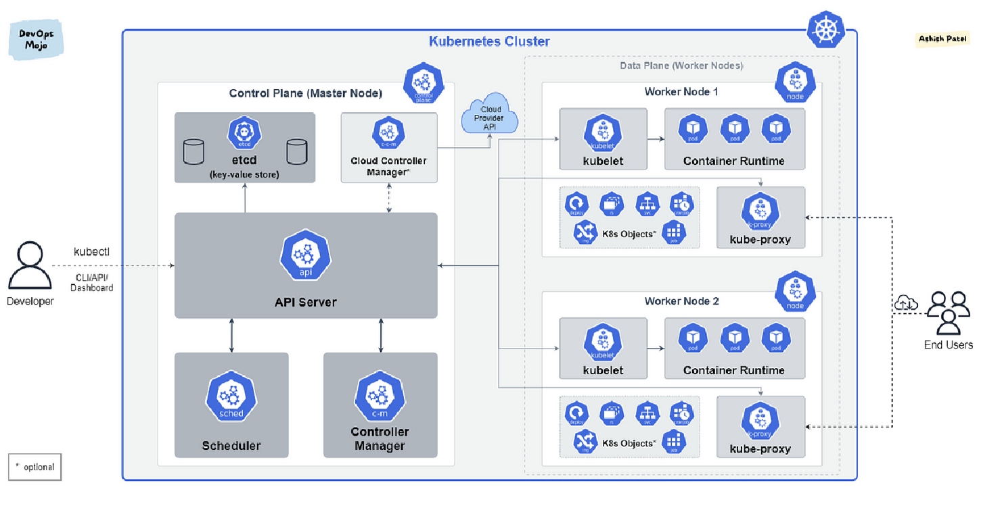

# K8s

> [CKA(Certified Kubernetes Administrator)](https://training.linuxfoundation.org/certification/certified-kubernetes-administrator-cka/)
## 기본 이해

- 현대 개발에서 필수 도구
  - CloudkNative 황경에서 표준 컨테이너 오케스레이션 도구가 되었음
  - MSA에서 필수 기술로 자리자븜
- 배포 및 관리 자동화
  - 자동화된 배포, 스케일링, 롤백을 지원
  - 무중단 배포, 롤백 업데이트 같은 기능을 활용할 수 있다.
  - 이를 통해서 배포 효율성을 높일 수 있다.
- 최적화
  - 리소스 할당과 자동 확장을 제공한다.
  - 모니터링을 통해서 성능을 개선할 수 있다.
- MSA
  - K8s는 컨테이너화된 마이크로 서비스를 쉽게 배포하고 관리하는데 최저고하
  - 마이크로서비스 간의 통신, 장애 발생 시 복구, 각 서비스의 독립적 배포되는 방식을 이해해야 이를 감안하여 개발할 수 있음
- CI/CD 통합
  - K8s는 많은 CI/CD 도구와 통합되어 있음
- CloudNative 이해
  - 클라우드 서비스 제공업체에서 제공하는 많은 관리형 서비스가 있음(EKS, GKS)
- DevOps와 개발자 간 협업
  - 어떻게 배포되고 관리되는지에 대해서 알고 이해하는게 원활한 협업에 도움이 된다.

## DockerCompose를 쓰면?
- k8s는 여러 대의 물리 서버를 운영하는 것을 전제로 한다.
- dockercompose으로 여러 번의 command를 사용해야한다.
- 모니터링에도 한계가 있다.
- k8s는 오케스트레이션 도구다.

## DesiredState를 유지
- Desired State는 사용자가 원하는 애플리케이션의 상태를 의미한다.
- Pod, Container가 3개 실행되어 있어야 한다고 설정했다면 오케스트레이션 시스템은 항상 그 상태를 유지하려고 한다.

## 동작 방식
1. 원하는 상태(DesiredState) 설정: 
   - 몇 개의 컨테이너가 실행되어야 하는지, 어떤 버전의 애플리케이션이 배포되어야 하는 지 설정
2. 현재 상태(CurrentState) 모니터링:
   - 오케이스트레이션 시스템은 CurrentState를 모니터링한다.
   - 만약 컨테이너가 중단되거나 장애가 발생하면 이를 감지
3. 원하는 상태와 현재 상태 비교: 
   - 원하는 상태, 현재 상태를 비교한다.
   - 지속적으로 원하는 상태로 맞추기 위해서 작동한다.
4. 자동 복구 및 조정(Self-healing): 
   - 자체 복구라고 하며 이 기능으로 항상 가용한 상태를 유지하게 된다.

## desired condition을 유지하려는 결과적으로
1. 자동화된 관리: 도커 오케스트레이션 도구는 컨테이너 배포, 관리 및 확장을 자동화하여, 수동 작업의 필요성을 줄여준다.
2. 확장성 : 오케스트레이션 도구를 사용하면 컨테이너를 쉽게 스케일 아웃할 수 있다.
3. 부하분산: 여러 컨테이너와 서버에 걸쳐 트래픽과 부하를 자동으로 분산시키는 기능을 제공
4. 서비스 발견과 네트워킹: 오케스트레이션 도구는 컨테이너 간의 네트워킹과 서비스 발견을 관리한다.
5. 상태 관리와 self-healing: 시스템이 정의한 상태를 유지하도록 설정할 수 있으며, 문제가 발생했을 때 오케스트레이션 도구가 자동으로 문제를 해결하고자 시도한다.

## 주요 도커 오케스트레이션 도구
- Kubernetes
- DockerSwarm
- ApacheMesos

## 구성요소
> 논리적 단위로 그룹화한다. => Pod
> - k8s에서 '논리적 단위로 그룹화한다.'는 말은 컨테이너들을 효과적으로 관리하고 조정하기 위해서, 관련 컨테이너들을 하나의 그룹로 묶는 것을 의미
> - k8s에서 생성 및 관리되는 가장 작은 단위

1. 공유 리소스와 통신:
   - Pod 안에 있는 컨테이너들은 network namespace, storage를 공유할 수 있다.
   - 컨테이너들이 서로 통신을 용이하게 하며, 필요한 데이터를 서로 접근할 수 있게 해준다.
2. 컨테이너 조정
   - Pod를 사용하면 여러 컨테이너들을 한 그룹으로 관리할 수 있다.
   - 배포, 스케일링 및 관리를 간소화한다.
3. 서비스 디스커버리
   - Pod는 하나의 Logical 호스트로 취급됨으로써, 하나의 IP 주소와 Port 범위를 가진다.
   - 네트워크를 통한 서비스 발견과 라우팅을 단순화함
4. 부하 분산과 자동 복구
   - Pod를 여러 노드에 걸쳐 자동으로 배포할 수 있다.
   - Pod가 실패할 경우 자동으로 복구

## 주요 구조
- Node는 Pod를 실행하는 물리적 또는 가상의 서버
- Pod는 k8s의 기본 배포 단위로 하나 이상의 컨테이너로 구성될 수 있다.
- pod내 컨테이너들은 공유된 리소스 정보를 가지며, 네트워크, 스토리지 측면에서 밀접하게 연관되어 작동

### MasterNode
- k8s 클러스터의 제어 허브로서 클러스터 관리 및 조정을 담당
- kubectl을 설치하고 마스터 노드의 초기 설정 후 마스터 노드를 조정하여, 직접 워커 노드를 관리하는 일은 없음

### ControlPlane을 통해서 워커 노드를 관리하는 핵심 컴포넌트
- ControlPlane과 WorkerNode로 구성된다.
- 중앙 제어 시스템으로 클러스터의 상태를 유지하고, 리소스를 배치하며, 전반적인 작업을 관리하는 역할을 한다.
- ControlPlane은 여러 핵심 컴포넌트들로 구성되어 있으며, 이들 간의 상호 작용을 통해서 Kuberentes 클러스터를 관리

#### 1. API 서버(kube-apiserver)
- API 서버는 k8s클러스터와의 모든 통신 중심 엔드포인트
- 클러스터 내부 및 외부의 모든 구성 요소가 API 서버를 통해서 상호작용
- CRUD 작업이 모두 이곳에서 처리된다.
- k8s의 REST API를 제공하고 외부 요청을 받아 k8s 클러스터에 명령을 전달
- 주요 역할
  - 명령어 처리 : kubectl 명령어를 사용해서 클러스터에 명령을 내릴 떄, 이 요청은 모두 API 서버에서 처리
  - 보안 관리 : 인증(Authentication), 인가(Authorization)를 통해, 사용자가 클러스테 접근하고 리소스에 대한 작업을 수행할 수 있는지 확인함
  - 클러스터 내부 통신 : k8s 내부 컴포넌트들 간의 통신도 API 서버를 통해서 이뤄진다. 클러스터 내부 통신의 일관성을 보장
  - 유효성 검사 및 전달 : 리소스 정의 파일(YAML, JSON)을 받으면 유효성 검사하고, 이에 따라 클러스터에 작업을 전달한다.

#### 2. 컨트롤 매니저(kube-controller-manager)
- k8s 클러스터에서 여러 컨트롤러들을 실행하여 클러스터의 상태를 `원하는 상태(DesiredState)`로 유지하는 역할을 수행한다.
- 컨트롤러는 각기 다른 k8s 리소스를 관리하는 백그라운드 프로세스로, 리소스가 설정된 대로 실행되는지 모니터링하고 이를 유지하는 역할을 담당
- 주요 역할
  - ReplicationController: Pod가 설정된 수만큼 실행 중인지 확인하고, 부족한 경우 새로운 Pod를 생성하거나, 초과할 경우 삭제
  - EndpointController: 서비스와 Pod 간의 연결을 관리하며, 클러스터 내 서비스 디스커버리 및 로드 밸런싱을 관리
  - NameSpaceController: 네임스페이스를 생성 및 삭제하는 작업을 관리한다.
  - NodeContoller: 클러스터의 노드 상태를 모니터링하며, 장애가 발생한 노드를 감지하고 이를 처리한다.
  - 자원관리 : 클러스터의 리소스 상태가 정의한대로 유지되도록 보장함

#### 3. 스케쥴러(kube-scheduler)
- 스케쥴러는 새롭게 생성된 Pod를 적절한 workerNode에 배치하는 역할을 담당
- k8s는 Pod가 클러스터 내의 노드에서 실행되도록 해야하므로, 스케쥴러는 Pod가 요구하는 리소스와 각 노드 상태를 고려하여 배치함
- 주요 역할
  - Pod 배치 결정
  - 노드 리소스 고려: CPU, 메모리, 네트워크, 디스크 용량 등을 종합적으로 고려
  - 애플리케이션 요구 사항 반영: Pod가 특정 zone이나  region에서 실행되어야 하는 경우 이를 반영

#### 4. 클라우드 컨트롤러 매니저(Cloud Controller Manager)