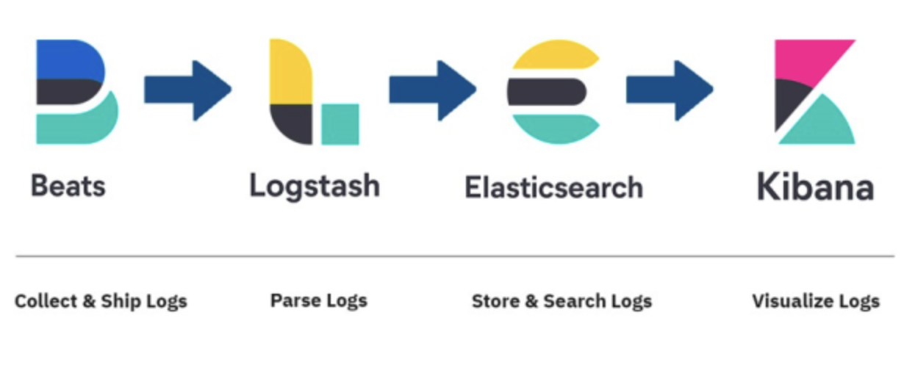
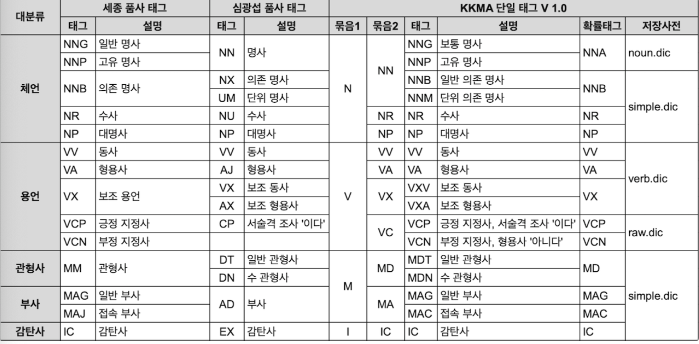

# ElasticSearch
- ApacheLucene 기반 Java 오픈 소스 분산 검색 엔진
- 대규모 로그 파일 관리나 실시간 검색 서비스 등과 같은 대용량 데이터를 빠르게 처리해야 하는 경우 사용

## RDB와 차이점
1. ElasticSearch는  JSON 형태로 비정형 데이터를 저장하고 인덱싱할 수 있다.
2. 단어를 기반으로 데이터를 저장한다.
3. NoSQL와 같이 저장된다.

|        RDB        |    ElasticSearch     |
|:-----------------:|:--------------------:|
|     Database      |        Index         |
|       Table       |         Type         |
|        Row        |       Document       |
|      Column       |        Field         |
|       Index       |       Analyze        |
|    Primary key    |         _id          |
|      Schema       |       Mapping        |
| PhysicalPartition |        Shard         |
| LogicalPartition  |        Route         |
|    Relational     | Parent/Child, Nested |

- Cluster : 노드 집합
- Node : 기본 작동 단위
- Index : Document 집합을 Index라고 한다.
- Shard : Kafka의 파티션과 유사

## 장점
1. 데이터를 여러 노드에 분산 저장하고 처리 및 새로운 노드를 추가(ScaleOut)할 수 있고, 스키마리스이므로, 비구조화된 대량 데이터 처리 유연성이 높다.
2. 모든 데이터를 역 색인 구조로 저장해 가공된 텍스트를 검색한다.
3. JSON으로 데이터를 유연하게 저장할 수 있다.
4. Replication, Sharding으로 노드 실패에도 서비스 중단 없이 작업을 할 수 있다.

## 단점
1. 트랜잭션 미지원
2. 데이터 수정 삭제에 비효율


# ELK(Elasticsearch/ Logstash/ Kibana)
로그를 모아서 원하는 데이터를 빠르게 검색한 뒤 시각화해서 모니터링하기 위해서 사용한다.


## Beats
여러 데이터를 서버에서 다른 곳으로 전송하는 역할(로그 파일의 변화를 감지해서 logstash, elasticSearch로 전달)

## Logstash
실시간 파이프라인 기능을 가져 데이터를 수집하는 역할을 한다.
1. input: 데이터 저장소로부터 데이터를 입력받는 작업
2. filter: 데이터를 확장, 변경, 필터링 및 삭제 처리하는 가공 작업
3. output: elasticsearch로 전송

### 간단 설정
1. `/usr/share/logstash/conf/pipeline.yml`에 파이프 라인 지정
   - pipeline.id와 pipeline 설정이 있는 path를 기입

   
2. pipeline path에 파이프라인 구축
```
set
input { #수집
    stdin{}
    jdbc{}
    file{}
}
filter { #가공
    mutate{}
    date{}
    grok{}
}
output { #전송
    stdout {}
    elasticsearch{}
    kafka {}
    csv{}
}

```
( 아래 예시는 logstash에 포함된 jdbc input plugin을 사용한 예시 )
[elasticsearch jdbc setup](https://www.elastic.co/guide/en/logstash/current/plugins-inputs-jdbc.html)
```logstash.conf
input {
    jdbc {
        jdbc_driver_library => "/usr/share/logstash/pipeline/maria-client.jar"
        #jdbc connector 위치
        jdbc_driver_class => "org.mariadb.jdbc.Driver"
        #jdbc driver class
        jdbc_connection_string => "jdbc:mariadb://mariaDB:3306/UnionGlobal?useUnicode=true&characterEncoding=utf8&serverTimezone=Asia/Seoul&autoReconnect=true"
        jdbc_user => "root"
        jdbc_password => "root"
        # url/user/password
        
        
        #jdbc_page_size => 5000
        #jdbc_paging_enabled => true
        
        
        use_column_value => true
        # true면 :sql_last_value를 사용할 수 있으며, 쿼리가 실행된 마지막 부분을 반영한다.
        
        tracking_column => "regdate"
        tracking_column_type => "timestamp"
        #기본은 numeric 선택지는 nuermic, timestamp
        #어디까지 조회했는지 확인하는데 사용한다.
        
        last_run_metadata_path => "/usr/share/logstash/inspector-index.dat"
        #어디까지 조회헀는지에 대한 정보를 위의 경로에 저장
        
        schedule => "* */5 * * * "
        #crontab 과 유사(  분/ 시/ 일/월/ 요일 )
        
        statement => "SELECT *, UNIX_TIMESTAMP(modification_time) as unix_ts_in_secs
                      FROM tblUser
                      WHERE (
                              UNIX_TIMESTAMP(modification_time) > :sql_last_value
                              AND modification_time < NOW()
                            )
                      ORDER BY modification_time ASC"
        #jdbc query
        
        # sql_last_value 
        # 이것은 Logstash의 폴링 루프의 현재 반복 계산을 위한
        # 시작점을 포함하는 기본 제공 매개변수이며,
        # 위의 jdbc 입력 구성의 SELECT 문에서 참조됩니다. 
        # 이것은 “unix_ts_in_secs”의 가장 최근 값으로 설정되며,
        # .logstash_jdbc_last_run으로부터 읽습니다.
        # 이것은 Logstash의 폴링 루프에서 실행되는 MySQL 쿼리가 반환하는
        # 문서를 위한 시작점으로 사용됩니다.
        #  
        # 쿼리에 이 변수를 포함시키면,
        # 이전에 변경사항이 Elasticsearch에 적용된 삽입이나 
        # 업데이트가 Elasticsearch로 다시 전송되지 않도록 해줍니다.
        
        # modification_time
        # 이 필드는 MySQL의 레코드가 추가되거나 수정되면 그 시간을 저장합니다.
        #
        # insertion_time
        # 이 필드는 어떤 레코드가 처음 추가된 시간을 저장합니다. 
        
        clean_run => true
    }
}

filter {
   mutate { #값을 변경할 때 사용
#        copy => { "userNo" => "[@metadata][_id]"}
       remove_field => ["@version", "unix_ts_in_secs"]
       # 정볼르 제거할 때 사용
      
       #date {
       # match => ["setdt","yyyyMMdd'T'HHmmss"]
       # timezone => "Asia/Seoul"
       # target => "setdt"
       #}
       #날짜 형식 변경
   }
}


output {
  elasticsearch {
      hosts => "elasticsearch:9200"
      user => "logstash_internal"
      password => "${LOGSTASH_INTERNAL_PASSWORD}"
      index => "user"
      document_id => "%{userno}"
  }
  stdout {
# 	  codec => rubydebug # 디버깅용
  }
}
```


## Elasticsearch
데이터 저장소 역할 + 검색 엔진
1. indexing : 엘라스틱 서치는 모든 레코드를 JSON으로 관리. 도큐먼트를 인덱싱해 쿼리 결과에 일치하는 원본 도큐먼트를 반환
2. 병렬/ 분산 처리 : 텍스트, 도큐먼트의 경우 인덱싱 시점에 분석을 거쳐 용어 단위로 분해하고 역인덱스 사전을 구축한다.
3. Lucene 기반 검색엔진 : 루씬 기반으로 스코어링, 연관도에 따른 정렬을 지원한다.
4. REST API : REST API로 언어를 타지 않는다.


### nori(형태소 분석기)
nori_tokenizer, nori_part_of_speech, nori_readingform 토큰 필터를 제공한다.
```elasticsearch
GET _analyze
{
  "tokenizer": "standard",
  "text": [
    "동해물과 백두산이"
  ]
}
## 기본 
{
  "tokens" : [
    {
      "token" : "동해물과",
      "start_offset" : 0,
      "end_offset" : 4,
      "type" : "<HANGUL>",
      "position" : 0
    },
    {
      "token" : "백두산이",
      "start_offset" : 5,
      "end_offset" : 9,
      "type" : "<HANGUL>",
      "position" : 1
    }
  ]
}

## nori
{
  "tokens" : [
    {
      "token" : "동해",
      "start_offset" : 0,
      "end_offset" : 2,
      "type" : "word",
      "position" : 0
    },
    {
      "token" : "물",
      "start_offset" : 2,
      "end_offset" : 3,
      "type" : "word",
      "position" : 1
    },
    {
      "token" : "과",
      "start_offset" : 3,
      "end_offset" : 4,
      "type" : "word",
      "position" : 2
    },
    {
      "token" : "백두",
      "start_offset" : 5,
      "end_offset" : 7,
      "type" : "word",
      "position" : 3
    },
    {
      "token" : "산",
      "start_offset" : 7,
      "end_offset" : 8,
      "type" : "word",
      "position" : 4
    },
    {
      "token" : "이",
      "start_offset" : 8,
      "end_offset" : 9,
      "type" : "word",
      "position" : 5
    }
  ]
}

```

#### nori_tokenizer
- user_dictionary: 사용자 사전 저장 경로
- user_dictionary_rules: 사용자 정의 사전을 배여롤 입력
- decompound_mode
  - none: 어근 분리 없이 완성된 합성어만 저장
  - discard: 합성어 분리 후 어근만 저장
  - mixed: 어근/ 합성어 모두 저장

#### nori_part_of_speech
제거할 품사 정보의 지정이 가능하다. `soptags` 배열에 품사 코드를 나열해서 입력해서 사용한다.

```elasitcsearch
"stoptags": [
  "E", "IC", "J", "MAG", "MAJ",
  "MM", "SP", "SSC", "SSO", "SC",
  "SE", "XPN", "XSA", "XSN", "XSV",
  "UNA", "NA", "VSV"
]
```
#### nori_readingform
한자로 된 단어를 한글로 변경해서 저장한다.


### 형태소 분석기 간단 설정
```elasticsearch
POST product/_close
PUT product/_settings
{
  "index":{
    "analysis": {
      "tokenizer": {
        "nori_user_dict": {
          "type": "nori_tokenizer",
          "decompound_mode": "mixed",
          "user_dictionary": "user_dict.txt"
        }
      },
      "analyzer": {
        "korean_analyzer": {
          "filter": [
            "pos_filter_speech", "nori_readingform",
            "lowercase", "synonym", "remove_duplicates"
          ],
          "tokenizer": "nori_user_dict"
        }
      },
      "filter": {
        "synonym" : {
          "type" : "synonym_graph",
          "synonyms_path" : "synonyms.txt"
        },
        "pos_filter_speech": {
          "type": "nori_part_of_speech",
          "stoptags": [
            "E", "J", "SC", "SE", "SF", "SP", "SSC", "SSO", "SY", "VCN", "VCP",
            "VSV", "VX", "XPN", "XSA", "XSN", "XSV"
          ]
        }
      }
    }
  }
}
POST product/_open


GET product/_count
GET product/_search
{"query":{"match":{"namekr":{"analyzer":"korean_analyzer","query":"A"}}}}

```


[elastic 가이드북 - nori](https://esbook.kimjmin.net/06-text-analysis/6.7-stemming/6.7.2-nori)
## Kibana
저장된 데이터를 모아서 시각화하는 역할