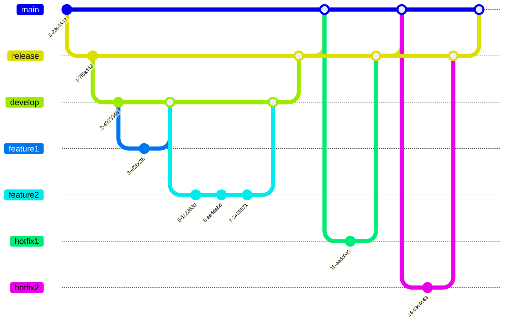

# gitFlow

`브랜치를 활용한 변경 이력 관리 전략` 정도로 생각하면 될 것 같다. 

예시로

- `master` : 배포된 버전이 존재하는 곳
- `feature` : 기능별 개발 브랜치
- `stage/release` : 테스트 브랜치
- `develop` : 개발 브랜치
- `hotfix` : 핫픽스

```mermaid
gitGraph
    commit
    branch release
    commit
    branch develop
    commit
    branch feature1
    commit
    checkout develop
    merge feature1
    branch feature2
    commit
    commit
    commit
    checkout develop
    merge feature2
    checkout release
    merge develop
    checkout main
    merge release
    branch hotfix1
    commit
    checkout release
    merge hotfix1
    checkout main
    merge release
    branch hotfix2
    commit
    checkout release
    merge hotfix2
    checkout main
    merge release
    
    
    
    
```