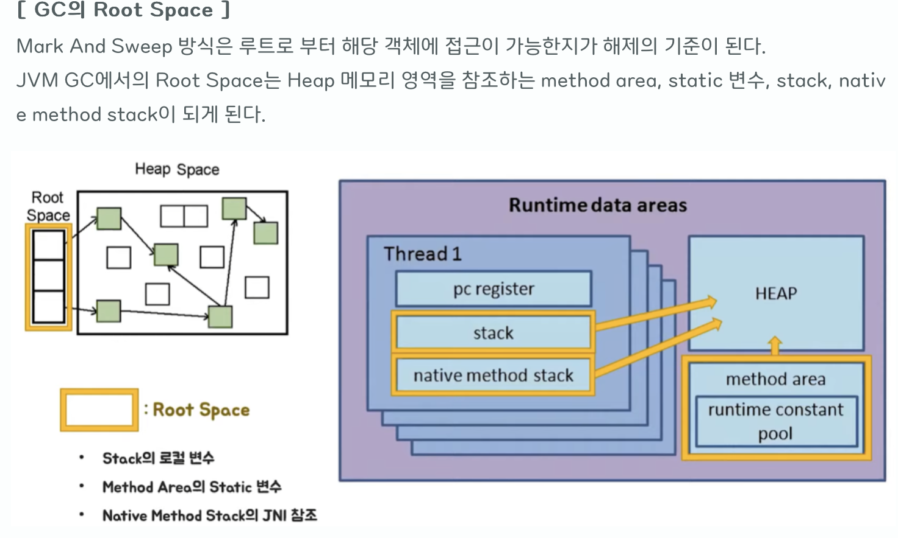

# GC
자바의 메모리 관리 방법 중 하나로 JVM의 HEAP 영역에서 동적으로 할당했던 메모리 중 필요 없게 된 메모리 객체(garbage)를 모아 주기적으로 제거하는 프로세스
(C/C++ 은 수동으로 메모리 할당, 해제를 해야했다.)

## 1. 대상
판단 근거로 도달성, 도달능력(Reachability)라는 개념을 적용한다. 객체에 레퍼런스가 있다면 Reachable[[1]](#reachable), 객체에 유효한 레퍼런스가 없으면 UnReachable[[2]](#unreachable)로 구분한다.
주로 Heap Area에서 참조하고 있지 않은 객체가 GC 대상이 된다.

# 청소 방식
## Mark And Sweep
GC가 동작하는 가장 기초적인 청소 과정.

GC 대상이 될 객체를 식별(Mark), 제거(Sweep)하며 객체가 제거되며 파편화된 메모리를 영역 앞에서부터 채워나가는 작업을 수행한다.
1. Mark : Root Space부터 그래프 순회를 통해서 연결되나 객체를 찾아서 각각 어떤 객체를 참조하고 있는지 마킹
2. Sweep : Unreachable를 Heap에서 제거한다.
3. Compact : Heap의 시작 주소를 모아 메모리가 할당된 부분과 아닌 부분으로 압축한다. (GC 종류에 따라 하지 않는 경우도 있음 )

------
<a href="reachable">[1]</a> : 객체가 참조되고 있는 상태

<a href="unreachable">[2]</a> : 객체가 참조되고 있지 않은 상태 (GC 대상)