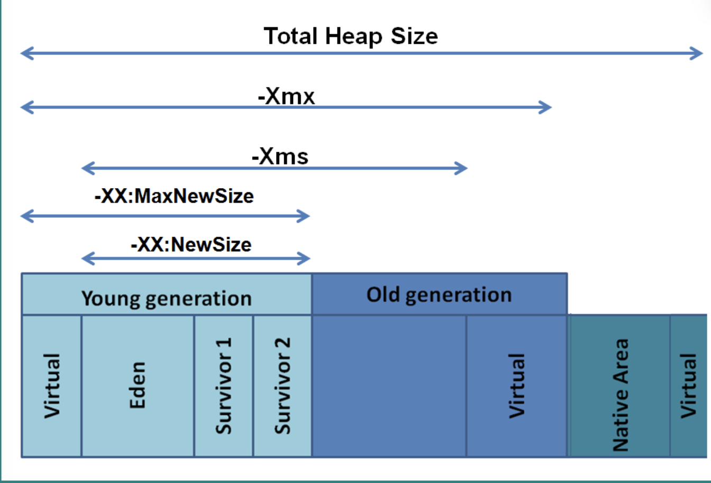

# GC Tuning

## 주의점 
1. GC 옵션은 서비스 특징마다 적정 값이 다르다.
2. GC 튜닝은 최후의 수단이다. (코드 최적화가 우선이다.)

## 목표
1. Old로 넘어가는 객체의 수 최소화 하기
Old는 Young에서 GC보다 시간이 오래 소요된다. 따라서 Old로 넘어가는 수를 줄이면 Full GC가 줄어든다.
이는 Young size를 잘 조절하는 것만으로 Old로 넘어가는 것을 줄이고 이 자체로 튜닝이 된다는 것이다.
2. Full GC 시간 줄이기
Full GC 실행 시간은 Minor GC에 비해 길다. 그러므로 Old 사이즈를 조정하는 것도 방법이다. 그렇다고 너무 줄이면 OutOfMemoryError가 발생하거나 FUll GC가 
자주 발생할 수 있다. 반대로 너무 Old를 늘리면 FullGC는 줄지만 실행 시간이 늘어날 수 있다.

## 튜닝 진행
### 1. GC 상황 모니터링
```shell
# jstat gcutil  명령어로 현재 실행중인 8884번 프로세스에 대해 1초에 한번 씩 총 10번 GC와 관련된 정보를 출력하도록 모니터링
jstat -gcutil -t 8844 1000 0
```

|컬럼 | 설명                                |
|:---:|:----------------------------------|
|S0  | Survivor 영역 0의 사용율(현재 용량에 대한 비율)  |
|S1 | Survivor 영역 1의 사용율(현재 용량에 대한 비율)  |
|E | Eden 영역의 사용율 (현재 용량에 대한 비율)       |
|O | Old 영역의 사용율 (현재 용량에 대한 비율)        |
|P | Permanent 영역의 사용율 (현재 용량에 대한 비율)  |
|YGC | Young 세대의 GC 이벤트 수                |
|YGCT | Young 세대의 GC 시간                   |
|FGC| Full GC 이벤트 수                     |
|FGCT | Full GC 시간                        |
|GCT| GC 총 시간                           |

### 2. 모니터링 결과 분석 후 GC 튜닝 여부 결정
   >
   > Minor GC 수행시간: YGCT / YGC (0.314 / 19) = 0.016초
   > 
   > Major GC 수행 시간: FGCT / FGC (0.291 / 3) = 0.097초
   > 

```shell
# Minor GC의 처리 시간이 빠르다 (50ms 내외)
# Minor GC의 주기가 빈번하지 않다 (10초 내외)
# Full GC의 처리 시간이 빠르다 (1초 내외)
# Full GC의 주기가 빈번하지 않다 (10분에 1회)
```

### 3. GC 알고리즘 방식 지정

|GC 알고리즘| 	내용                                                                                                                                                                        |
|:---:|:---------------------------------------------------------------------------------------------------------------------------------------------------------------------------|
|Parallel GC| - '처리량'이 중요한 시스템에서 주로 사용<br/> - Full GC 수행 시 compaction 작업이 수행되기 때문에 GC 시간 자체는 많이 소요되나 일정한 멈춤 시간을 제공함                                                                      |
|   CMS GC    | - 응답시간이 중용한 시스템에사 주로 사용 <br/> - compaction 미수행으로 Stop-The-World 시간은 짧으나 자주 Compaction이 발생하는 시스템의 경우 오히려 Full GC 보다 Compation 시간이 오래 걸릴 수 있음 <br/> - 자원 사용량이 증가하는 점도 고려해야 함 |
|  G1 GC     |                                                  - 성능적으로 가장 우수한 GC 방식이나, JDK 7 버전부터 정식 제공되었으며, Java 9 에서 Default GC 방식으로 채택|

### 4. Heap 크기 지정
JVM의 힙 크기는 GC 발생 횟수와 수행 시간에 영향을 끼치기 떄문에 옵션을 통해 조절하면 애플리케이션의 성능 향상을 가져올 수 있다. 
메모리 크기는 JVM의 시작 크기 `-Xms` 최대 크기 `-Xmx`를 말한다.
메모리 크기와 GC 발생 횟수, GC 수행 시간 관계는 아래와 같다.

1. 메모리 크기가 크면
   - GC 발생 횟수가 감소
   - GC 수행 시간은 길어진다.
2. 메모리 크기가 작으면
   - GC 발생 횟수는 증가한다.
   - GC 수행 시간은 짧아진다.

|구분|       	옵션	        |설명|
|:---:|:-----------------:|:-----|
| 힙(heap) 영역 크기 |       -Xms        | JVM 시작 시 힙 영역 크기 |
| 힙(heap) 영역 크기 |       -Xmx        |  최대 힙 영역 크기|
| New 영역의 크기	 |   -XX:NewRatio    | New 영역과 Old 영역의 비율 |
| New 영역의 크기 |    -XX:NewSize    | New 영역의 크기 |
| New 영역의 크기 | -XX:SurvivorRatio | Eden 영역과 Survivor 영역의 비율 |



```shell
# 이 중에서 중요한 옵션은 -Xms 옵션, -Xmx 옵션, -XX:NewRatio 옵션이다.
# 특히 -Xms 옵션과 -Xmx 옵션은 왠만하면 필수로 지정하길 권장되며, 그리고 NewRatio 옵션을 어떻게 설정하느냐에 따라서 GC 성능에 많은 차이가 발생한다.
# 
# NewRatio는 New 영역과 Old 영역의 비율이다. 
# -XX:+NewRatio=1로 지정하면 (New 영역):(Old 영역)의 비율은 1:1이 된다. 
# 만약 1GB라면 (New 영역):(Old 영역)은 500MB:500MB가 된다. 
# NewRatio가 2이면 (New 영역):(Old 영역)이 1:2가 된다. 
# 즉, 값이 커지면 커질수록 Old 영역의 크기가 커지고 New 영역의 크기가 작아진다.


# 힙 시작 크기 256mb, 힙 최대 크기 2gb
# young 영역과 old 영역 비율 1:2 로 설정 (New 영역:Old 영역 = 1:2)
# Parallel GC 로 실행
java -Xms256m -Xmx2048m -XX:+NewRatio=2 -XX:+UseParallelGC
```

### 5. 결과 분석
분석할 때는 다음의 사항을 중심으로 살펴보는 것이 좋다. 이는 우선 순위 별로 나열되어 있다.

1. FullGC 수행 시간
2. MinorGC 수행 시간
3. Full GC 수행 간격
4. MinorGC 수행 간격
5. 전체 Full GC 수행 시간
6. 전체 Minor GC 수행 시간
7. 전체 GC 수행 시간
8. Full GC 수행 횟수
9. Minor GC 수행 횟수

