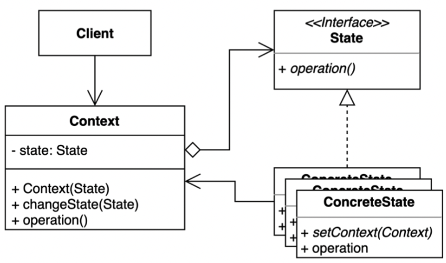

# State
상태 패턴(State Pattern)은 객체가 특정 상태에 따라 행위를 달리하는 상황에서, 상태를 조건문으로 검사해서 행위를 달리하는 것이 아닌, 
상태를 객체화 하여 상태가 행동을 할 수 있도록 위임하는 패턴을 말한다.
객체 지향 프로그래밍에서의 클래스는 꼭 사물 / 생물만을 표현하는 고체 형태의 데이터만 표현 할 수 있는게 아니다.
경우에 따라서 무형태의 행위 / 동작도 클래스로 묶어 표현할 수 있다.
그래서 상태를 클래스로 표현하면 클래스를 교체해서 ‘상태의 변화’를 표현할 수 있고, 객체 내부 상태 변경에 따라 객체의 행동을 상태에 특화된 행동들로 분리해 낼 수 있으며,
새로운 행동을 추가하더라도 다른 행동에 영향을 주지 않는다.

>
> 전략 패턴(Strategy Pattern)이 '전략 알고리즘'을 클래스로 표현한 패턴이라면, 상태 패턴(State Pattern)은 '객체 상태'를 클래스로 표현한 패턴이라고 보면 된다.
> 

# 구조

- State 인터페이스 : 상태를 추상화한 고수준 모듈.
- ConcreteState : 구체적인 각각의 상태를 클래스로 표현. State 역할로 결정되는 인터페이스(API)를 구체적으로 구현한다. 다음 상태가 결정되면 Context에 상태 변경을 요청하는 역할도 한다.
- Context : State를 이용하는 시스템. 시스템 상태를 나타내는 State 객체를 합성(composition)하여 가지고 있다. 클라이언트로부터 요청받으면 State 객체에 행위 실행을 위임한다

> 상태 클래스는 싱글톤 클래스로 구성한다.
> 전략 패턴의 전략 객체 같은 경우 매개 값에 따라 알고리즘 수행 형태가 달라질수 있지만, 상태는 그 객체의 현 폼을 나타내는 것이기 때문에 대부분의 상황에서 유일하게 있어야 한다.
> 

# 특징
## 사용 시기

- 객체의 행동(메서드)가 상태(state)에 따라 각기 다른 동작을 할때.
- 상태 및 전환에 걸쳐 대규모 조건 분기 코드와 중복 코드가 많을 경우
- 조건문의 각 분기를 별도의 클래스에 넣는것이 상태 패턴의 핵심
- 런타임단에서 객체의 상태를 유동적으로 변경해야 할 때

## 장점
- 상태(State)에 따른 동작을 개별 클래스로 옮겨서 관리 할 수 있다.
- 상태(State)와 관련된 모든 동작을 각각의 상태 클래스에 분산시킴으로써, 코드 복잡도를 줄일 수 있다.
- 단일 책임 원칙을 준수할 수 있다. (특정 상태와 관련된 코드를 별도의 클래스로 구성)
- 개방 폐쇄 원칙을 준수할 수 있다. (기존 State 클래스나 컨텍스트를 변경하지 않고 새 State를 도입할 수 있다)
- 하나의 상태 객체만 사용하여 상태 변경을 하므로 일관성 없는 상태 주입을 방지하는데 도움이 된다.

## 단점
- 상태 별로 클래스를 생성하므로, 관리해야할 클래스 수 증가
- 상태 클래스 갯수가 많고 상태 규칙이 자주 변경된다면, Context의 상태 변경 코드가 복잡해지게 될 수 있다.
- 객체에 적용할 상태가 몇가지 밖에 없거나 거의 상태 변경이 이루어지지 않는 경우 패턴을 적용하는 것이 과도할 수 있다.