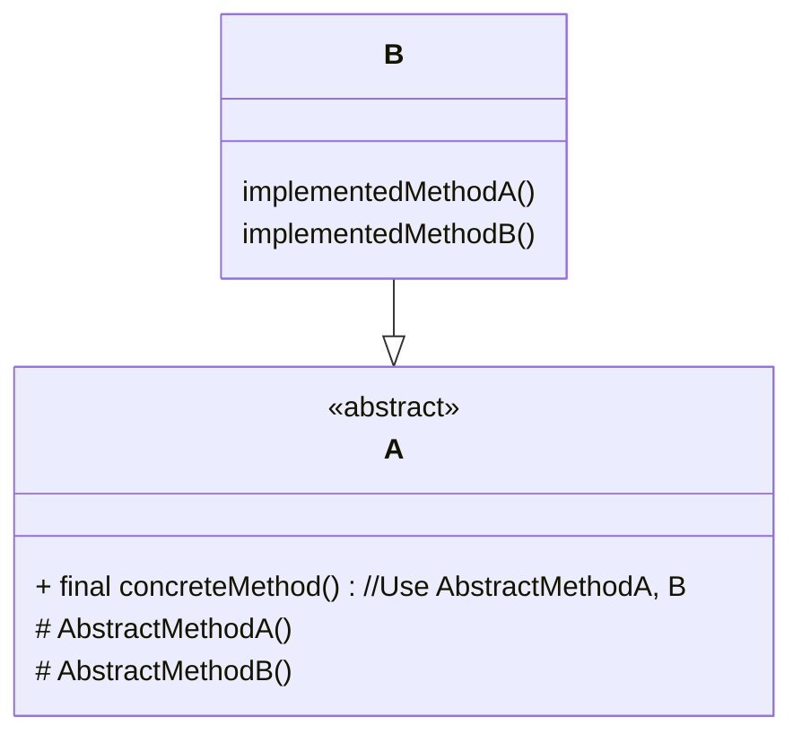

# TemplateMethod

- 상위 클래스에 템플릿이 만들어져 있고, 그 안에서는 추상적으로 정해진 메소드들이 사용되고 있다.
- 추상적으로 정해진 메소드의 구체적인 처리 방식은 구현 시 정해지는 식이다.
- 알고리즘의 구조 자체를 캡슐화 한 것이다.
- 전체 뼈대를 숨기고 변경될 부분을 **abstract method**로 slot화 하여 분리한다.
- 결과적으로 실행 순서, 큰 흐름은 부모를 따르며 전체적인 일관성을 부여한다.
- 세부적 구현을 서브클래싱을 통해서 정의하도록 강제한다. 

- 하위 클래스, 상위 클래스 간 단순 서브 클래싱이 아닌 타입 상속이 될 수 있다.  
- 위 조건으로 **The Liskov Substitution Principal**이 만족한다. 
