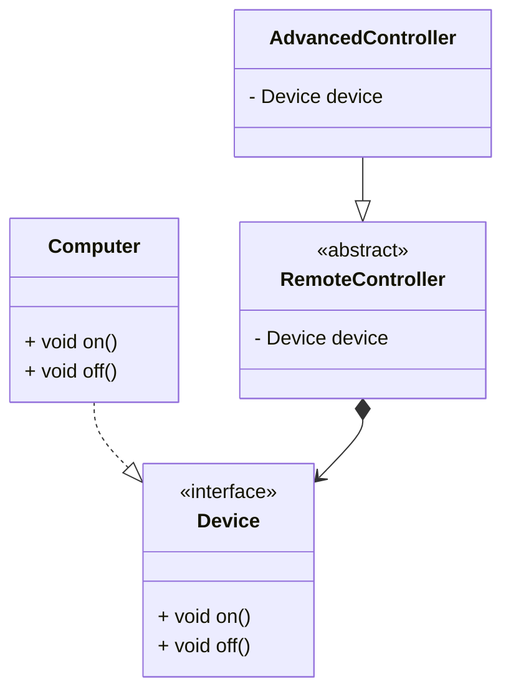

# Bridge

- 클래스 확장은 두 가지 측면으로 나뉠 수 있다.
  - 기능 확장: 기능을 추가하거나 변경
  - 구현 확장: 구현 방법을 다양화하거나 변경
- 추상화와 구현이 강하게 결합되어 있다면 구현 방식을 변경할 때 클래스 계층이 늘어난다.
- 추상화, 구현을 분리한다.
- 구현하고자 하는 것을 추상화한 계층 아래 Composition으로 구현한다.
- 추상화한 계층을 구현하여 Composition한 구현 계층을 확장한다.
- **추상화와 구현의 결합을 캡슐화한다.**

