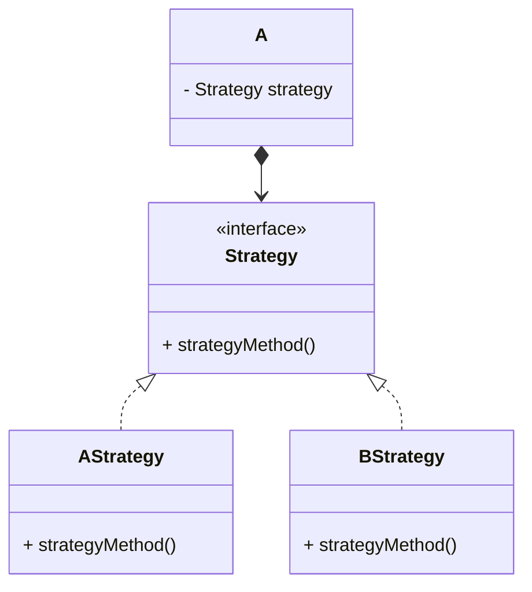

# Strategy

- 전략을 교환할 수 있도록 구성한다.
- 알고리즘 또는 행동 등을 독립된 클래스에 캡슐화해서 서로 다른 알고리즘을 교체하는데 문제가 없도록 한다.
- **클라이언트가 알고리즘을 선택하지만 알고리즘 구현 자체에 대해서는 모르도록 한다.**

```mermaid
classDiagram
    class A {
        - Strategy strategy
    }
    
    class Strategy {
        <<interface>>
        + strategyMethod()
    }
    
    class AStrategy {
        + strategyMethod()
    }
    class BStrategy {
        + strategyMethod()
    }
    
    A *--> Strategy
    Strategy <|.. AStrategy
    Strategy <|.. BStrategy
```