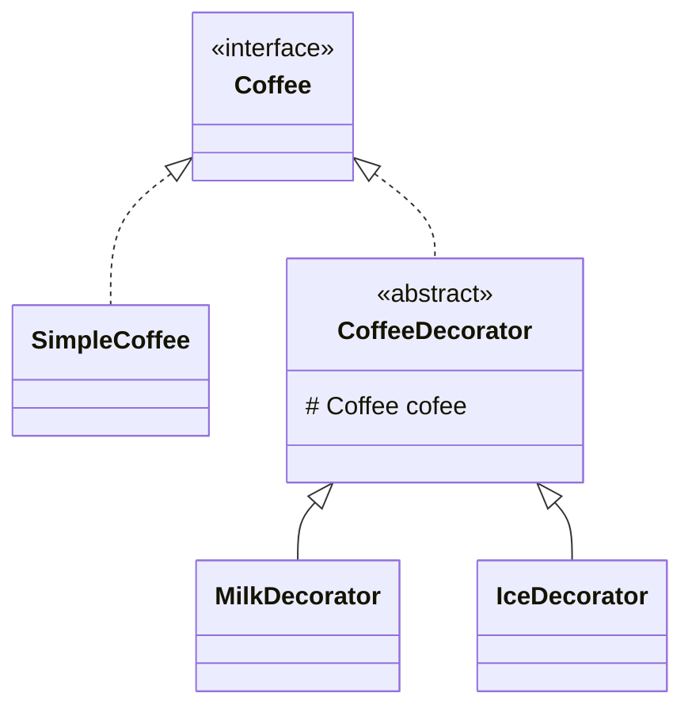

# Decorator

- 객체의 기능을 동적으로 추가하거나 수정할 수 있는 패턴
  - 위임을 통한 확장을 사용한다.
  - `java`의 `BufferedReader`, `FileReader`
- 기능의 동적 확장 자체를 숨긴다. 
  - 핵심 동작이 변경되지 않고, 객체의 새로운 행동을 캡슐화하여 동적으로 추가
  - 기존 인터페이스를 유지하면서도, 새로운 동작을 추가
- 구현 세부 사항을 은닉
  - 기능 확장을 캡슐화
- 책입의 분리
  - 객체의 추가적 행동이나 기능의 확장 방식을 캡슐화해서 기능을 추가하는 구현 세부 사항을 은닉한다.
  - 데코레이터는 클라이언트가 사용해야 할 객체와 동일한 인터페이스를 가지므로, 클라이언트는 객체가 기본 구현인지, 확장된 구현인지 알지 못한 채 사용할 수 있다.

- 필드로 받아서 메소드 내에서 확장 + 필드 메소드 실행으로 확장한다.