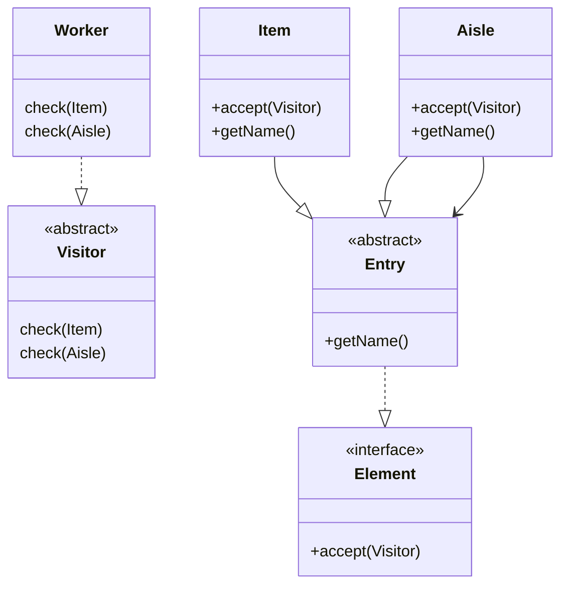

# Visitor

- 데이터 구조와 처리를 분리
- 객체 구조의 변경 없이 새로운 동작을 추가할 수 있도록 동작 자체를 캡슐화
- 클라이언트는 방문자와 요소의 상호작용 결과를 볼 뿐, 그 내부 구현을 알 필요가 없다.

- 처리를 데이터 구조와 분리한다. 
- 데이터는 순회를 모른다. 
- 순회자는 데이터의 작업을 모른다. 
- 서로는 서로 간의 독립성을 가진다. 오로지 서로 공개된 인터페이스만 알 뿐이다.