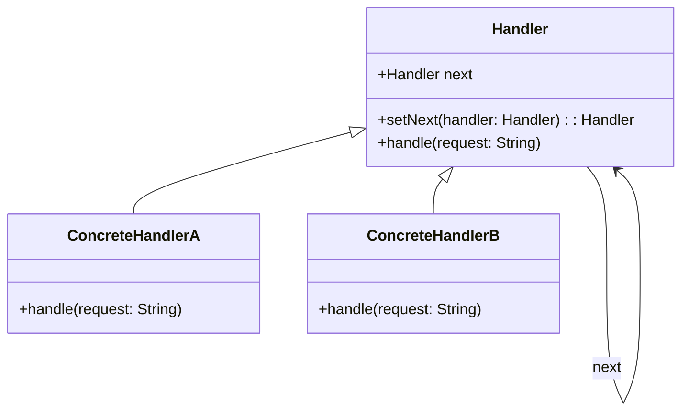

# Chain Of Responsibility

- 요청을 다른 객체로 떠넘기며, 요청을 실제로 처리하는 구체적인 객체를 숨긴다.
- 요청하는 쪽, 실제 처리하는 쪽 간의 결합을 낮출 수 있다.

```mermaid
classDiagram

   class Handler {
        +Handler next
        +setNext(handler: Handler): Handler
        +handle(request: String)
    }

    class ConcreteHandlerA {
        +handle(request: String)
    }

    class ConcreteHandlerB {
        +handle(request: String)
    }

    Handler <|-- ConcreteHandlerA
    Handler <|-- ConcreteHandlerB
    Handler --> Handler : next
```
- 요청의 처리 순서와 책임 분리를 캡슐화하며 클라이언트는 요청 처리 과정을 알 필요가 없다.
- 각 Handler는 자기의 일에만 집중하면 된다.
- 