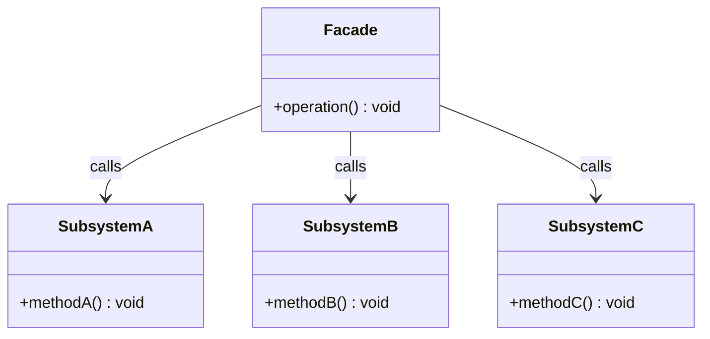

# Facade

- 복잡한 서브 시스템을 단순한 인터페이스로 캡슐화하여 클라이언트가 서브 시스템의 세부 구현을 알 필요 없도록 하는 것
- 인터페이스(API)의 수를 줄이는 것이 핵심
- 인터페이스의 수가 적다는 것은 외부와의 결합이 느슨하다고 표현할 수 있다.
- 복잡한 것보다는 간단하고 쉬위 보이는 것이 더 좋다는 예시로 들만한 패턴
- 파사드 클래스는 복잡한 서브시스템을 하나의 간단한 인터페이스로 제공하는 책임만을 가진다.
- 클라이언트는 파사드에만 의존하므로, 클라이언트, 서브 시스템 간 결합도가 떨어진다.

