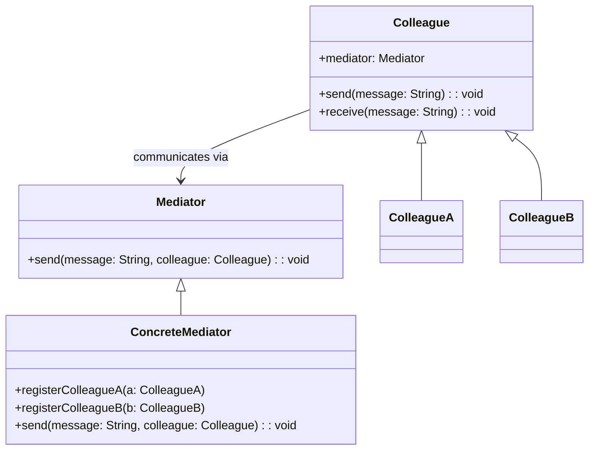

# Mediator

- 객체 간의 복잡한 상호 작용을 캡슐화한다.
- 객체들이 직접 통신하는 대신 중앙 집중된 중재자를 통해서 통신하도록 한다.
- 이러한 방법은 결합도를 낮춘다.
- 결과적으로 복잡한 객체 간의 상호작용을 단순화하고 관리할 수 있다.

```mermaid
classDiagram
    class Mediator {
        +send(message: String, colleague: Colleague): void
    }

    class ConcreteMediator {
        +registerColleagueA(a: ColleagueA)
        +registerColleagueB(b: ColleagueB)
        +send(message: String, colleague: Colleague): void
    }

    class Colleague {
        +mediator: Mediator
        +send(message: String): void
        +receive(message: String): void
    }

    class ColleagueA
    class ColleagueB

    Mediator <|-- ConcreteMediator
    Colleague <|-- ColleagueA
    Colleague <|-- ColleagueB
    Colleague --> Mediator : communicates via
```