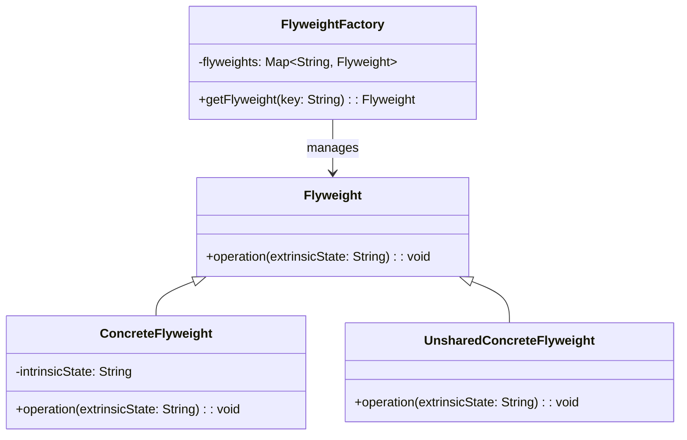

# FlyWeight

- 메모리 사용량을 줄이는 패턴
- 최대한 공유하고 쓸데없이 new 하지 않도록 한다.
- 공유 사용 속성은 FlyWeight로 위임하고 캡슐화 해서 메모리 절약, 개별 속성은 클라이언트가 따로 관리

```mermaid
classDiagram
    class Flyweight {
        +operation(extrinsicState: String): void
    }

    class ConcreteFlyweight {
        -intrinsicState: String
        +operation(extrinsicState: String): void
    }

    class UnsharedConcreteFlyweight {
        +operation(extrinsicState: String): void
    }

    class FlyweightFactory {
        -flyweights: Map~String, Flyweight~
        +getFlyweight(key: String): Flyweight
    }

    Flyweight <|-- ConcreteFlyweight
    Flyweight <|-- UnsharedConcreteFlyweight
    FlyweightFactory --> Flyweight : manages
```