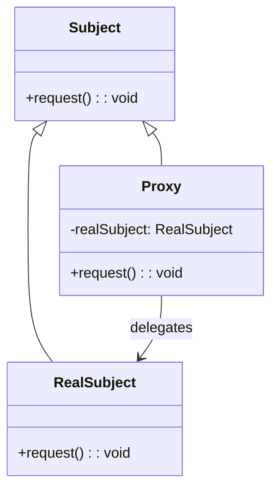

# Proxy

- 어떤 객체에 대한 접근 제어를 위해서 그 객체의 대리인을 세우는 패턴

## 주효 유형
1. VirtualProxy : 지연로딩
2. RemoteProxy : 원격 객체에 대한 접근을 로컬에서 대리
3. ProtectionProxy : 권한 검사를 수행
4. SmartProxy : RealSubject 호출전 캐싱, 로깅, 참조 관리 등 수행

- RealSubject에 대한 접근을 캡슐화한다.
- 덕분에 결합이 느슨해진다.
- 객체에 대한 접근을 제어하거나 기능을 확장하기 위해, 원본 객체와 동일한 인터페이스를 가지는 대리 객체를 제공하는 패턴