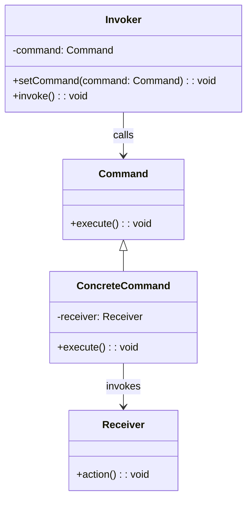

# Command

- 명령을 나타내는 클래스를 사용해서 이벤트를 표현
- 즉, 요청 자체를 객체로 캡슐화 해서, 요청에 대한 정보를 가지고 있다가 실행 시점에 요청으로 처리할 수 있도록 하는 패턴

- 요청을 객체로 만들어서 요청에 대한 세부 구현을 클라이언트에 분리시킨다.
- 요청을 캡슐화해서 실행을 지연시키거나 큐에 저장할 수 있다.
- 실제 동작은 Command만 알고 있기에 클래스 간 결합이 느슨해진다.