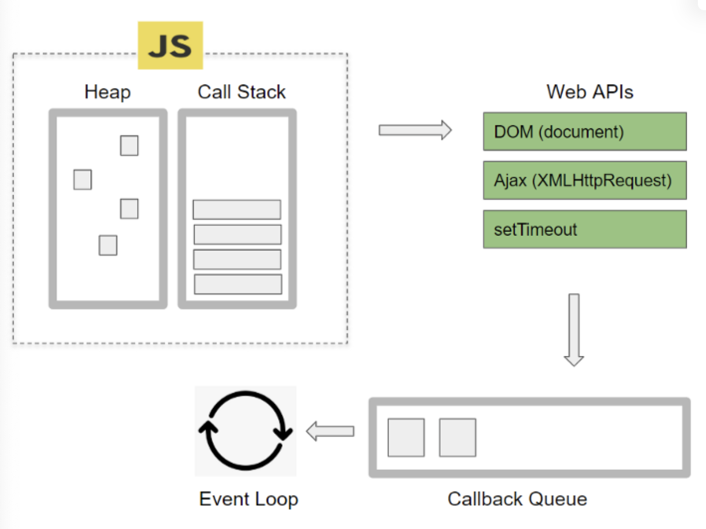
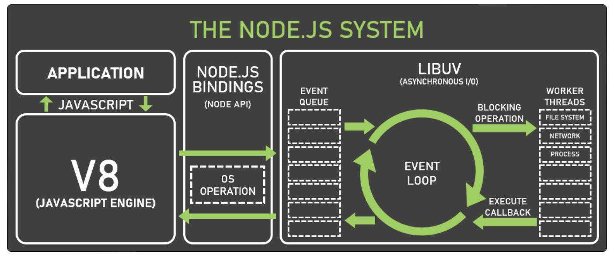
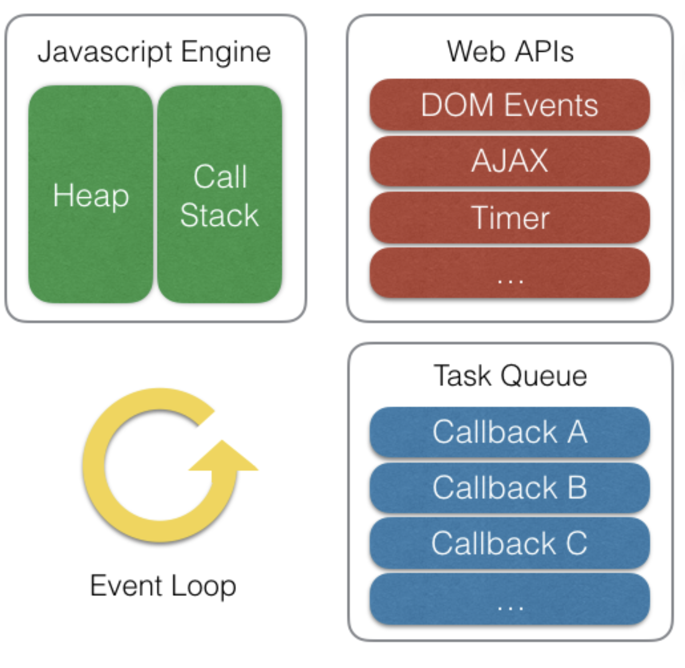

# EventLoop
JS는 싱글 쓰레드다. 만약 브라우저 동작이 한 번에 하나씩 실행하면 사전 작업이 모두 끝날 때까지 멈춰 대기해야한다.
따라서 파일 다운로드, 네트워크 요청, 타이머, 애니메이션과 같이 오래 걸리고 반복적인 작업들은 JS 엔진이 아닌 브라우저 내부 멀티 쓰레드인 Wep API에서 비동기 + 논블로킹으로 처리된다. 


## EventLoop는 브라우저 동작을 제어하는 관리자
JS를 멀티쓰레드로 변경하거나 여러 작업 중 어떤 것을 먼저 처리할지 결정해서 실행시켜야 한다.
후자를 구현해주는 것이 EventLoop이다. 이는 브라우저 내부의 CallStack, Callback Queue, Web APIs 등의 요소를 모니터링하면서 비동기적으로 실행하는 작업들을
관리하고 이를 순서대로 처리하는 역할을 한다. 

>
> ### JS가 싱글 쓰레드인 이유?
> netscape 시절 멀티 코어가 보편화되지 않었고 JS로 이렇게 많을 일을 처리할 경우도 별로 없었다. 그래서 싱글 코어다. 
>



- callStack : JS 엔진이 코드 실행을 위해 사용하는 메모리 구조
- heap : 동적으로 생성된 JS 객체가 저장되는 공간
- Web APIs : 브라우저에서 제공하는 API 모음, 비동기적으로 실행되는 작업들을 전담해서 처리
- Callback Queue : 비동기 처리가 완료되면 실행되는 함수들이 대기하는 공간
- Event Loop : 비동기 함수들을 적절한 시점에 실행시키는 관리자.
- Event Table : 특정 이벤트(timeout, click, mouse 등)이 발생했을 떄 어떤 Callback이 실행되야하는지 저장하고 있는 자료구조

##### Web APIs
- DOM : HTML 문서의 구조와 내용을 표현하고 조작할 수 있는 객체
- XMLHttpRequest : 서버와 비동기 통신할 수 있는 객체
- Timer API : 일정산 시간 간격으로 함수를 실행하거나 지연시키는 메소드 제공(오차 다소 있음)
- Console API : 개발자 도구 콘솔을 제공
- Canvas API : <canvas> 요소로 그래픽을 그리거나 애니메이션을 만들 수 있는 메소드들을 제공
- Geolocation API : 웹브라우저에서 geolocation 관련 메소드를 제공

##### Callback Queue
1. Macro Task Queue
    - settimeout, setInterval, fetch, addEventListener와 같이 비동기로 처리되는 함수들을 콜백 함수가 들어가는 큐
2. Micro Task Queue
    - Promise.then, process.nextTick, MutationObserver와 같이 우선적으로 비동기 처리되는 함수들의 콜백 함수가 들어가는 큐 (처리 우선순위 높음)
3. AnimationFrame Queue
    - 브라우저 큐는 콜백 큐뿐만 아니라 브라우저 애니메이션 작업을 처리하는 Queue도 있다. `requestAnimationFrame`으로 콜백을 등록하면, 이 큐에 적재되어 repaint
   직전에 AnimtaionFrame Queue에 있는 작업을 전부 처리한다. 따라서 JS 스타일 관련 코드들로 AnimationFrame Queue에 비동기로 처리하도록 구성하면 브라우저가 애니메이션의 타이밍을
   관리하고, 적절한 프레임 속도를 유지하고, 다른 탭, 창에 있을 때 애니메이션을 중지해서 애니메이션 동작, 성능, 품질을 향상시킬 수 있다.

## Node.js


- V8(JS Engine) : Chrome의 V8엔진이다.
- Bindings(Node API) : Node.js와 V8엔진 간 상호 작용을 가능하게 하는 C++ 라이브러리
- Libuv : Node.js에서 non-blocking I/O를 처리하기 위한 C 라이브러리
- Event Queue : 비동기 I/O 결과를 저장하고 처리하기 위한 자료구조 (웹브라우저의 Task Queue와 비슷)
- Event Loop : Event Queue에 저장된 I/O 작업 결과를 처리하고 다음 작업을 수행하도록 하는 관리자.
- Worker Thread : CPU 집ㅈ약적인 작업을 처리하기 위해서 Node.js 10부터 추가된 멀티 쓰레드, worker threads는 메인 쓰레드와 독립적인 V8 인스턴스를 가진다.


브라우저의 Web APIs는 위 그림과 같이 각각 전용 작업을 처리하는 API 스레드들로 구성된 집합을 말한다. 따라서 setTimeout 이 호출되면 Timer API 라는 별도의 스레드에서 타이머 동작이 별도로 실행되는 것이며, fetch 가 호출되면 Ajax API 스레드에서 네트워크 통신이 이루어 지는 것이다.
이벤트 루프(Event Loop)는 이 비동기 함수 작업을 Web API에 옮기는 역할을 하고 작업이 완료되면 콜백을 큐(Queue)에 적재했다가 다시 자바스크립트 엔진에 적재해 수행시키는 일종의 '작업을 옮기는 역할' 만을 한다. 작업을 처리하는 주체는 자바스크립트 엔진과 웹 API 이다. 그래서 이벤트 루프는 Call Stack에 현재 실행 중인 작업이 있는지 그리고 Task Queue에 대기 중인 작업이 있는지 반복적으로 확인하는 일종의 무한 루프만을 돌고, 대기 작업이 있다면 작업을 옮겨주는 형태로 동작한다고 보면 된다. (그래서 이벤트 '루프' 이다)

```javascript
// 이벤트 루프의 동작을 나타내는 가상의 코드
while(queue.waitForMessage()){ // 큐에 메시지가 있을 때까지 대기
  queue.processNextMessage(); // 가장 오래된 메시지를 큐에서 꺼내서 호출 스택으로 옮김
}
```

<cite>출처: https://inpa.tistory.com/entry/🔄-자바스크립트-이벤트-루프-구조-동작-원리#브라우저의_멀티_스레드로_작업을_동시에 [Inpa Dev 👨‍💻:티스토리]</cite>