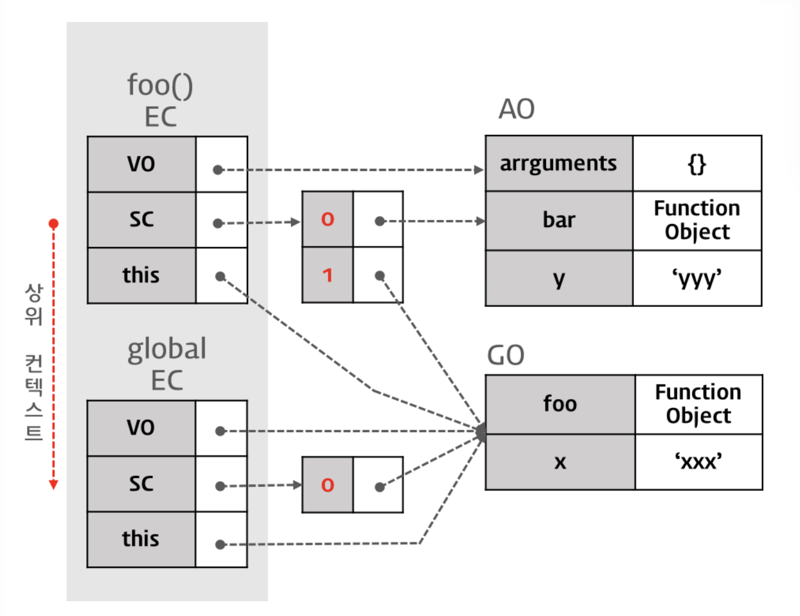

# Execution Context
실행 컨텍스트(Execution Context)는 scope, hoisting, this, function, closure 등의 동작원리를 담고 있는 자바스크립트의 핵심원리이다.
실행 컨텍스트를 바로 이해하지 못하면 코드 독해가 어려워지며 디버깅도 매우 곤란해 질 것이다

## 실행 컨텍스트의 3가지 객체
실행 컨텍스트는 가능한 코드를 형상화하고 구분하는 추상적인 개념이지만 물리적으로는 객체 형태를 가지며, 3가지 프로퍼티를 소유한다. 
<table>
    <tr>
        <th colspan="2"> Execution Context</th>
    </tr>
    <tr>
        <td>Variable Object</td>
        <td> { vars, function declarations, arguments...}</td>
    </tr>
    <tr>
        <td>Scope Chain</td>
        <td>{ Variable Objectc + all Parent Scopes }</td>
    </tr>
    <tr>
        <td>ThisValue</td>
        <td>Context Object</td>
    </tr>
</table>

### Variable Object 
실행컨텍스트가 생성되면 자바스크립트 엔진은 실행에 필요한 여러 정보들을 담을 객체를 생성한다. 
- 변수
- 매개변수, 인수 변수
- 함수 선언

  Variable Object는 실행 컨텍스트의 프로퍼티이기 때문에 값을 갖는데 이 값은 다른 객체를 가리킨다.
  그런데 전역 코드 실행시 생성되는 전역 컨텍스트의 경우와 함수를 실행할 때 생성되는 함수 컨텍스트의 경우, 가리키는 객체가 다르다.
  이는 전역 코드와 함수의 내용이 다르기 때문이다. 예를 들어 전역 코드에는 매개변수가 없지만 함수에는 매개변수가 있다.

## 전역 컨텍스트
Variable Object는 유일하며 최상위에 위치하고 모든 전역 변수, 전역 함수 등을 포함하는 전역 객체(Global Object / GO)를 가리킨다.
전역 객체는 전역에 선언된 전역 변수와 전역 함수를 프로퍼티로 소유한다.

## 함수 컨텍스트
Variable Object는 Activation Object(AO / 활성 객체)를 가리키며 매개변수와 인수들의 정보를 배열의 형태로 담고 있는 객체인 argument객체가 추가된다.

# 스코프 체인
현재 실행 컨텍스트의 활성 객체(AO)를 선두로 하여 순차적으로 상위 컨텍스트의 활성 객체(AO)를 가리키며 마지막 리스트는 전역 객체(GO)를 가리킨다.


<cite>https://inpa.tistory.com/entry/JS-📚-실행-컨텍스트</cite>

>스코프 체인은 식별자 중에서 객체(전역 객체 제외)의 프로퍼티가 아닌 식별자, 즉 변수를 검색하는 메커니즘이다.​
> 
> 식별자 중에서 변수가 아닌 객체의 프로퍼티(물론 메소드도 포함된다)를 검색하는 메커니즘은 프로토타입 체인(Prototype Chain)이다.
> 
> * 식별자 : 변수명,함수명,객체명 등 이름을 붙일떄 사용하는 단어
>

엔진은 스코프 체인을 통해 렉시컬 스코프를 파악한다.
함수가 중첩 상태일 때 하위함수 내에서 상위함수의 스코프와 전역 스코프까지 참조할 수 있는데 이것는 스코프 체인을 검색을 통해 가능하다.

함수가 중첩되어 있으면 중첩될 때마다 부모 함수의 Scope가 자식 함수의 스코프 체인에 포함된다.
함수 실행중에 변수를 만나면 그 변수를 우선 현재 Scope, 즉 Activation Object에서 검색해보고, 만약 검색에 실패하면 스코프 체인에 담겨진 순서대로 그 검색을 이어가게 되는 것이다.
이것이 스코프 체인이라고 불리는 이유이다.

# This
this는 기본적으로 window 이다.
일반 함수 내에서 혼자 this를 선언하면, 그 this는 window객체를 가리킨다.

```javascript
var obj = {
  a: function() { console.log(this); },
};
obj.a(); // obj
```
객체 메서드 a 안의 this는 객체 obj를 가리킨다.
이것은 객체의 메서드를 호출할 때 this를 내부적으로 바꿔주기 때문에 그렇다.


# 실행 컨텍스트 생성 과정
```javascript
var x = 'xxx';

function foo () {
  var y = 'yyy';

  function bar () {
    var z = 'zzz';
    console.log(x + y + z);
  }
  bar();
}

foo();
```

## 1. 전역 코드에 진입
전역 객체가 생성된 이후, 전역 코드로 컨트롤이 진입하면 전역 실행 컨텍스트가 생성되고 실행 컨텍스트 스택에 쌓인다.
### 1-1 스코프 체인의 생성과 초기화
실행 컨텍스트가 생성된 이후 가장 먼저 스코프 체인의 생성과 초기화가 실행된다.
이때 스코프 체인은 전역 객체의 레퍼런스를 포함하는 리스트가 된다.
### 1-2 Variable Instantiation 
스코프 체인의 생성과 초기화가 종료하면 변수 객체화(Variable Instantiation)가 실행된다.
변수, 매개변수와 인수 정보(arguments), 함수 선언을 Variable Object에 추가하여 객체화 한다.
전역 코드의 경우, Variable Object는 Global Object를 가리킨다.
### 1-3 foo 선언
선언된 함수명 foo가 Variable Object(전역 코드인 경우 Global Object)의 프로퍼티로, 생성된 함수 객체가 값으로 설정된다.
생성된 함수 객체는 [[Scopes]] 프로퍼티를 가지게 된다.
[[Scopes]] 프로퍼티는 함수 객체만이 소유하는 내부 프로퍼티(Internal Property)로서 함수 객체가 실행되는 환경을 가리킨다.
따라서 현재 실행 컨텍스트의 스코프 체인이 참조하고 있는 객체를 값으로 설정한다.
내부 함수의 [[Scopes]] 프로퍼티는 자신의 실행 환경(Lexical Enviroment)과 자신을 포함하는 외부 함수의 실행 환경과 전역 객체를 가리키는데,
이때 자신을 포함하는 외부 함수의 실행 컨텍스트가 소멸하여도 [[Scopes]] 프로퍼티가 가리키는 외부 함수의 실행 환경(Activation object)은 소멸하지 않고 참조할 수 있다.

<strong><q>이것이 클로저이다</q></strong>

지금까지 살펴본 실행 컨텍스트는 아직 코드가 실행되기 이전이다.
하지만 스코프 체인이 가리키는 변수 객체(VO)에 이미 함수가 등록되어 있으므로 이후 코드를 실행할 때 함수선언식 이전에 함수를 호출할 수 있게 되었다.
이때 알 수 있는 것은 함수선언식의 경우, 변수 객체(VO)에 함수표현식과 동일하게 함수명을 프로퍼티로 함수 객체를 할당한다는 것이다.
단, 함수선언식은 변수 객체(VO)에 함수명을 프로퍼티로 추가하고 즉시 함수 객체를 즉시 할당하지만
함수 표현식은 일반 변수의 방식(나중에 함수 객체 할당)을 따른다.

따라서 함수선언식의 경우, 선언문 이전에 함수를 호출할 수 있다.
이러한 현상을 함수 호이스팅(Function Hoisting)이라 한다

### 1-4 변수 x 선언
> - 선언 단계(Declaration phase)
> 변수 객체(Variable Object)에 변수를 등록한다. 이 변수 객체는 스코프가 참조할 수 있는 대상이 된다.
> 
> - 초기화 단계(Initialization phase)
> 변수 객체(Variable Object)에 등록된 변수를 메모리에 할당한다. 이 단계에서 변수는 undefined로 초기화된다.
> 
> - 할당 단계(Assignment phase)
> undefined로 초기화된 변수에 실제값을 할당한다.
>

var 키워드로 선언된 변수는 선언 단계와 초기화 단계가 한번에 이루어진다.

다시 말해 스코프 체인이 가리키는 변수 객체에 변수가 등록되고 변수는 undefined로 초기화된다.
따라서 변수 선언문 이전에 변수에 접근하여도 Variable Object에 변수가 존재하기 때문에 에러가 발생하지 않는다. 다만 undefined를 반환한다.

이러한 현상을 변수 호이스팅(Variable Hoisting)이라한다.

### 1-5 this value 결정 
변수 선언 처리가 끝나면 다음은 this value가 결정된다.
this value가 결정되기 이전에 this는 전역 객체를 가리키고 있다가 함수 호출 패턴에 의해 thisVisit Website에 할당되는 값이 결정된다.
전역 코드의 경우, this는 전역 객체를 가리킨다.

## 2. 전역 코드 실행
### 2-1 변수 값 할
스코프 체인이 참조하고 있는 Variable Object를 선두(0)부터 검색하여 변수명에 해당하는 프로퍼티가 발견되면 값(‘xxx’)을 할당한다.
### 2-2 함수 foo 실행
전역 코드의 함수 foo가 실행되기 시작하면 새로운 함수 실행 컨텍스트가 생성된다.
함수 foo의 실행 컨텍스트로 컨트롤이 이동하면 전역 코드의 경우와 마찬가지로

- 스코프 체인의 생성과 초기화,
- Variable Instantiation 실행,
- this value 결정

이 순차적으로 실행된다.

### 2-3 스코프 체인 생성, 초기화
함수 코드의 스코프 체인의 생성과 초기화는 우선 Activation Object에 대한 레퍼런스를 스코프 체인의 선두에 설정하는 것으로 시작된다.
Activation Object는 우선 arguments 프로퍼티의 초기화를 실행하고 그 후, Variable Instantiation가 실행된다.
Activation Object는 스펙 상의 개념으로, 프로그램이 Activation Object에 직접 접근할 수 없다. (Activation Object의 프로퍼티로의 접근은 가능하다)

### 2-4 Variable Instantiation 변수 객체화 실행
Function Code의 경우, 스코프 체인의 생성과 초기화에서 생성된 Activation Object를 Variable Object로서 Variable Instantiation가 실행된다.
이것을 제외하면 전역 코드의 경우와 같은 처리가 실행된다.

### 2-5 thisValue 결정
변수 선언 처리가 끝나면 다음은 this value가 결정된다. thisVisit Website에 할당되는 값은 함수 호출 패턴에 의해 결정된다.
내부 함수의 경우, this의 value는 전역 객체이다.