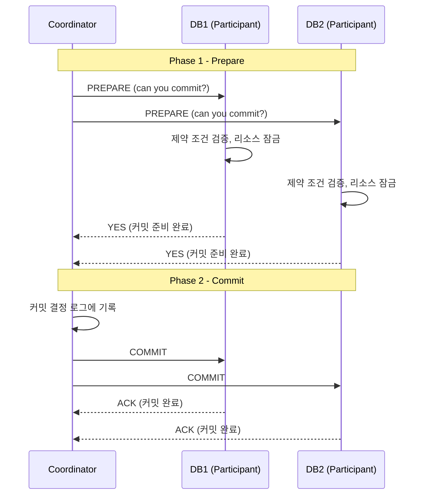

## 2PC (Two-Phase Commit)

### 분산 트랜잭션 문제

**문제 상황**

- 싱글 노드에서는 트랜잭션 커밋이 데이터가 디스크에 쓰여진 순서에 의존
- 분산 환경에서는 일부 노드에서는 제약위반 발생을 감지하여 커밋 실패가 발생하나, 일부 노드에서는 성공적으로 커밋됨
- **결과**: 노드들 간 데이터 불일치

### 2PC 동작 방식

**구성 요소**

- 코디네이터(또는 트랜잭션 매니저): 전체 트랜잭션 조율
- **참여자(Participants)**: 실제 데이터 저장하는 노드들

### Phase 별 상세 동작

**Phase 1 - Prepare**

- 참여자가 prepare 요청을 받으면, 참여자는 어떠한 상황에서는 트랜잭션을 커밋할 수 있도록 합니다
- 모든 트랜잭션 데이터를 디스크에 쓰고, 제약위반 등을 검증
- **YES 응답 = 약속**: 이후 무조건 커밋 가능하다고 보장

**Phase 2 - Commit/Abort**

- 코디네이터는 그러한 결정을 디스크에 존재하는 코디네이터 트랜잭션 로그에 기록하여 혹시나 발생하는 crash에 대비 
- **커밋 또는 abort 요청이 모든 참여자들에게 전달**
- 요청이 실패하거나 타임아웃되면 코디네이터는 성공할 때까지 retry

### 2PC의 치명적 약점

**Coordinator 장애 문제**

- 참여자가 prepare 요청을 받고 yes를 응답한 이후에 코디네이터가 다운된다면 참여자는 더 이상 혼자서 abort를 수행할 수 없습니다.
- **Blocking 상태**: 참여자들이 무한 대기
- 2PC가 완결되는 방법은 오직 코디네이터가 회복되기를 기다리는 것뿐이다.

**실무 사용 한계**

- **성능 저하**: 두 번의 네트워크 라운드트립
- **가용성 문제**: 코디네이터 SPOF (Single Point of Failure)
- **확장성 문제**: 참여자 수에 따라 기하급수적 성능 저하

### 구현 기술

**Java 생태계**

- **Atomikos**: 분산 트랜잭션 관리 기법을 제공하는 오픈소스 JTA 구현체
- **Spring @Transactional**: 어노테이션으로 분산 트랜잭션 처리
- **XA Protocol**: 표준 분산 트랜잭션 인터페이스

**실제 사용 현황**

- **레거시 시스템**: 기존 엔터프라이즈 환경에서 제한적 사용
- **현대 아키텍처**: 마이크로서비스 환경에서 거의 사용 안함
- **대안 채택**: Saga Pattern, Outbox Pattern 선호